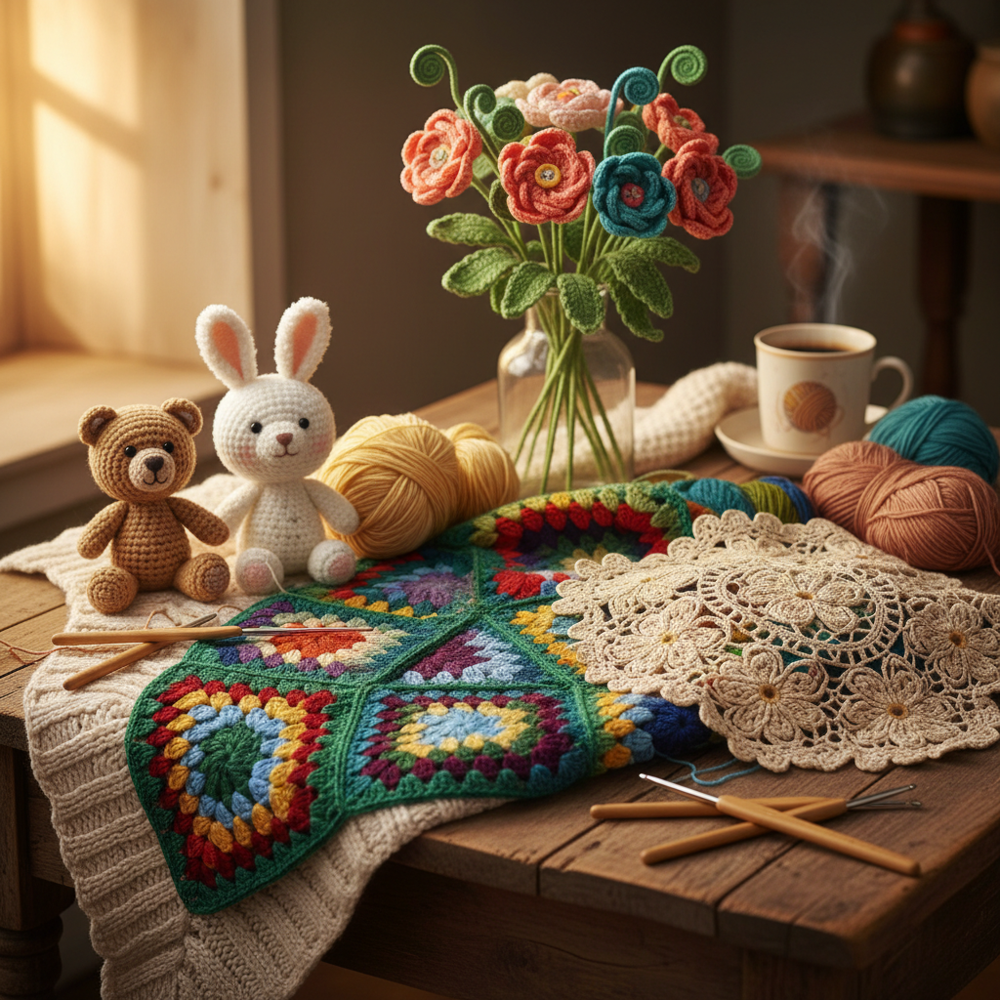

# Crochet 钩针编织

> "Crochet is drawing with yarn — one hook, one loop at a time, building fabric from a single continuous line." — Unknown

## 概述

钩针编织（Crochet）是使用钩针（crochet hook）将纱线钩成环圈，环环相扣形成织物的手工艺。与棒针编织（knitting）使用两根针同时操作多个活环不同，钩针编织在任何时刻只有一个活环——这使得它更加灵活，可以轻松创造三维形态和自由形状。钩针编织可以制作从精细蕾丝到厚实毯子的各种织物，也可以创造雕塑性的立体作品。

钩针编织的独特之处在于：一线成物——从一个起始环开始，一根连续的线通过钩针的操作，逐渐生长成任何形状的织物。

## 核心特征

| 特征 | 描述 |
|------|------|
| 单钩 | 使用单根钩针 |
| 环圈 | 环环相扣的结构 |
| 灵活 | 极其灵活的技法 |
| 立体 | 易于创造立体形态 |
| 连续 | 一根连续的线 |
| 多样 | 极其多样的应用 |

## 视觉特征

- **纹理**：丰富的针法纹理
- **色彩**：多彩的配色可能
- **立体**：三维的立体形态
- **柔软**：柔软的织物质感
- **图案**：重复的图案单元
- **温暖**：视觉上的温暖感

## 代表作品

| 作品 | 艺术家 | 年代 | 意义 |
|------|--------|------|------|
| *Irish crochet lace* | 匿名 | 19世纪 | 爱尔兰钩针蕾丝 |
| *Granny squares* | 传统 | 1960s-70s | 祖母方块 |
| *Olek yarn bombing* | Agata Oleksiak | 2000s+ | 钩针城市装置 |
| *Hyperbolic crochet* | Daina Taimina | 2000s+ | 双曲面钩针数学 |
| *Amigurumi* | Various | 当代 | 钩针玩偶 |

## 历史时间线

| 时期 | 事件 |
|------|------|
| 19世纪初 | 钩针编织的明确记录 |
| 1840s | 爱尔兰大饥荒时期的蕾丝产业 |
| 19世纪末 | 维多利亚时代的流行 |
| 1960s-70s | 嬉皮文化中的复兴 |
| 2000s+ | Amigurumi和纱线轰炸 |
| 当代 | 钩针艺术的多元发展 |

## 中国语境

钩针编织在中国有广泛的群众基础——从老一辈的钩针台布、杯垫到年轻一代的Amigurumi（钩针玩偶），钩针编织在中国一直有活跃的实践者。中国的钩针爱好者社区非常庞大，各种钩针教程和图解在社交媒体上广泛传播。中国手工艺人也将钩针与中国传统图案结合——如钩针中国结、钩针旗袍装饰等。近年来，钩针花束作为永不凋谢的礼物在中国年轻人中非常流行。

## AI生成概念图

## 与其他风格的关系

- **Knitting** → 棒针编织
- **Tatting** → 梭编
- **Bobbin Lace** → 棒针蕾丝
- **Amigurumi** → 钩针玩偶
- **Fiber Art** → 纤维艺术
- **Yarn Bombing** → 纱线轰炸

---

*浮光艺志 | Chronicle of Artistry*
