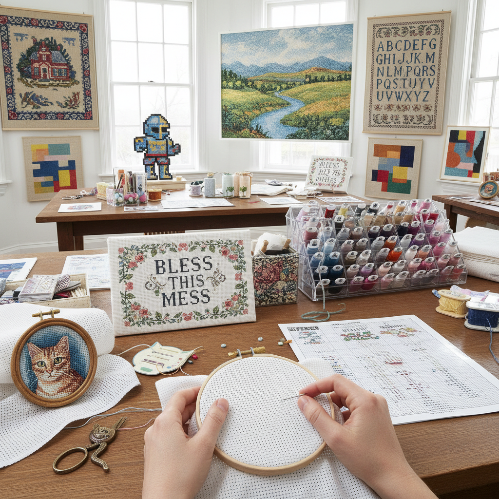

# Cross Stitch Art 十字绣艺术

> "Cross stitch is the pixel art of the textile world — each X a single unit of color placed on a grid, thousands of identical stitches building up images with the same logic as digital displays, proving that complexity emerges from the simplest possible repeated element when arranged with intention." — Unknown

## 概述

十字绣艺术（Cross Stitch Art）是使用十字形针法（X形针脚）在均匀网格织物（even-weave fabric/Aida cloth）上按照图表逐格填色创造图像的刺绣技法。十字绣是世界上最普及的刺绣形式——因为它只需要掌握一种基本针法（十字针），任何人都可以按照图表完成复杂的作品。

十字绣的历史可以追溯到中世纪——最早的十字绣样品（sampler）来自16世纪。十字绣在18-19世纪作为女性教育的一部分广泛实践——年轻女性通过缝制字母表和格言样品来学习针法和字母。20世纪后期，十字绣经历了商业化的繁荣——预印图案和材料包（kit）使十字绣成为全球最流行的手工艺之一。当代十字绣艺术突破了传统的花卉和格言主题——亚文化十字绣（subversive cross stitch）、像素艺术十字绣、当代艺术十字绣等新形式不断涌现。

## 核心特征

| 特征 | 描述 |
|------|------|
| 十字针 | 基本的X形针法 |
| 网格 | 在网格布上 |
| 图表 | 按图表逐格填色 |
| 像素 | 像素化的图像 |
| 普及 | 最普及的刺绣 |
| 民主 | 民主化的艺术 |

## 视觉特征

- **像素**：像素化的图像质感
- **网格**：可见的网格结构
- **色彩**：丰富的色彩选择
- **规律**：规律的十字针脚
- **清晰**：清晰的图案边界
- **多样**：从简单到复杂

## 代表作品

| 作品 | 艺术家 | 年代 | 意义 |
|------|--------|------|------|
| *Historical samplers* | Various | 16-19世纪 | 历史样品 |
| *Victorian cross stitch* | Various | 维多利亚时代 | 维多利亚十字绣 |
| *Subversive cross stitch* | Various | 当代 | 亚文化十字绣 |
| *Pixel art cross stitch* | Various | 当代 | 像素艺术十字绣 |
| *Contemporary cross stitch art* | Various | 当代 | 当代十字绣艺术 |

## 历史时间线

| 时期 | 事件 |
|------|------|
| 中世纪 | 十字绣的早期实践 |
| 16-17世纪 | 样品（sampler）传统的形成 |
| 18-19世纪 | 十字绣作为女性教育 |
| 20世纪后期 | 十字绣的商业化繁荣 |
| 当代 | 十字绣的艺术化和亚文化化 |

## 中国语境

十字绣在中国有极其广泛的流行——2000年代中国经历了十字绣的全民热潮。中国的十字绣产业规模巨大——从材料包生产到成品销售形成了完整的产业链。中国的十字绣以大幅风景画、花卉和人物肖像为主要题材。中国的电商平台上有数以万计的十字绣产品。虽然十字绣热潮在2010年代后有所降温，但仍有大量的爱好者。中国的十字绣文化与全球的"像素艺术"和"慢手工"运动有共鸣。

## AI生成概念图

## 与其他风格的关系

- **Pixel Art** → 像素艺术
- **Berliner Wool Work** → 柏林毛线绣
- **Blackwork** → 黑线刺绣
- **Needlepoint** → 针绣
- **Embroidery** → 刺绣
- **Folk Art** → 民间艺术

---

*浮光艺志 | Chronicle of Artistry*
