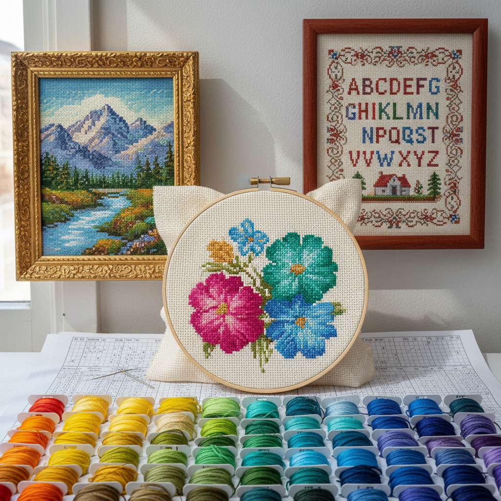

# Cross Stitch 十字绣

> "Cross stitch is pixel art before pixels existed — each X a dot of color, building images one tiny square at a time." — Unknown

## 概述

十字绣（Cross Stitch）是在均匀网格织物（如Aida布）上用X形针迹绣制图案的刺绣技法。每一个十字针迹占据网格的一个方格，如同像素——这使得十字绣成为最容易设计和跟随图案的刺绣形式。从简单的字母到复杂的风景画，十字绣可以表现几乎任何图像。它是世界上最流行的刺绣形式之一，因为入门简单但精通困难——基本技法几分钟就能学会，但一幅精美的大型作品可能需要数百小时。

十字绣的哲学在于：像素的诗意——在数字时代之前，十字绣就已经用离散的色彩单元构建连续的图像，每一个X都是一个"像素"。

## 核心特征

| 特征 | 描述 |
|------|------|
| X形 | X形的基本针迹 |
| 网格 | 在网格布上工作 |
| 像素 | 类似像素的构建 |
| 计数 | 按格数计数绣制 |
| 图案 | 易于跟随图案 |
| 普及 | 最普及的刺绣 |

## 视觉特征

- **网格**：规整的网格结构
- **像素**：像素化的图像效果
- **色彩**：丰富的配色
- **规整**：整齐规律的针迹
- **平面**：平面的装饰效果
- **细腻**：高目数的细腻表现

## 代表作品

| 作品 | 艺术家 | 年代 | 意义 |
|------|--------|------|------|
| *Samplers* | 匿名 | 16世纪+ | 传统样品绣 |
| *Berlin woolwork* | 匿名 | 19世纪 | 柏林毛线绣 |
| *Subversive cross stitch* | Julie Jackson | 2000s+ | 颠覆性十字绣 |
| *Pixel art cross stitch* | Various | 2010s+ | 像素艺术十字绣 |
| *Large-scale reproductions* | Various | 当代 | 大型名画复制 |

## 历史时间线

| 时期 | 事件 |
|------|------|
| 古代 | 最早的十字形针迹 |
| 16世纪 | 样品绣（sampler）传统 |
| 19世纪 | 柏林毛线绣的流行 |
| 20世纪 | 作为家庭手工艺的普及 |
| 2000s+ | 当代十字绣的复兴 |
| 当代 | 与像素艺术的融合 |

## 中国语境

十字绣在中国经历了一次巨大的流行浪潮——2000年代至2010年代，十字绣在中国成为全民手工艺热潮，几乎每个城市都有十字绣材料店。中国的十字绣爱好者特别偏爱大型作品——如《清明上河图》《富春山居图》等名画的十字绣复制品。虽然热潮已过，但十字绣在中国仍有大量忠实爱好者。中国也是全球最大的十字绣材料生产国和出口国。

## AI生成概念图

## 与其他风格的关系

- **Embroidery** → 刺绣（十字绣是其子类）
- **Pixel Art** → 像素艺术
- **Needlepoint** → 针绣（类似的网格技法）
- **Tapestry** → 挂毯
- **Mosaic** → 马赛克（类似的单元构建）
- **Digital Art** → 数字艺术（像素概念）

---

*浮光艺志 | Chronicle of Artistry*
