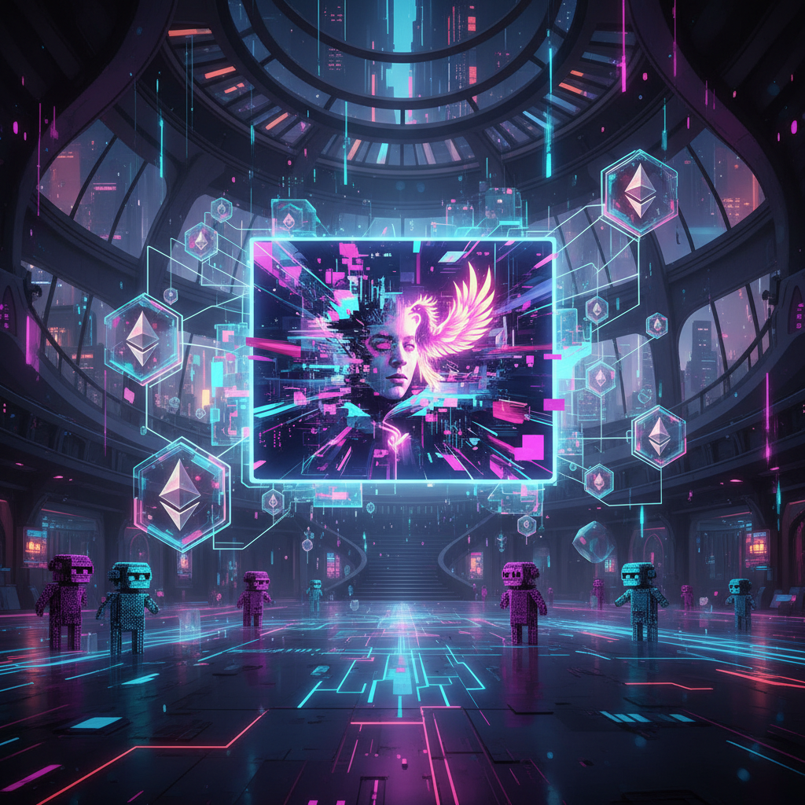

# Crypto Art 加密艺术

> "NFTs didn't create digital art. They created digital ownership." — Beeple

## 概述

加密艺术（Crypto Art / NFT Art）是利用区块链技术（主要是以太坊）进行创作、认证、销售和收藏的数字艺术形式。通过NFT（Non-Fungible Token，非同质化代币），数字艺术品获得了可验证的唯一性、所有权和稀缺性——解决了数字艺术长期面临的"无限复制"问题。

2021年Beeple的作品以6930万美元成交，标志着加密艺术从亚文化进入主流艺术市场，同时也引发了关于艺术价值、环境影响和投机泡沫的激烈争论。

## 核心特征

| 特征 | 描述 |
|------|------|
| 区块链认证 | NFT提供不可篡改的所有权证明 |
| 数字原生 | 作品在数字空间中创作和存在 |
| 去中心化 | 绕过画廊和拍卖行的直接交易 |
| 可编程 | 智能合约实现版税自动分配 |
| 社区驱动 | Discord、Twitter上的收藏家社区 |
| 投机性 | 艺术品同时是金融资产 |

## 视觉特征

- **风格多样**：从像素艺术到3D渲染、从生成艺术到摄影
- **动态**：GIF、视频、互动——超越静态图像
- **像素美学**：CryptoPunks式的低分辨率像素头像
- **生成性**：算法生成的独特变体（Art Blocks）
- **赛博朋克**：霓虹、金属、未来主义视觉
- **PFP**：头像项目——身份和社区的视觉标识

## 代表作品

| 作品 | 艺术家/项目 | 年代 | 意义 |
|------|------------|------|------|
| *Everydays: The First 5000 Days* | Beeple | 2021 | 6930万美元——NFT艺术的里程碑 |
| *CryptoPunks* | Larva Labs | 2017 | 10000个像素头像——PFP的鼻祖 |
| *Fidenza* | Tyler Hobbs (Art Blocks) | 2021 | 生成艺术的NFT化 |
| *Ringers* | Dmitri Cherniak | 2021 | 算法生成的弦绕钉画 |
| *Right-click, Save As* | XCOPY | 2021 | 对NFT批评的讽刺回应 |
| *Quantum* | Kevin McCoy | 2014 | 第一个NFT——历史起点 |

## 历史时间线

| 时期 | 事件 |
|------|------|
| 2014 | Kevin McCoy铸造第一个NFT *Quantum* |
| 2017 | CryptoPunks发布——PFP文化的起源 |
| 2017 | CryptoKitties——NFT进入大众视野 |
| 2020 | Nifty Gateway、SuperRare等平台兴起 |
| 2021.3 | Beeple在Christie's以6930万美元成交 |
| 2021 | NFT狂潮——Art Blocks、Bored Apes |
| 2022 | 市场崩溃——泡沫破裂 |
| 2023 | 市场冷却，严肃加密艺术继续发展 |
| 2024+ | AI生成+区块链——新的融合 |

## 子类型

| 子类型 | 特征 |
|--------|------|
| PFP项目 | CryptoPunks、BAYC——头像即身份 |
| 生成NFT | Art Blocks——链上生成的独特作品 |
| 1/1艺术 | Beeple、XCOPY——独一无二的数字画作 |
| 摄影NFT | Justin Aversano——摄影的NFT化 |
| 音乐NFT | 音乐作品的代币化 |
| AI×NFT | AI生成艺术的区块链认证 |

## 中国语境

中国的加密艺术发展受到政策限制——加密货币交易被禁止，但"数字藏品"以人民币计价的形式在国内平台（鲸探、幻核等）上发展。中国艺术家如黄河山、宋婷等在国际NFT平台上活跃。中国的数字藏品更强调文化IP（故宫、敦煌）的数字化，而非投机交易。政策环境使中国的加密艺术走出了一条不同于西方的路径。

## 争议与遗产

- **争议**：NFT是艺术革命还是投机泡沫？
- **环境问题**：以太坊PoW的能源消耗（已转PoS）
- **版权问题**：购买NFT不等于拥有版权
- **市场崩溃**：2022年后大量NFT价值归零
- **遗产**：永久改变了数字艺术的所有权和交易模式
- **当代回响**：创作者经济、去中心化文化、数字所有权

## AI生成概念图

## 与其他风格的关系

- **Net Art** → 网络艺术是加密艺术的精神先驱
- **Generative Art** → 生成艺术通过Art Blocks获得新生
- **Pop Art** → 波普的大众文化精神在PFP文化中延续
- **Conceptual Art** → 概念艺术的去物质化在数字艺术中实现
- **Data Art** → 区块链数据本身成为艺术素材
- **Street Art** → 街头艺术的民主精神在NFT中延续

---

*浮光艺志 | Chronicle of Artistry*
