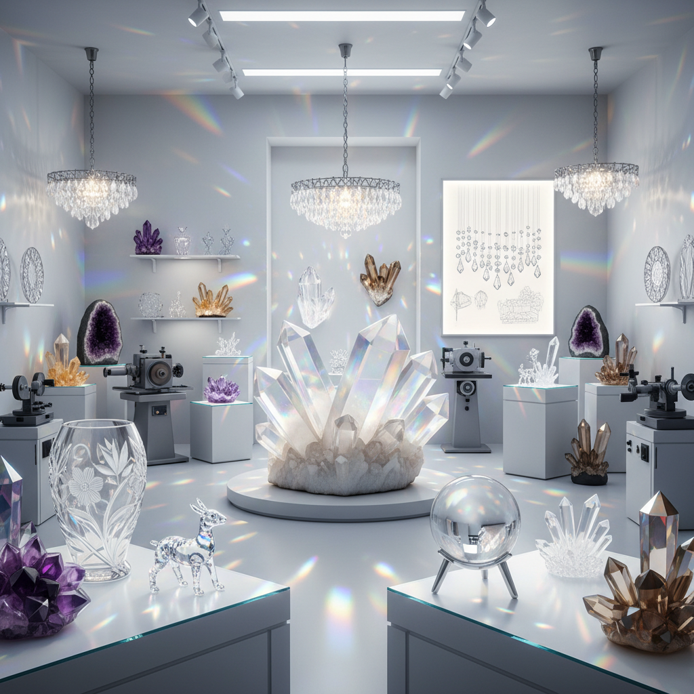

# Crystal Art 水晶艺术

> "A crystal is geometry made matter — atoms arranged in perfect repeating patterns that extend in three dimensions, creating flat faces, sharp edges, and angles that are always the same regardless of the crystal's size. When light enters a crystal, it is bent, split, and reflected by these geometric planes, creating rainbows, sparkle, and fire. Crystal art works with these optical properties, using nature's own geometry as both material and subject." — Unknown

## 概述

水晶艺术（Crystal Art）是以天然水晶或人造水晶为材料进行艺术创作的实践——利用水晶的透明度、折射率、色彩和天然晶体形态创造各种艺术形式。水晶艺术涵盖从天然水晶的雕刻到施华洛世奇水晶的装饰设计。

水晶艺术的实践包括：1）水晶雕刻——在天然水晶上进行精细雕刻；2）水晶球——抛光的水晶球体；3）水晶首饰——用水晶制作的首饰和装饰品；4）水晶吊灯——用切割水晶制作的吊灯；5）水晶镶嵌——将水晶嵌入服装、家具或建筑中；6）水晶装置——用大量水晶创作的当代装置艺术；7）水晶器皿——用水晶制作的杯、碗、花瓶等。

## 核心特征

| 特征 | 描述 |
|------|------|
| 透明 | 高度透明 |
| 折射 | 强烈的光线折射 |
| 几何 | 天然的几何形态 |
| 闪耀 | 切割后的闪耀效果 |
| 纯净 | 纯净无瑕的质感 |
| 坚硬 | 莫氏硬度7 |

## 视觉特征

- **透明**：水晶般的透明感
- **彩虹**：折射产生的彩虹光谱
- **闪耀**：切割面的闪耀效果
- **几何**：天然的六棱柱形态
- **纯净**：纯净无色的质感
- **光影**：光线穿透的效果

## 代表作品

| 作品 | 艺术家 | 年代 | 意义 |
|------|--------|------|------|
| *Crystal skulls* | Unknown | 争议 | 水晶头骨 |
| *Swarovski installations* | Various | 当代 | 施华洛世奇水晶装置 |
| *Crystal chandeliers* | 波西米亚传统 | 17世纪至今 | 水晶吊灯 |
| *Rock crystal vessels* | Various | 古代至今 | 水晶器皿 |
| *Crystal Palace* | Joseph Paxton | 1851 | 水晶宫（玻璃建筑） |

## 历史时间线

| 时期 | 事件 |
|------|------|
| 古代 | 水晶作为宝石和护身符 |
| 中世纪 | 水晶器皿和宗教用品 |
| 17世纪 | 波西米亚水晶切割 |
| 1895 | 施华洛世奇创立 |
| 当代 | 水晶在当代艺术中的运用 |

## 中国语境

水晶艺术在中国有深厚的文化传统。中国古代称水晶为"水精"或"水玉"，认为它是千年冰化而成。中国传统的水晶雕刻以精细著称——用水晶雕刻的佛像、印章、鼻烟壶等都是珍贵的艺术品。中国江苏东海县是中国最大的水晶产地，被称为"水晶之都"，有悠久的水晶加工传统。中国当代的水晶艺术涵盖了从传统雕刻到现代设计的广泛领域——水晶奖杯、水晶内雕（激光内雕）、水晶灯具等都是中国水晶艺术的当代表现。中国的水晶文化也与风水和养生传统相关联——不同颜色的水晶被认为有不同的能量和功效。

## AI生成概念图

## 与其他风格的关系

- **Glass Art** → 玻璃艺术
- **Gemstone Art** → 宝石艺术
- **Jewelry Art** → 首饰艺术
- **Light Art** → 光艺术
- **Minimalism** → 极简主义
- **Installation Art** → 装置艺术

---

*浮光艺志 | Chronicle of Artistry*
