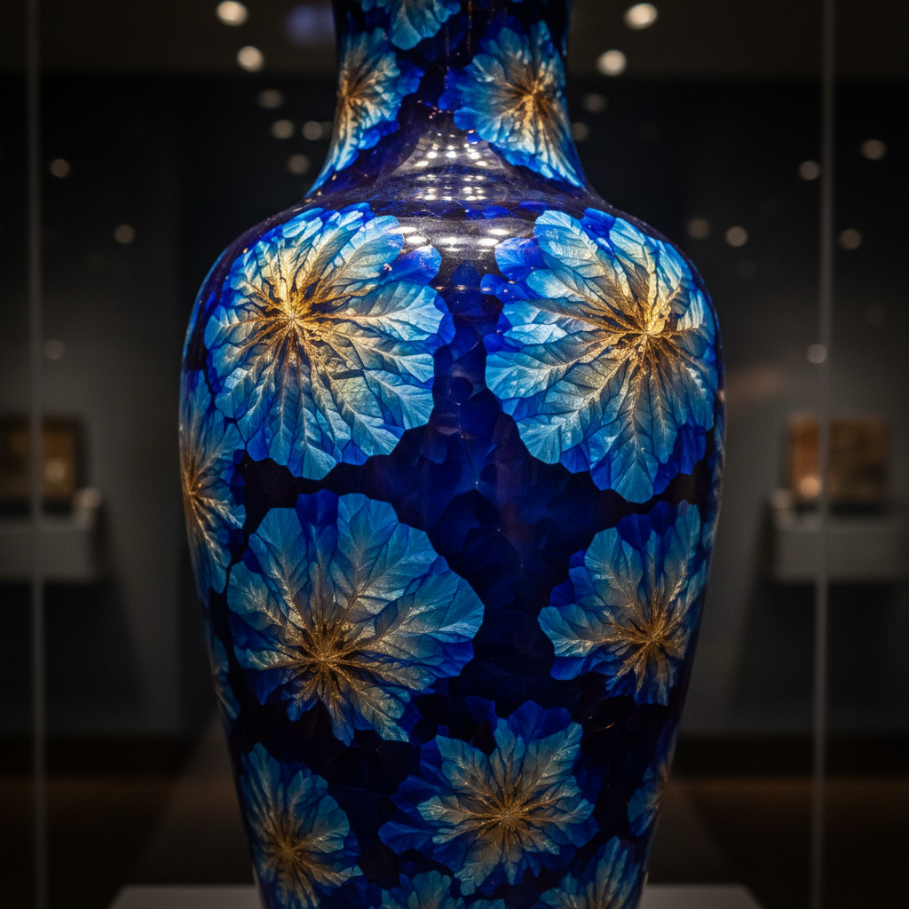

# Crystalline Glaze Art 结晶釉艺术

> "Crystalline glaze is chemistry made visible — zinc and silica dissolved in molten glass at 1300 degrees, then coaxed through precise cooling cycles to grow crystals that bloom across the surface like frost flowers on a winter window, each radial cluster a perfect geometric mandala of molecular self-organization, the potter becoming a gardener of minerals, cultivating flowers that grow in glass." — Unknown

## 概述

结晶釉艺术（Crystalline Glaze Art）是一种通过精确控制釉料配方和冷却过程，使釉面上生长出可见晶体的高级陶瓷釉料技法。结晶釉中的锌和硅在高温熔融后，在缓慢冷却的特定温度区间内重新结晶，形成如花朵般放射状展开的晶体簇——每个晶体都是分子自组织的完美几何图案。结晶釉是陶瓷釉料中技术难度最高的类型之一。

结晶釉艺术的核心要素包括：1）高锌配方——含高比例氧化锌的釉料；2）高温烧制——在1280-1300°C的高温中熔融；3）精确冷却——在特定温度区间缓慢降温；4）晶核形成——在冷却过程中形成结晶核心；5）晶体生长——晶核向外放射状生长；6）温度控制——需要精确的窑温控制程序；7）流动性——结晶釉具有很强的流动性。

## 核心特征

| 特征 | 描述 |
|------|------|
| 可见晶体 | 釉面上肉眼可见的晶体花 |
| 放射状 | 从中心向外放射的晶体结构 |
| 精确控制 | 需要精确的温度控制 |
| 高锌配方 | 氧化锌为主要结晶剂 |
| 流动性强 | 釉料在烧制中大量流动 |
| 技术难度 | 陶瓷釉料中最难的类型之一 |

## 视觉特征

- **晶体花**：如花朵般的放射状晶体
- **多彩**：通过金属氧化物着色的晶体
- **光泽**：高度光滑的玻璃质表面
- **对比**：晶体与背景釉的色彩对比
- **几何美**：晶体的完美几何结构
- **深度感**：透明釉层下的深度效果

## 代表作品

| 作品 | 艺术家/文化 | 年代 | 意义 |
|------|-------------|------|------|
| *Taxile Doat结晶釉* | Taxile Doat | 19世纪末 | 结晶釉先驱 |
| *Adelaide Robineau作品* | Adelaide Robineau | 20世纪初 | 美国结晶釉大师 |
| *当代结晶釉花瓶* | 各地陶艺家 | 当代 | 当代结晶釉创作 |
| *William Melstrom作品* | William Melstrom | 当代 | 大型结晶釉 |
| *中国当代结晶釉* | 中国陶艺家 | 当代 | 中国结晶釉探索 |

## 历史时间线

| 时期 | 事件 |
|------|------|
| 19世纪末 | 法国塞夫勒窑开始结晶釉实验 |
| 1900年代 | 结晶釉在欧美陶瓷界发展 |
| 20世纪中期 | 工作室陶艺家探索结晶釉 |
| 1980年代 | 电窑和数字控制使结晶釉更可控 |
| 当代 | 结晶釉在全球陶艺中的普及 |

## 中国语境

结晶釉在中国有独特的历史渊源。宋代建窑的"曜变"天目——釉面上出现的彩色光晕——被认为是一种自然结晶现象。中国传统的"窑变"釉中也包含了各种结晶效果。当代中国陶瓷研究机构和陶艺家在结晶釉领域进行了大量研究和创作。景德镇的陶瓷研究所在结晶釉配方和烧制工艺方面有重要贡献。中国当代结晶釉作品在国际陶瓷展览中频繁获奖，展现了中国陶艺家在这一高技术领域的实力。

## AI生成概念图

## 与其他风格的关系

- **Tenmoku** → 天目釉（曜变）
- **Science Art** → 科学与艺术
- **Glass Art** → 玻璃艺术
- **Mineral Art** → 矿物美学
- **High Fire** → 高温烧制
- **Studio Pottery** → 工作室陶艺

---

*浮光艺志 | Chronicle of Artistry*
