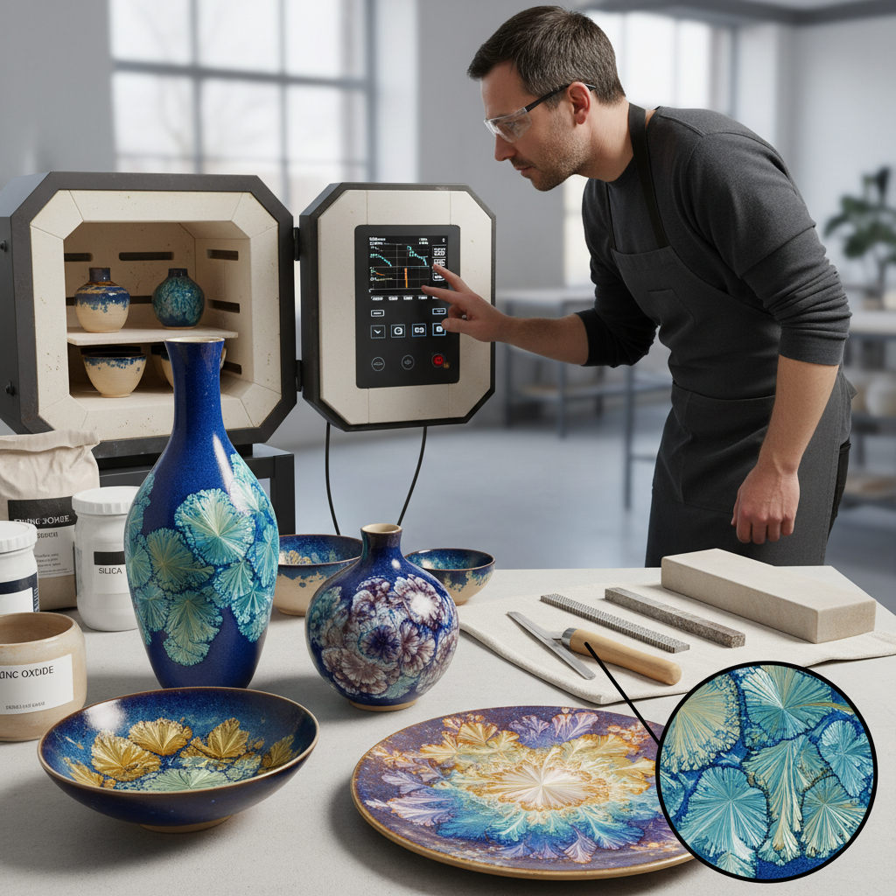

# Crystalline Glaze 结晶釉

> "Crystalline glazing is growing gardens in glass — zinc silicate crystals bloom on the surface of the pot during cooling, each one a unique snowflake of mineral geometry that the potter can encourage but never fully command." — Unknown

## 概述

结晶釉（Crystalline Glaze）是一种特殊的陶瓷釉料——在烧制和冷却过程中，釉中的某些成分（通常是硅酸锌zinc silicate）会结晶生长，在釉面上形成可见的晶体图案。这些晶体通常呈现为放射状的花朵形或星形图案，大小从几毫米到十几厘米不等。

结晶釉的关键在于精确控制冷却过程——晶体在特定的温度范围内（约1050-1100°C）生长，需要在这个温度区间保持足够长的时间（"保温"）让晶体充分发育。冷却太快晶体来不及生长，冷却太慢则可能过度生长。结晶釉的配方通常含有高比例的氧化锌和二氧化硅，以及少量的着色氧化物（如氧化铁、氧化钴、氧化锰等）来赋予晶体不同的颜色。

## 核心特征

| 特征 | 描述 |
|------|------|
| 晶体 | 可见的晶体图案 |
| 控温 | 精确的温度控制 |
| 锌 | 硅酸锌晶体 |
| 花形 | 花朵状的晶体 |
| 技术 | 高技术难度 |
| 独特 | 每件都独一无二 |

## 视觉特征

- **晶体**：放射状的晶体花朵
- **色彩**：丰富的色彩变化
- **对比**：晶体与背景的对比
- **光泽**：玻璃般的光泽
- **几何**：自然的几何图案
- **深度**：釉层的深度感

## 代表作品

| 作品 | 艺术家 | 年代 | 意义 |
|------|--------|------|------|
| *Taxile Doat crystalline* | Taxile Doat | 1900s | 早期结晶釉大师 |
| *Adelaide Robineau* | Adelaide Robineau | 1900s | 美国结晶釉先驱 |
| *Contemporary crystalline* | Various | 当代 | 当代结晶釉 |
| *Chinese crystalline vases* | Various | 当代 | 中国结晶釉花瓶 |
| *Macro crystalline art* | Various | 当代 | 大晶体艺术 |

## 历史时间线

| 时期 | 事件 |
|------|------|
| 1880s | 法国塞夫勒窑的早期实验 |
| 1900s | Taxile Doat的系统研究 |
| 1900s | Adelaide Robineau的美国实践 |
| 1950s | 结晶釉配方的科学化 |
| 1980s | 电窑精确控温的普及 |
| 当代 | 结晶釉在全球的流行 |

## 中国语境

结晶釉在中国有着独特的历史——中国宋代的钧窑就以窑变效果（包括某些结晶现象）著称。当代中国的结晶釉陶艺非常活跃——景德镇、德化等陶瓷产区有大量的结晶釉创作者。中国的结晶釉作品在国际市场上有很高的知名度——一些中国陶艺家的结晶釉花瓶被收藏家追捧。中国的陶瓷教育中，结晶釉是高级釉料课程的重要内容。中国的电商平台上有丰富的结晶釉作品销售。

## AI生成概念图

## 与其他风格的关系

- **Ceramics** → 陶瓷
- **Glaze Chemistry** → 釉料化学
- **Jun Ware** → 钧窑
- **Art Pottery** → 艺术陶器
- **Studio Pottery** → 工作室陶艺
- **Science Art** → 科学艺术

---

*浮光艺志 | Chronicle of Artistry*
