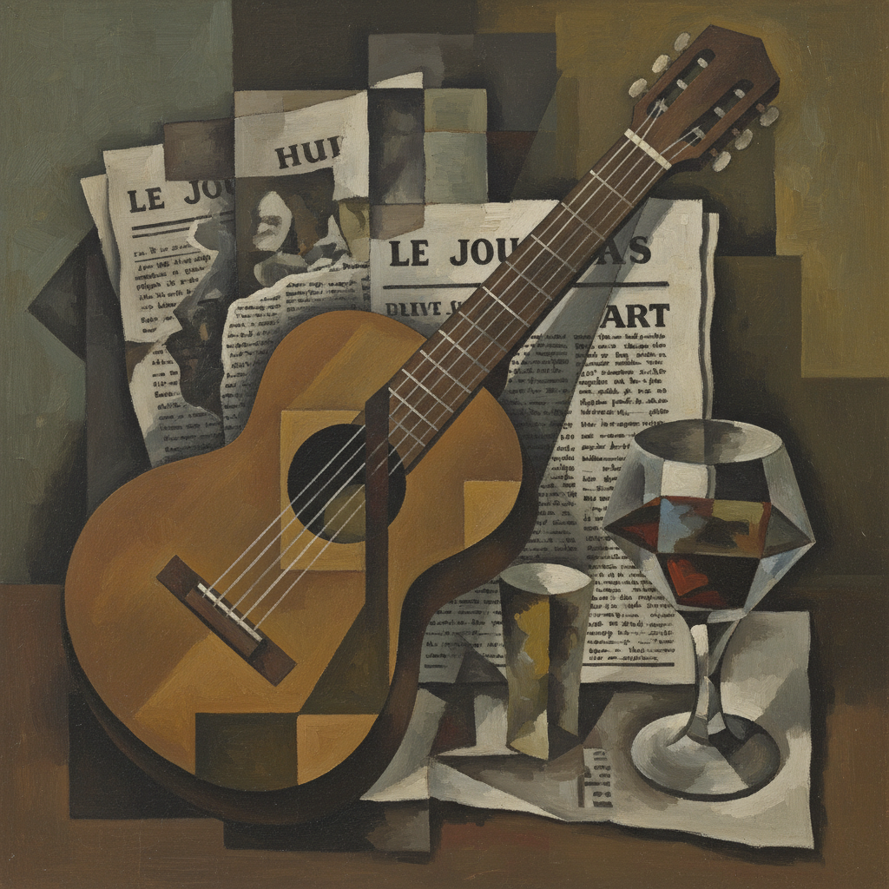

# Cubism Painting 立体主义绘画

> **时期：** 1907年–1920年代  
> **关键词：** 多视角、几何分解、毕加索、布拉克、第四维度

## 概述

Cubism（立体主义）是20世纪最具革命性的绘画运动——毕加索和布拉克彻底打破了自文艺复兴以来500年的单点透视传统。他们将物体从多个角度同时呈现在同一画面上，把三维世界分解为几何碎片再重新组装。《亚维农少女》不是画错了，而是画出了眼睛在时间中移动时看到的全部真相。

## 风格特征

- **多视角**：同时呈现物体的多个面
- **几何分解**：将形体还原为基本几何形
- **平面重组**：碎片化的空间拼贴
- **有限色彩**：分析期以褐灰为主
- **拼贴技法**：引入报纸、壁纸等实物

## 代表人物与作品

- 巴勃罗·毕加索《亚维农少女》
- 乔治·布拉克 静物系列
- 胡安·格里斯 综合立体主义
- 费尔南·莱热 机械形式

## 概念图

