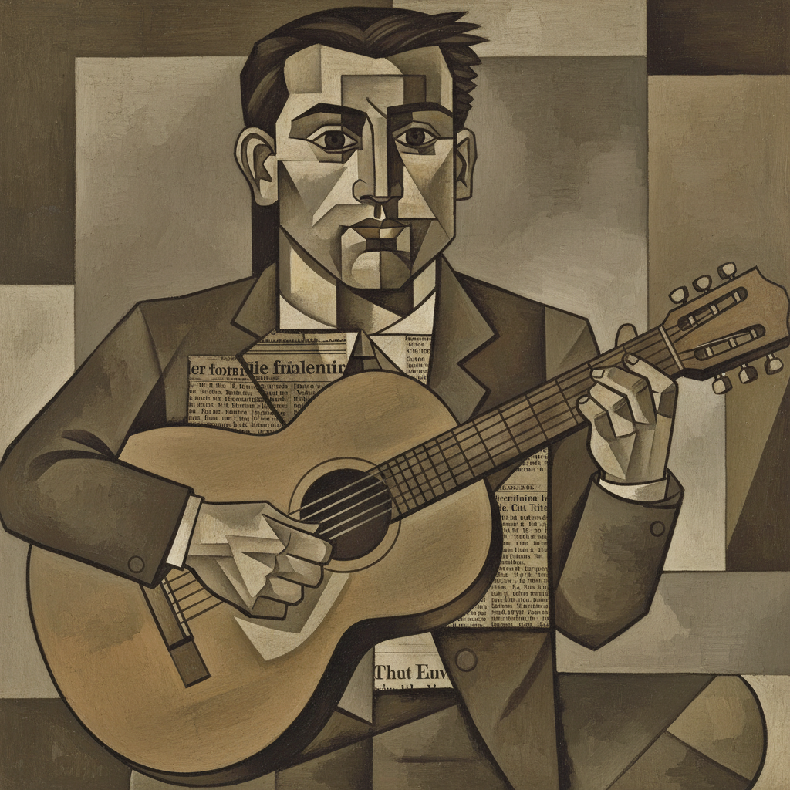

# Cubism 立体主义



> **"为什么只从一个角度看？——同时画出所有角度——这才是完整的真实。"**

## 概述

| 维度 | 描述 |
|------|------|
| 时期 | 1907–1920s/影响至今 |
| 别名 | Cubism, Analytical Cubism, Synthetic Cubism, 立体派 |
| 核心色彩 | 早期：褐色/灰色/赭石；后期：明亮色彩+拼贴 |
| 关键元素 | 多视角同时呈现、几何分解、平面化、拼贴 |
| 代表人物 | Pablo Picasso, Georges Braque, Juan Gris, Fernand Léger |
| 关联风格 | Futurism, Constructivism, De Stijl, Art Deco, Abstract Art |

---

## 历史脉络

| 年份 | 事件 |
|------|------|
| 1907 | 毕加索《亚维农少女》——立体主义诞生 |
| 1908 | 布拉克的风景画被评论家称为"立方体" |
| 1909-12 | 分析立体主义——分解形体 |
| 1912-14 | 综合立体主义——拼贴+色彩 |
| 1920s | 立体主义影响扩散——建筑、设计、时尚 |
| 2020s | 立体主义精神在数字艺术中持续 |

### 核心哲学

立体主义的精神是**"一个视角是谎言——真实需要所有视角"**：
- 多视角 = 真实（"正面+侧面+背面 = 完整的人"）
- 分解 = 理解（"把事物拆开——才能真正看到它"）
- 平面 = 诚实（"画布是平的——为什么假装它不是？"）
- 同时 = 时间（"不是一个瞬间——是所有瞬间"）
- 毕加索: "我不画事物看起来的样子——我画我对它们的认知"

---

## 视觉语法

### 色彩系统

```
分析立体主义 (1909-12)：
  赭石 (#CC7722) — 泥土、中性
  灰色 (#808080) — 结构
  褐色 (#8B4513) — 温暖
  黑色 (#000000) — 线条

综合立体主义 (1912+)：
  明亮色彩 — 自由
  报纸色 — 拼贴
  木纹 — 材质
  任何颜色 — 解放

规则：
  - 早期：有限色彩（聚焦结构）
  - 后期：色彩自由
  - 平面色块
  - 线条定义形体

质感：
  拼贴 — 报纸、壁纸、布
  平面 — 无深度幻觉
  几何 — 棱角、切面
  文字 — 字母、报纸标题
```

### 标志性元素

| 类别 | 元素 |
|------|------|
| 视角 | 多视角同时呈现、正面+侧面 |
| 形体 | 几何分解、棱角、切面 |
| 空间 | 平面化、无传统透视 |
| 拼贴 | 报纸、壁纸、布料、文字 |
| 题材 | 静物、人物、乐器、瓶子 |
| 态度 | 分析、解构、重组、智性、革命 |

---

## 与千禧怀旧的关系

### 20世纪最重要的视觉革命
- 立体主义 → 所有现代艺术运动的基础
- "没有立体主义——就没有抽象艺术、没有现代设计"
- 立体主义的"多视角" = 数字时代"多屏幕"的预言
- David Hockney 的 iPad 拼贴 = 当代立体主义

### 对设计的深远影响
- 立体主义 → Art Deco 的几何化
- → 构成主义的抽象
- → 当代平面设计的碎片化构图
- "立体主义教会了设计师：空间可以被重新定义"

---

## 中国语境

- 中国现代艺术对立体主义的接受和转化
- 中国美术教育中立体主义的核心地位
- 中国当代艺术家对立体主义的重新诠释
- 与中国传统"散点透视"的对话

---

## 设计应用

| 场景 | 应用方式 |
|------|----------|
| 品牌 | 几何+解构+智性+现代+艺术 |
| 插画 | 多视角+碎片化+拼贴+概念 |
| 建筑 | 解构主义+几何+多面+空间 |
| 数字 | 碎片化UI+多视角+拼贴+实验 |

---

## 相关风格

← [Impressionism 印象派](impressionism.md) | [Constructivism 构成主义](constructivism.md) →

↑ [返回千禧怀旧目录](README.md) | [返回总目录](../README.md)
