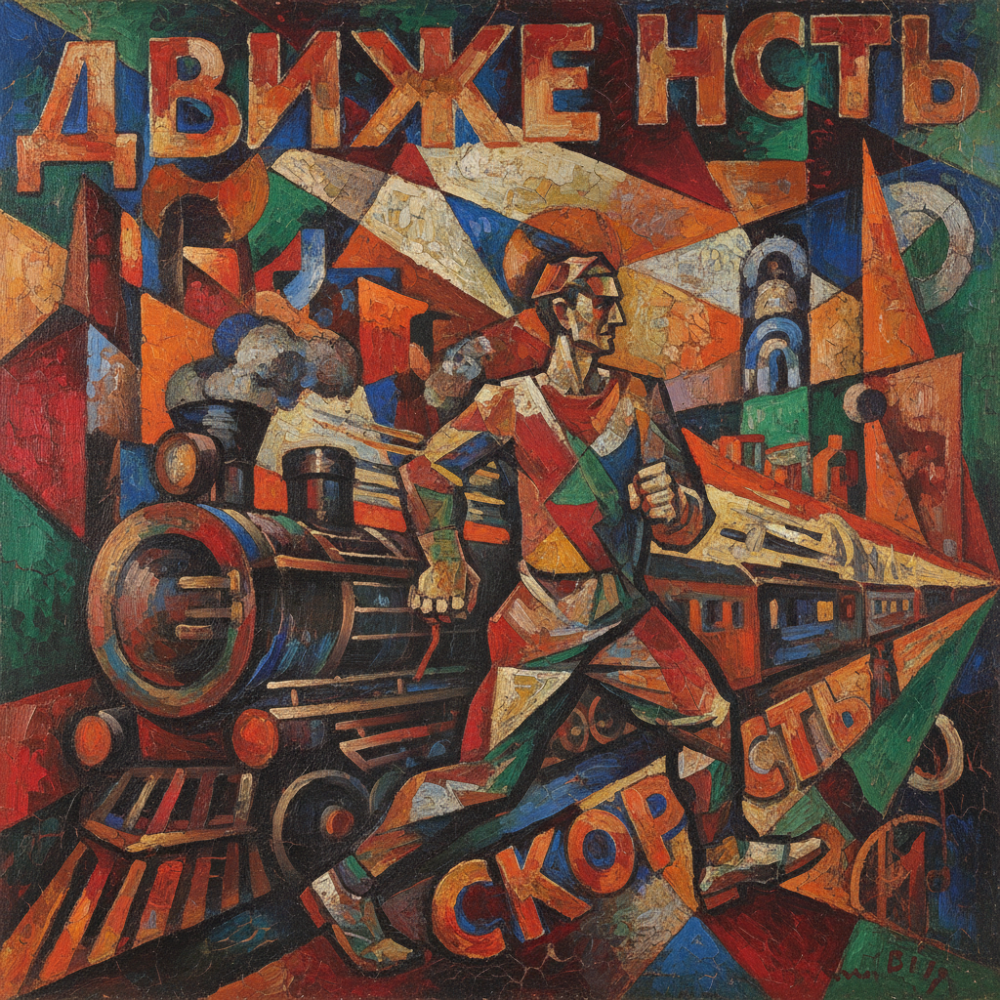

# Cubo-Futurism 立体未来主义

> **时期：** 1912年–1920年代  
> **关键词：** 俄罗斯前卫、立体主义+未来主义、机械动感、碎片化、革命美学

## 概述

Cubo-Futurism（立体未来主义）是1912年前后在俄罗斯兴起的前卫运动，将法国立体主义的多视角碎片化与意大利未来主义的速度崇拜融为一体。马列维奇早期的农民系列、冈察洛娃的机械人物——他们用几何碎片和动态线条表现工业时代的能量，为后来的至上主义和构成主义铺平了道路。

## 风格特征

- **几何碎片**：立体主义的多面体分解
- **动态线条**：未来主义的速度和运动感
- **机械意象**：工业和城市的视觉元素
- **鲜艳色彩**：比法国立体主义更大胆的用色
- **文字介入**：俄语字母作为构图元素

## 代表人物与作品

- 卡济米尔·马列维奇 早期农民系列
- 娜塔莉亚·冈察洛娃《骑自行车的人》
- 柳博芙·波波娃 建筑绘画
- 亚历山大·埃克斯特 城市风景

## 概念图

