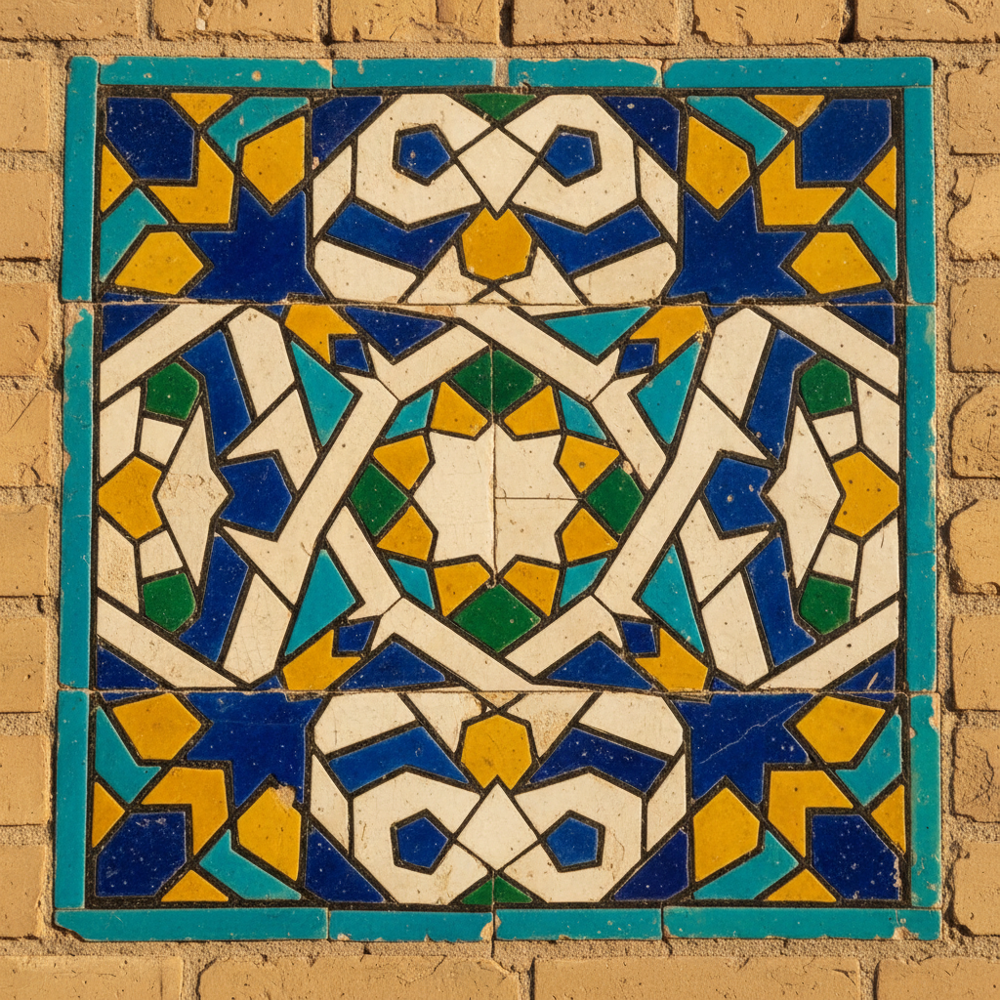

# Cuerda Seca Art 干线法陶瓷艺术

> "Cuerda seca draws boundaries in wax and manganese — each color held in its own jeweled cell." — Islamic ceramic tradition

## 概述

干线法陶瓷艺术（Cuerda Seca Art）是一种源自伊斯兰世界的陶瓷装饰技术——通过在釉面上用含油脂或蜡的锰线条划分区域，使不同颜色的釉料在烧成时不会相互流动混合，从而创造出色彩鲜明、边界清晰的多彩装饰效果。

"Cuerda seca"在西班牙语中意为"干线"——指的是那条将不同颜色釉料分隔开的深色线条。这一技术起源于10世纪的伊斯兰世界——可能最早出现在伊朗或伊拉克，后来传播到北非和西班牙的摩尔人地区。技术原理是：陶工先在素坯上用含有锰和油脂的混合物画出线条图案，然后在线条分隔的区域内填入不同颜色的釉料。烧成时，含油脂的线条因为排斥釉料而保持干燥（故名"干线"），形成深色的分隔线，而各色釉料则在各自的区域内熔融，互不侵犯。

干线法陶瓷艺术的核心要素包括：1）分隔技术——用含油脂的锰线分隔釉料；2）多彩效果——多种颜色釉料的并置；3）清晰边界——颜色之间的清晰分界；4）伊斯兰起源——10世纪伊斯兰世界的发明；5）建筑装饰——清真寺和宫殿的瓷砖装饰；6）几何图案——伊斯兰几何纹样的表现；7）当代复兴——现代陶艺家的重新探索。

## 核心特征

| 特征 | 描述 |
|------|------|
| 分隔技术 | 含油脂锰线分隔釉料 |
| 多彩效果 | 多种颜色釉料并置 |
| 清晰边界 | 颜色之间清晰分界 |
| 伊斯兰起源 | 10世纪伊斯兰发明 |
| 建筑装饰 | 清真寺宫殿瓷砖装饰 |
| 几何图案 | 伊斯兰几何纹样 |

## 视觉特征

- **深色线条**：锰黑色的分隔线条
- **宝石色彩**：蓝、绿、黄、白的宝石般色彩
- **几何图案**：精确的伊斯兰几何图案
- **花卉纹样**：阿拉伯式花卉装饰
- **星形图案**：多角星形的复杂图案
- **瓷砖拼贴**：建筑瓷砖的大型拼贴

## 代表作品

| 作品 | 年代 | 意义 |
|------|------|------|
| *伊朗早期干线法陶器* | 10世纪 | 技术起源 |
| *西班牙摩尔干线法瓷砖* | 11-15世纪 | 西班牙发展 |
| *阿尔罕布拉宫瓷砖* | 14世纪 | 建筑应用 |
| *帖木儿帝国瓷砖* | 15世纪 | 中亚发展 |
| *萨法维王朝瓷砖* | 16-17世纪 | 伊朗巅峰 |
| *当代干线法陶瓷* | 21世纪 | 现代复兴 |

## 历史时间线

| 时期 | 事件 |
|------|------|
| 10世纪 | 干线法技术在伊斯兰世界出现 |
| 11-12世纪 | 传播到北非和西班牙 |
| 13-14世纪 | 西班牙摩尔人广泛使用 |
| 15世纪 | 帖木儿帝国建筑瓷砖 |
| 16-17世纪 | 萨法维伊朗的巅峰 |
| 18-19世纪 | 传统衰落 |
| 当代 | 现代陶艺家复兴 |

## 中国语境

干线法与中国陶瓷中的"分隔"技术有着有趣的平行关系。中国明代的"掐丝珐琅"（景泰蓝）——用铜丝在金属胎体上分隔不同颜色的珐琅釉——与干线法的原理极为相似，只是基底材料不同（金属vs陶瓷）。中国清代的"粉彩"瓷器中也使用了类似的分隔技术——用"玻璃白"作为底色来分隔不同颜色的彩料。干线法从伊斯兰世界沿丝绸之路传播的历史，与中国陶瓷技术向西传播的路径形成了有趣的对照——两种文明在陶瓷技术上的交流是双向的。当代中国陶艺家也在探索干线法——将这一伊斯兰传统与中国陶瓷美学相结合。

## 概念图

## 与其他风格的关系

- **Islamic Ceramics** → 伊斯兰陶瓷（起源）
- **Cloisonne** → 景泰蓝（平行技术）
- **Azulejo** → 阿苏莱霍瓷砖
- **Talavera** → 塔拉韦拉
- **Lustre Pottery** → 光泽陶（同一传统）
- **Geometric Art** → 几何艺术

---

*浮光艺志 | Chronicle of Artistry*
