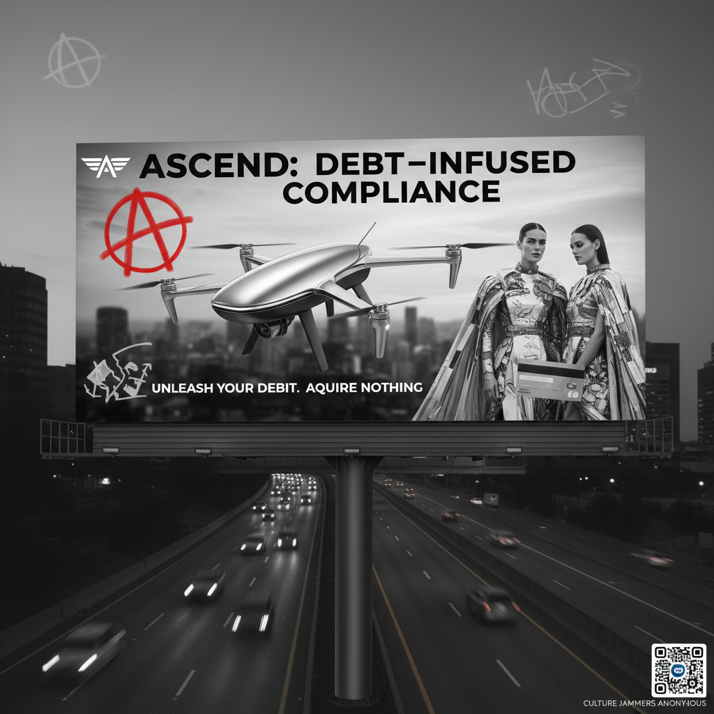

# Culture Jamming 文化干扰

> **时期：** 1980年代–至今  
> **关键词：** 广告颠覆、品牌破坏、消费批判、符号游击战、反广告

## 概述

文化干扰（Culture Jamming）是一种通过篡改、模仿和颠覆商业广告与企业符号来进行文化批判的实践。干扰者们在广告牌上涂改标语、制作恶搞广告、创建虚假企业网站——用资本主义自己的视觉语言来揭露其内在矛盾，让消费者从被动接收变为主动质疑。

## 风格特征

- **广告模仿**：完美复制商业广告的视觉语言
- **意义颠覆**：保留形式但篡改内容
- **公共空间**：在广告牌、公交站等公共场所干预
- **幽默讽刺**：用笑声瓦解品牌权威
- **病毒传播**：设计易于复制和传播的图像

## 代表人物与作品

- Adbusters 杂志与反广告运动
- Billboard Liberation Front 广告牌解放阵线
- Banksy 街头艺术
- Brandalism 集体广告牌替换行动
- The Bubble Project 对话泡泡贴纸

## 概念图

