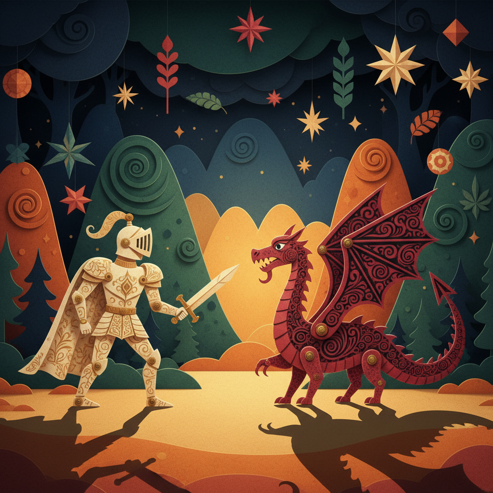

# Cut-out Animation 剪纸动画

> **时期：** 1920年代–至今  
> **关键词：** 剪纸拼贴、平面关节、影子戏、数字剪纸、低成本高效

## 概述

Cut-out Animation（剪纸动画）使用平面剪纸或卡片制作的角色部件，通过移动关节连接的肢体来创造动画效果。从洛特·赖尼格的剪影动画到《南方公园》的数字剪纸风格，这种技术以其独特的平面美学和高效的制作方式著称。中国的剪纸动画（如《猪八戒吃西瓜》）也是这一传统的重要分支。

## 风格特征

- **平面层次**：明确的前后层叠关系
- **关节运动**：铰接式的肢体活动
- **剪影效果**：强烈的轮廓和形状语言
- **纹理丰富**：纸张、布料等材质的表面质感
- **拼贴美学**：不同材料的组合碰撞

## 代表人物与作品

- 洛特·赖尼格《阿赫迈德王子历险记》(1926)
- 特雷·帕克《南方公园》
- 万古蟾《猪八戒吃西瓜》（中国剪纸动画）
- 尤里·诺尔施泰因《故事中的故事》

## 概念图

