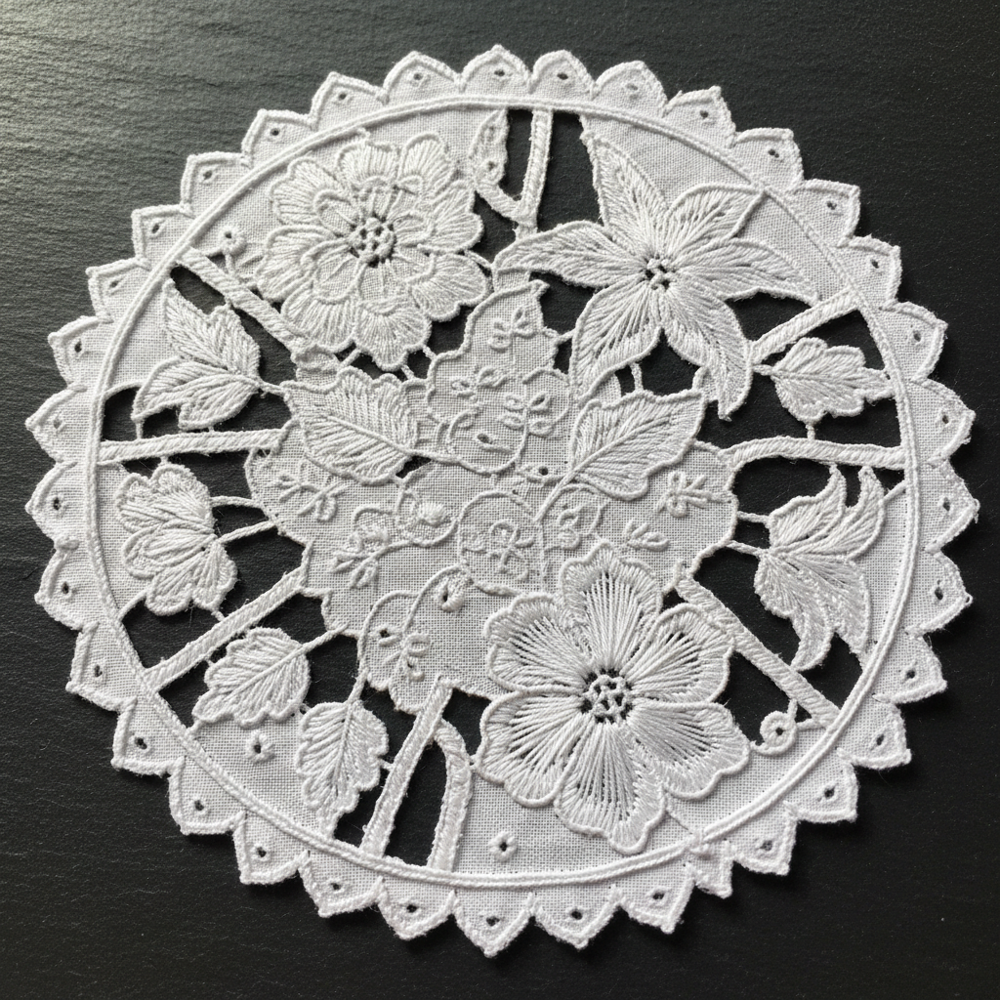

# Cutwork Art 镂空绣艺术

> "Cutwork is embroidery's most daring act — after stitching a design with buttonhole stitch to secure the edges, the embroiderer takes scissors to the fabric itself, cutting away sections to create openwork patterns. What remains is a delicate skeleton of cloth and thread, a fabric transformed into lace by the simple courage of cutting. Cutwork is where embroidery ends and lace begins." — Unknown

## 概述

镂空绣艺术（Cutwork Art）是一种先用锁边针法（buttonhole stitch）加固图案边缘，然后将图案内部或周围的织物剪去，形成镂空效果的刺绣技法——是从刺绣到蕾丝的过渡形式。镂空绣是最古老的装饰技法之一，也是针织蕾丝（needle lace）的直接前身。

镂空绣艺术的实践包括：1）简单镂空——剪去小块织物的基本形式；2）Richelieu镂空——带有装饰棒连接的镂空；3）Renaissance镂空——带有编织棒的复杂镂空；4）意大利镂空——精细的意大利传统镂空；5）Reticella——从镂空发展出的几何蕾丝；6）彩色镂空——使用彩色线的现代变体；7）当代镂空绣——将传统技法与现代设计结合的创作。

## 核心特征

| 特征 | 描述 |
|------|------|
| 剪切 | 剪去织物的勇气 |
| 镂空 | 精美的镂空效果 |
| 锁边 | 锁边针法的加固 |
| 过渡 | 刺绣到蕾丝的过渡 |
| 古老 | 最古老的技法之一 |
| 精密 | 精密的边缘处理 |

## 视觉特征

- **镂空**：精美的镂空图案
- **对比**：实体与空洞的对比
- **精细**：精细的锁边边缘
- **透光**：镂空处的透光效果
- **蕾丝**：蕾丝般的精致感
- **优雅**：优雅精致的整体感

## 代表作品

| 作品 | 艺术家/文化 | 年代 | 意义 |
|------|-------------|------|------|
| *Italian Reticella* | 意大利 | 15-16世纪 | 意大利网格蕾丝 |
| *Richelieu cutwork* | 法国 | 17世纪 | 黎塞留镂空绣 |
| *Madeira cutwork* | 葡萄牙 | 19世纪至今 | 马德拉镂空绣 |
| *Chinese cutwork* | 中国 | 传统 | 中国镂空绣 |
| *Contemporary cutwork* | 当代 | 当代 | 当代镂空绣 |

## 历史时间线

| 时期 | 事件 |
|------|------|
| 古代 | 镂空绣的起源 |
| 15-16世纪 | 意大利Reticella的发展 |
| 17世纪 | 法国Richelieu镂空的流行 |
| 19世纪 | 马德拉镂空绣的商业化 |
| 当代 | 镂空绣的艺术化复兴 |

## 中国语境

镂空绣艺术在中国有悠久的传统。中国传统刺绣中的"雕绣"就是镂空绣的中国形式——在绣好图案后剪去多余织物。中国的汕头抽纱中有精美的镂空绣传统——将镂空与抽线结合创造复杂的装饰效果。中国的苗族刺绣中有独特的镂空技法——将剪纸与刺绣结合创造镂空效果。中国的出口工艺品中，镂空绣桌布和手帕曾是重要的产品——以精细的工艺著称。中国当代的一些设计师将镂空绣应用于时装设计——在服装上创造精致的镂空装饰效果。中国的非物质文化遗产保护中，一些地方的镂空绣技法被列为保护项目——传承这一精细的手工艺传统。

## AI生成概念图

## 与其他风格的关系

- **Whitework** → 白色刺绣
- **Needle Lace** → 针织蕾丝
- **Drawn Thread Work** → 抽线绣
- **Hardanger** → 哈当厄尔刺绣
- **Broderie Anglaise** → 英式镂空绣
- **Richelieu** → 黎塞留绣

---

*浮光艺志 | Chronicle of Artistry*
