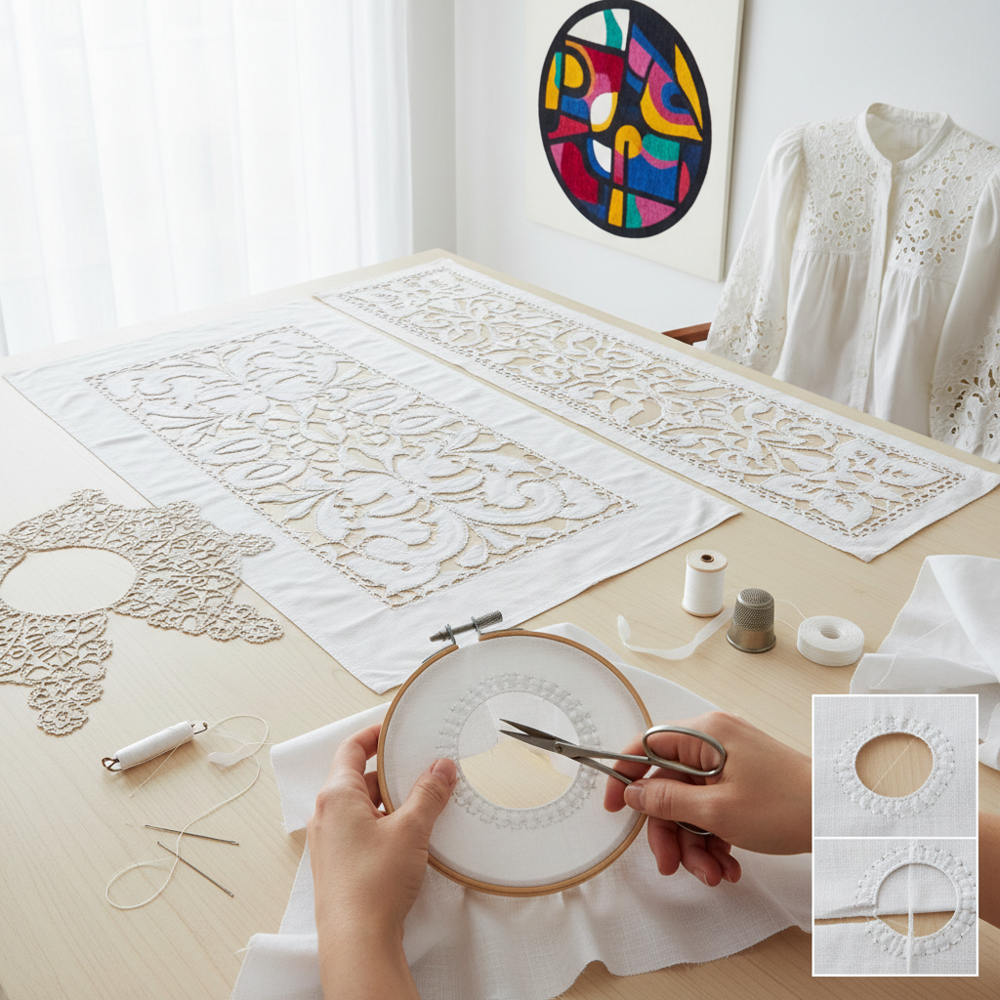

# Cutwork Embroidery 雕绣

> "Cutwork is embroidery's most daring act — fabric deliberately cut away to leave only thread, buttonhole-stitched edges holding the design together over void, creating lace from cloth by removing everything that is not the pattern, proving that what you take away can be more beautiful than what you leave behind." — Unknown

## 概述

雕绣（Cutwork Embroidery），也称为镂空绣，是一种先用扣眼针法（buttonhole stitch）沿图案轮廓密密缝制，然后将轮廓内或外的织物剪除，留下由针法支撑的透空图案的刺绣技法。雕绣是从实体织物到蕾丝的过渡技法——最简单的雕绣只剪除小块织物，最复杂的雕绣（如Richelieu和Renaissance cutwork）几乎将所有背景织物剪除，只留下由"bars"（横杆）连接的图案元素。

雕绣的主要类型包括：
- **Simple Cutwork**：简单雕绣，剪除小面积
- **Richelieu Cutwork**：黎塞留雕绣，大面积剪除，用带picot的bars连接
- **Renaissance Cutwork**：文艺复兴雕绣，用编织bars连接
- **Italian Cutwork/Reticella**：意大利雕绣，几乎全部剪除，接近针绣蕾丝

雕绣的历史可以追溯到15-16世纪的意大利——它是针绣蕾丝（needle lace）的直接前身。

## 核心特征

| 特征 | 描述 |
|------|------|
| 剪切 | 剪除织物 |
| 扣眼针 | 扣眼针法包边 |
| 透空 | 创造透空效果 |
| 横杆 | bars连接元素 |
| 蕾丝 | 接近蕾丝效果 |
| 精确 | 精确的剪切 |

## 视觉特征

- **透空**：大面积的透空
- **轮廓**：清晰的图案轮廓
- **蕾丝**：蕾丝般的效果
- **对比**：实体与空洞的对比
- **精细**：精细的扣眼针边
- **优雅**：古典的优雅

## 代表作品

| 作品 | 艺术家 | 年代 | 意义 |
|------|--------|------|------|
| *Italian Reticella* | 意大利工匠 | 15-16世纪 | 意大利雕绣 |
| *Richelieu cutwork* | 法国工匠 | 17世纪 | 黎塞留雕绣 |
| *Renaissance cutwork* | 欧洲工匠 | 文艺复兴 | 文艺复兴雕绣 |
| *Madeira cutwork* | 马德拉工匠 | 传统 | 马德拉雕绣 |
| *Contemporary cutwork* | Various | 当代 | 当代雕绣 |

## 历史时间线

| 时期 | 事件 |
|------|------|
| 15世纪 | 意大利雕绣的起源 |
| 16世纪 | Reticella的发展 |
| 17世纪 | 黎塞留雕绣的流行 |
| 18-19世纪 | 各地方风格的发展 |
| 当代 | 雕绣的艺术化复兴 |

## 中国语境

雕绣在中国有重要的传统——中国的"雕绣"或"镂空绣"是传统刺绣技法之一。中国的汕头抽纱中包含雕绣元素。中国的温州瓯绣和一些地方刺绣传统中有雕绣技法。当代中国的服装设计中，雕绣（cutwork）是常用的装饰技法——用于连衣裙、衬衫和内衣的装饰。中国的机器雕绣（machine cutwork）在服装工业中有广泛应用。手工雕绣在中国的高端定制和艺术创作中仍有实践。

## AI生成概念图

## 与其他风格的关系

- **Needle Lace** → 针绣蕾丝
- **Whitework** → 白色刺绣
- **Hardanger** → 哈当厄尔刺绣
- **Drawn Thread Work** → 抽丝绣
- **Broderie Anglaise** → 英式镂空绣
- **Embroidery** → 刺绣

---

*浮光艺志 | Chronicle of Artistry*
