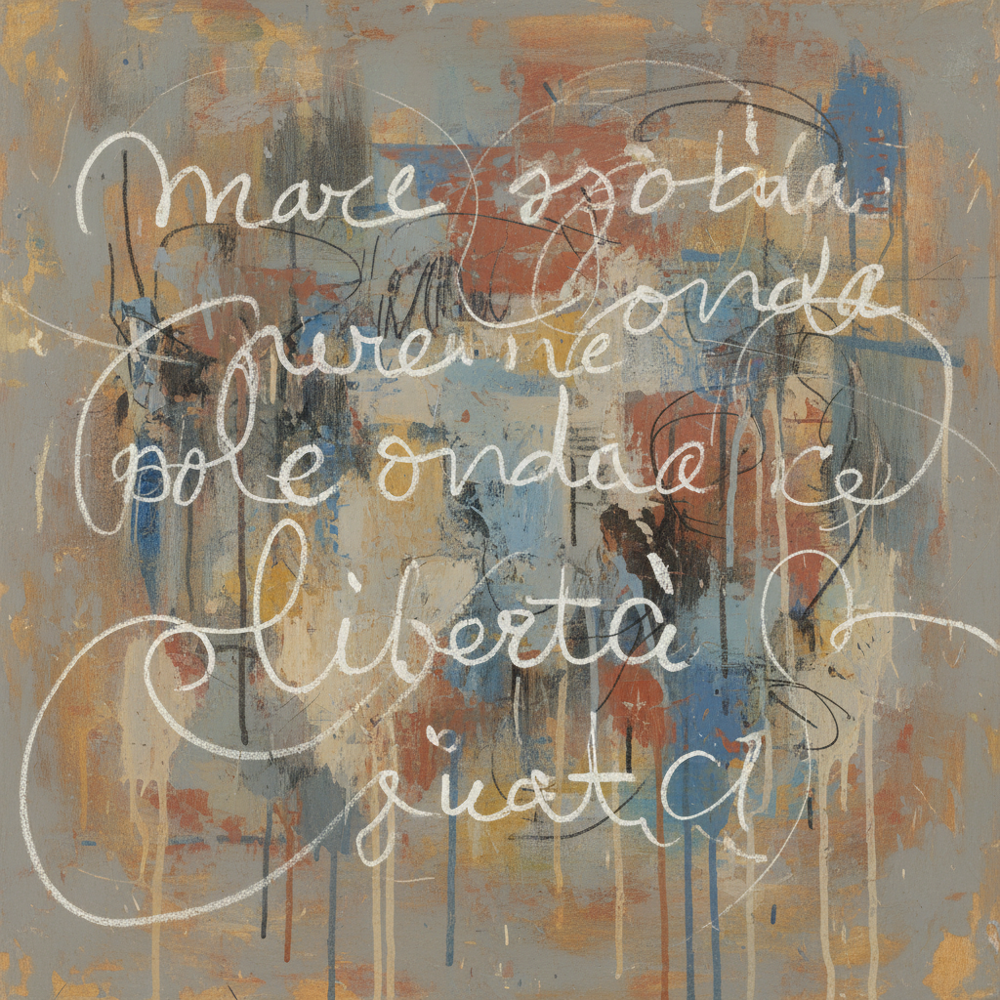

# Cy Twombly 赛·托姆布雷

> **流派**: 抽象表现主义 · 后极简主义  
> **时期**: 1928–2011 美国/意大利  
> **关键词**: 涂鸦书写、地中海色彩、古典引用、诗意痕迹

## 概述

赛·托姆布雷以其看似随意的涂鸦式绘画闻名。他的作品融合了书写、绘画和诗歌，在巨大的白色画布上留下铅笔痕迹、蜡笔涂抹和油彩飞溅，引用古希腊罗马神话和诗歌，创造出一种介于文字与图像之间的独特语言。

## 视觉特征

- **涂鸦书写**: 潦草的文字、数字和符号散布画面
- **白色底色**: 大面积的白色或浅色背景，如同纸张
- **铅笔痕迹**: 细弱的铅笔线条与厚重的油彩形成对比
- **地中海色彩**: 晚期作品中出现浓烈的红、橙、绿
- **古典引用**: 画面中常出现维吉尔、荷马等古典文本片段

## 代表作品

- 《黑板》系列 (1966–1971)
- 《勒潘托之战》(2001)
- 《玫瑰》系列 (2008)
- 《无题（巴克斯）》(2005)

## 历史影响

托姆布雷打破了绘画与书写的界限，证明了最私密的手势痕迹可以承载最宏大的文化记忆。他影响了后来的新表现主义和当代涂鸦艺术。

## 相关风格

- [Abstract Expressionism 抽象表现主义](abstract-expressionism.md)
- [Jean-Michel Basquiat 让-米歇尔·巴斯奎特](basquiat.md)
- [Robert Motherwell 罗伯特·马瑟韦尔](robert-motherwell.md)
