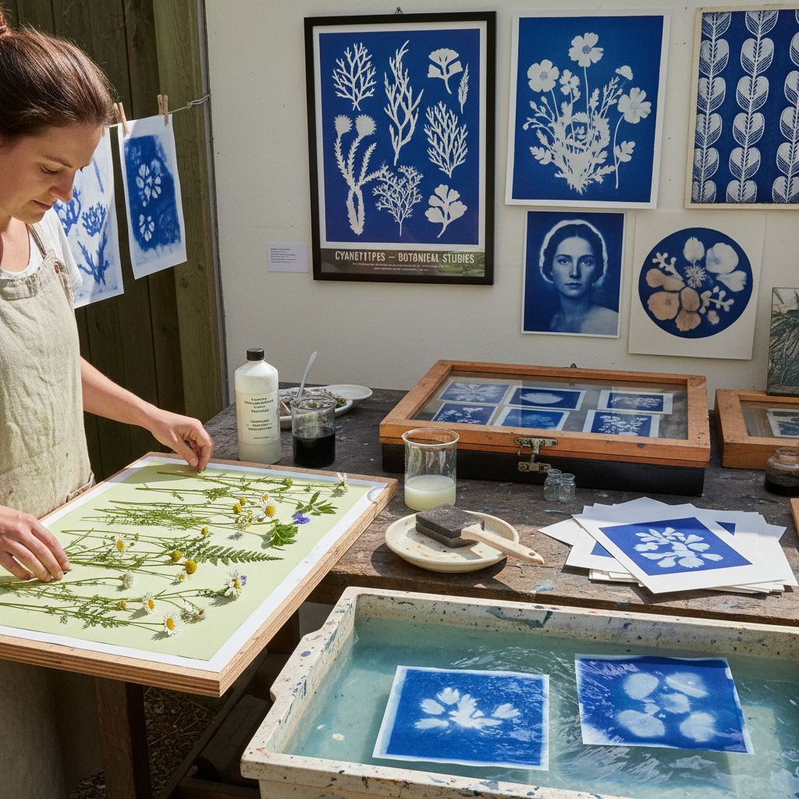

# Cyanotype Art 蓝晒艺术

> "Cyanotype is photography's blue ancestor — iron salts painted on paper and exposed to sunlight, the ultraviolet rays transforming the chemistry into Prussian blue wherever light touches while shadows remain white, creating images of haunting beauty in a single perfect color that evokes blueprints, summer skies, and the earliest days when people first learned to capture light's shadow on paper." — Unknown

## 概述

蓝晒（Cyanotype）是一种使用铁盐感光化学反应的古典摄影/印刷技法。将柠檬酸铁铵和铁氰化钾的混合溶液涂在纸张或织物上，干燥后在紫外线（阳光）下曝光——被光照射的区域变为深蓝色（普鲁士蓝），被物体遮挡的区域保持白色。曝光后用水冲洗即可固定图像。

Cyanotype由英国科学家John Herschel在1842年发明。Anna Atkins是第一位使用cyanotype系统记录植物标本的人——她的《British Algae》（1843）被认为是第一本用摄影技术制作的书。Cyanotype也是"蓝图"（blueprint）的技术基础——在复印机发明之前，建筑和工程图纸都使用cyanotype技术复制。当代艺术家将cyanotype作为一种独特的艺术表达媒介。

## 核心特征

| 特征 | 描述 |
|------|------|
| 蓝色 | 普鲁士蓝的色彩 |
| 感光 | 铁盐的感光反应 |
| 阳光 | 使用阳光曝光 |
| 简单 | 工艺相对简单 |
| 接触 | 接触印相的方式 |
| 古典 | 古典摄影工艺 |

## 视觉特征

- **蓝色**：标志性的普鲁士蓝
- **白色**：白色的影像区域
- **剪影**：剪影般的效果
- **植物**：常见植物标本题材
- **柔和**：柔和的色调过渡
- **手工**：手工涂布的质感

## 代表作品

| 作品 | 艺术家 | 年代 | 意义 |
|------|--------|------|------|
| *British Algae* | Anna Atkins | 1843 | 第一本摄影书 |
| *Cyanotype botanical prints* | Anna Atkins | 1843-1853 | 蓝晒植物标本 |
| *Architectural blueprints* | Various | 19-20世纪 | 建筑蓝图 |
| *Contemporary cyanotype art* | Various | 当代 | 当代蓝晒艺术 |
| *Cyanotype on fabric* | Various | 当代 | 织物蓝晒 |

## 历史时间线

| 时期 | 事件 |
|------|------|
| 1842 | John Herschel发明蓝晒 |
| 1843 | Anna Atkins的植物蓝晒 |
| 19-20世纪 | 蓝图技术的广泛应用 |
| 1960年代 | 蓝晒的艺术化复兴 |
| 当代 | 蓝晒作为当代艺术媒介 |

## 中国语境

蓝晒在中国近年来非常流行——作为一种简单、安全、效果独特的古典摄影工艺，蓝晒在中国的摄影爱好者、手工爱好者和艺术教育中广受欢迎。中国的许多手工工作坊和创意市集提供蓝晒体验课程。中国的一些当代摄影艺术家使用蓝晒进行创作。中国的美术院校摄影专业教授蓝晒作为古典工艺的入门。蓝晒的蓝白色调与中国传统的蓝印花布有视觉上的呼应。

## AI生成概念图

## 与其他风格的关系

- **Photography** → 摄影
- **Alternative Process** → 替代工艺
- **Botanical Art** → 植物艺术
- **Blueprint** → 蓝图
- **Sun Printing** → 日光印刷
- **Photogram** → 光影图

---

*浮光艺志 | Chronicle of Artistry*
