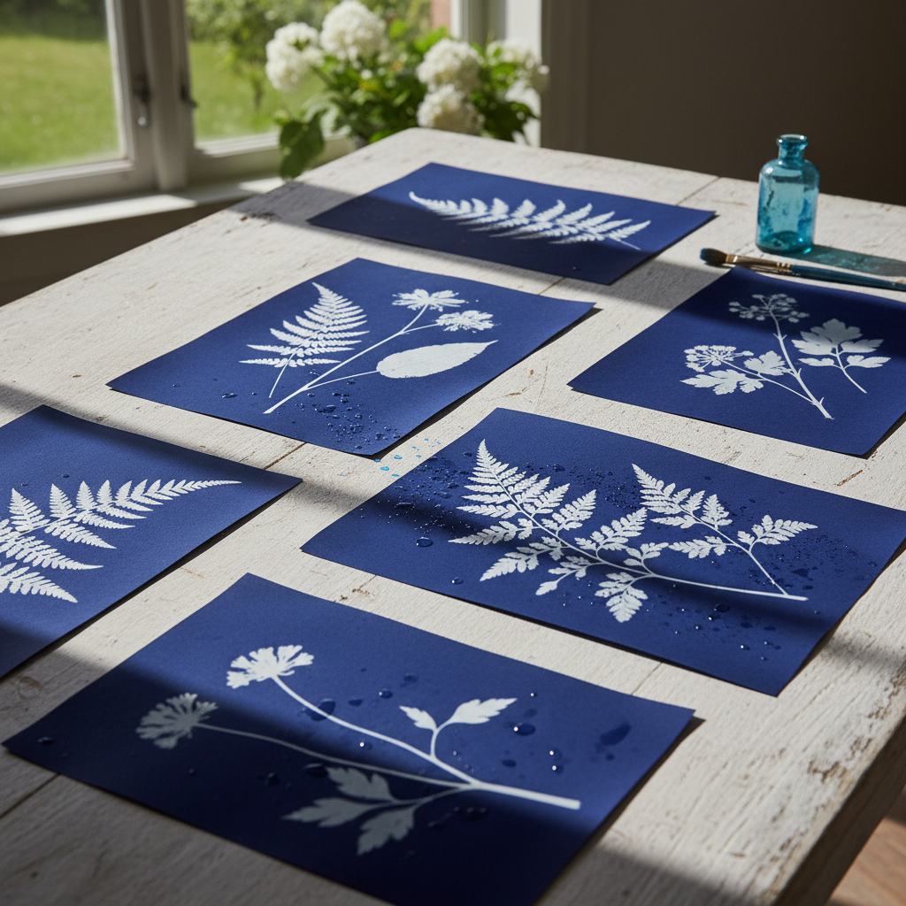

# Cyanotype 蓝晒法

> "The sun is the artist's collaborator in cyanotype — light itself becomes the brush." — Anna Atkins

## 概述

蓝晒法（Cyanotype）是一种利用紫外线和铁盐化学反应在纸上创造普鲁士蓝色图像的古老摄影印刷技法。1842年由约翰·赫歇尔爵士发明，安娜·阿特金斯随后用它创作了世界上第一本摄影书——记录英国藻类的蓝色植物标本。蓝晒法以其独特的深蓝色调、简单的操作和阳光参与的诗意成为最受欢迎的替代摄影工艺之一。

蓝晒法的诗意在于：它是阳光的直接记录——每一张蓝晒都是太阳在那个特定时刻、那个特定地点留下的印记。

## 核心特征

| 特征 | 描述 |
|------|------|
| 蓝色 | 独特的普鲁士蓝色调 |
| 光敏 | 利用紫外线曝光 |
| 接触 | 接触印刷——物体直接放在纸上 |
| 简单 | 操作相对简单 |
| 阳光 | 需要阳光或紫外光源 |
| 永久 | 图像相当持久 |

## 视觉特征

- **蓝色**：深沉的普鲁士蓝
- **白色**：未曝光区域的纯白
- **剪影**：物体的清晰剪影
- **细节**：透明物体的精细细节
- **渐变**：半透明物体的蓝色渐变
- **质感**：纸张和化学反应的质感

## 代表作品

| 作品 | 艺术家 | 年代 | 意义 |
|------|--------|------|------|
| *Photographs of British Algae* | Anna Atkins | 1843 | 第一本摄影书 |
| *Botanical cyanotypes* | Anna Atkins | 1843-53 | 植物蓝晒的经典 |
| *Blueprint drawings* | 工程师们 | 1870s-1940s | 蓝图——工程应用 |
| *Contemporary cyanotypes* | Christian Marclay | 2000s+ | 当代蓝晒艺术 |
| *Large-scale cyanotypes* | Various | 2010s+ | 大尺度蓝晒实验 |

## 历史时间线

| 时期 | 事件 |
|------|------|
| 1842 | Herschel发明蓝晒法 |
| 1843 | Anna Atkins——第一本摄影书 |
| 1870s-1940s | 蓝图——工程制图的标准 |
| 1960s-70s | 艺术家重新发现蓝晒法 |
| 1990s+ | 替代摄影工艺运动 |
| 当代 | 蓝晒法的艺术复兴 |

## 中国语境

蓝晒法在中国主要在摄影艺术教育和替代摄影工艺圈中流行。中国的摄影艺术家和手工书创作者使用蓝晒法创作。蓝晒的蓝色与中国传统的靛蓝染色有视觉上的呼应。当代中国的实验摄影和手工印刷运动中，蓝晒法是最受欢迎的替代工艺之一。

## AI生成概念图

## 与其他风格的关系

- **Photography** → 蓝晒是最早的摄影工艺之一
- **Botanical Art** → 植物蓝晒是经典题材
- **Alternative Process** → 替代摄影工艺的代表
- **Printmaking** → 蓝晒是一种印刷形式
- **Sun Art** → 阳光参与的艺术
- **Blueprint** → 蓝图是蓝晒的工程应用

---

*浮光艺志 | Chronicle of Artistry*
