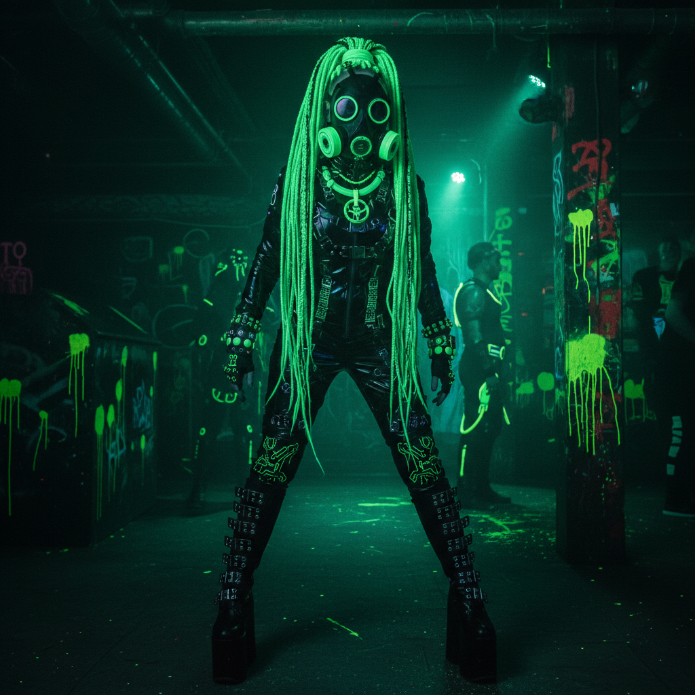

# Cyber Goth 赛博哥特



> **"荧光假发、防毒面具、工业舞步——当哥特遇上赛博朋克。"**

## 概述

| 维度 | 描述 |
|------|------|
| 时期 | 1990s–至今 |
| 别名 | Cyber Goth, Cybergoth, Industrial Goth |
| 核心色彩 | 黑色+荧光色（绿、粉、蓝、紫） |
| 关键元素 | 荧光假发/发片、防毒面具、PVC、护目镜 |
| 代表人物 | 工业音乐场景、Cyberdog 品牌 |
| 关联风格 | Gothic, Industrial, Rave, Cyberpunk |

---

## 历史脉络

| 年份 | 事件 |
|------|------|
| 1990s | 哥特+锐舞文化融合——Cyber Goth 诞生 |
| 1994 | Cyberdog 品牌在伦敦 Camden 开店 |
| 2000s | 全盛期——工业俱乐部场景 |
| 2006 | "Cyber Goth dancing under bridge" 视频走红 |
| 2010s | 衰落但从未消失 |
| 2020s | 作为怀旧美学被重新发现 |

### 核心哲学

Cyber Goth 的精神是**"未来是黑暗的——但黑暗中有荧光"**：
- 哥特 + 未来 = Cyber Goth
- 黑暗 + 荧光 = 视觉冲击
- 工业 = 音乐基础（EBM、Industrial）
- 防毒面具 = "空气有毒"（反乌托邦）
- "我们是末日后的幸存者——但我们跳舞"

---

## 视觉语法

### 色彩系统

```
主色：
  黑色 (#000000) — 基底（必须）
  荧光绿 (#39FF14) — 最经典搭配
  荧光粉 (#FF69B4) — 第二经典
  荧光蓝 (#00BFFF) — 赛博感
  紫色 (#9400D3) — UV 反应

规则：
  - 黑色 + 一种荧光色 = 基本公式
  - 荧光色在UV灯下发光
  - 对比越强越好
  - PVC/乙烯基的光泽

质感：
  PVC — 光泽、未来
  网眼 — 层叠、透视
  毛绒 — 假发、腿套
  塑料 — 护目镜、配饰
  金属 — 链条、铆钉
```

### 标志性元素

| 类别 | 元素 |
|------|------|
| 头部 | 荧光假发/发片、护目镜、防毒面具 |
| 服装 | PVC紧身衣、网眼层叠、平台靴 |
| 配饰 | 荧光管饰、链条、UV反应首饰 |
| 舞蹈 | 工业舞步（手臂旋转） |
| 音乐 | EBM、Industrial、Aggrotech |
| 态度 | 未来、黑暗、反叛、舞蹈 |

---

## 与千禧怀旧的关系

### 2000s 亚文化的视觉极端
- Cyber Goth = 2000s 最"视觉冲击"的亚文化之一
- "桥下跳舞"视频 = 早期病毒视频经典
- 与 Emo/Scene 同时代但完全不同
- "2000s 的互联网让我们第一次看到这些人"

### 与 Rave 文化的交叉
- Rave = 快乐、PLUR、彩色
- Cyber Goth = 黑暗版 Rave
- 两者共享"荧光""舞蹈""电子音乐"
- Cyber Goth = "如果 Rave 发生在末日之后"

---

## 中国语境

- 与中国"赛博朋克"审美的交叉
- 中国电子音乐/俱乐部场景
- 与中国"暗黑系"时尚的关系
- 荧光元素在中国夜店文化中的存在

---

## 设计应用

| 场景 | 应用方式 |
|------|----------|
| 音乐 | 工业/EBM 视觉+俱乐部+海报 |
| 时尚 | 黑色+荧光+PVC+护目镜+未来 |
| 活动 | UV派对+工业俱乐部+荧光装饰 |
| 数字 | 黑色+荧光+故障+工业+未来 |

---

## 相关风格

← [Gothic 哥特美学](gothic.md) | [Industrial 工业风](industrial.md) →

↑ [返回千禧怀旧目录](README.md) | [返回总目录](../README.md)
