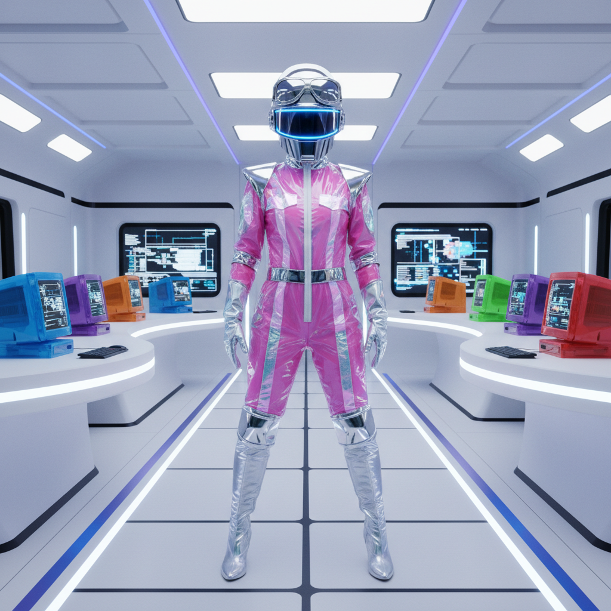

# Cyber Y2K | 赛博千禧风

## 概述

- **时间跨度**：1997 – 2004（回潮：2020s）
- **发源地**：全球科技文化、电子音乐圈
- **核心理念**：对数字未来的极度乐观——PVC、金属、霓虹、赛博空间
- **别名**：Cybercore、Kaybug、Y2K Futurism（狭义）

## 历史背景

Cyber Y2K 是Y2K美学中最"硬核"的分支，直接受到《黑客帝国》(1999)、《第五元素》(1997) 等科幻电影以及电子音乐文化的影响。它代表了千禧年前后人们对"数字未来"最狂热的想象：人类将与机器融合，赛博空间将成为新的现实。

在时尚领域，Thierry Mugler、Paco Rabanne、Hussein Chalayan 等设计师将这种未来主义推向极致。在日常层面，它表现为PVC材质的服装、金属色配饰、护目镜式太阳镜。

## 视觉特征

### 核心元素
- **PVC/乙烯基材质**：透明或金属色的塑料服装
- **护目镜（Goggles）**：赛博朋克标配
- **金属色**：铬银、钛金属灰
- **LED灯饰**：发光的配饰和服装
- **线缆与管道**：作为装饰元素
- **CGI blob形态**：早期3D渲染的有机形状
- **iMac G3美学**：半透明彩色塑料

### 色彩
- 铬银、冰蓝、电光蓝
- 搭配黑色和白色
- 荧光绿（Matrix绿）
- 半透明材质的糖果色

### 与相关风格的区别

| 风格 | 关键差异 |
|------|----------|
| Cyber Y2K | 科技乐观、未来主义、干净 |
| Cyberpunk | 反乌托邦、肮脏、阶级对立 |
| Metalheart | 更暗、更抽象、更艺术化 |
| Chromecore | 专注于铬色产品设计 |

## 代表案例

| 领域 | 代表 | 说明 |
|------|------|------|
| 电影 | The Matrix (1999) | 赛博美学的巅峰 |
| 电影 | The Fifth Element (1997) | Jean Paul Gaultier的未来时装 |
| 时装 | Thierry Mugler | 机器人女战士高定 |
| 时装 | Paco Rabanne | 金属片连衣裙 |
| 产品 | iMac G3 (1998) | 半透明彩色塑料的标志 |
| 音乐 | Daft Punk | 机器人头盔+电子乐 |
| 游戏 | Rez (2001) | 线框赛博空间 |

## 文化内核

Cyber Y2K 是**技术乌托邦主义的视觉化**。在互联网泡沫破裂之前，人们真诚地相信数字技术将带来一个更美好的世界。这种乐观在2001年后逐渐消退，但它留下的视觉遗产——半透明塑料、有机曲线、铬色光泽——至今仍在影响设计。

## 图片画廊

| | |
|:---:|:---:|
|  | |
| *赛博千禧风 · PVC与铬银未来* | |

## 延伸阅读

- [Y2K Futurism | Aesthetics Wiki](https://aesthetics.fandom.com/wiki/Y2K_Futurism)
- CARI Institute: Y2K Aesthetic Research

---

[← Harajuku Y2K](harajuku-y2k.md) | [↑ 返回目录](README.md)
