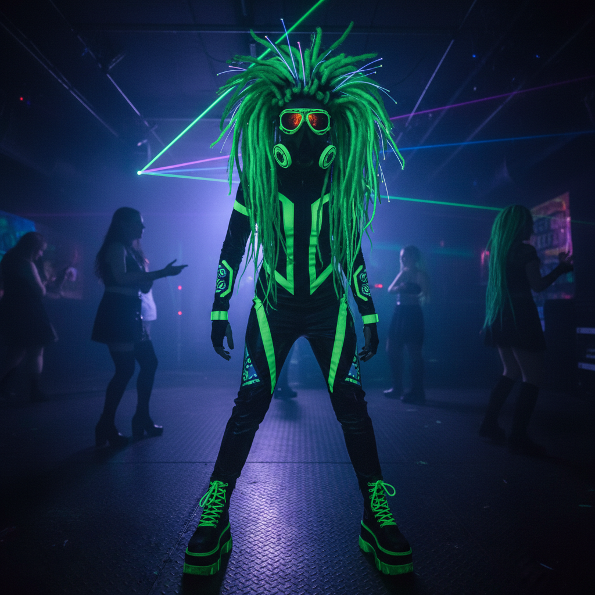
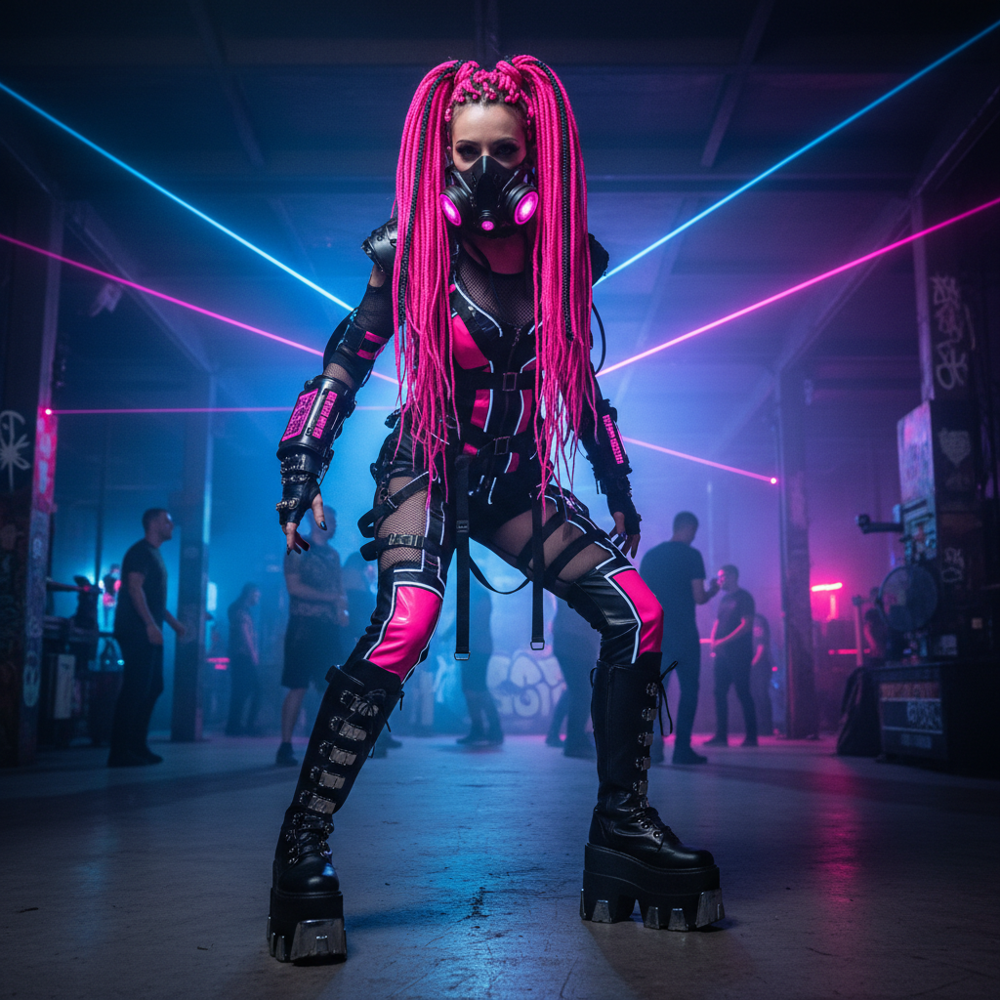

# Cybergoth 赛博哥特





> **"工业音乐遇见荧光管——在废墟上跳舞的未来部落。"**

## 概述

| 维度 | 描述 |
|------|------|
| 时期 | 1999–2012（鼎盛期 2004–2009） |
| 别名 | Cyber Goth, Industrial Goth, Neon Goth |
| 核心色彩 | 黑色 + 荧光绿/粉/蓝/紫（任选一种点缀色） |
| 关键元素 | 荧光假发辫、护目镜、防毒面具、平台靴、PVC |
| 代表人物 | Cyberdog 品牌、VNV Nation、Combichrist |
| 关联风格 | Mall Goth, Nu-Rave, Dark Y2K, Emo |

---

## 历史脉络

### 前史：哥特与电子的平行宇宙（1980s–1990s）

Cybergoth 的两条根脉在 1980 年代就已经存在，只是尚未交汇：

**哥特一脉**：
- Bauhaus、Siouxsie and the Banshees、The Sisters of Mercy
- 黑色、死亡、浪漫主义、维多利亚时代的怀旧
- 伦敦 Batcave 俱乐部（1982–1985）奠定了哥特俱乐部文化

**电子/工业一脉**：
- Throbbing Gristle、Cabaret Voltaire、Front 242
- 机器噪音、身体政治、反消费主义
- 芝加哥/底特律的 Acid House 和 Techno 运动

1990年代，这两条线开始交叉：
- **Front Line Assembly** 和 **Skinny Puppy** 将工业音乐带向更电子化的方向
- **The Prodigy** 的视觉风格（荧光色+暗黑态度）预示了 Cybergoth
- 德国的 **Wave-Gotik-Treffen** 音乐节（1992年起）成为两种文化交汇的物理空间

### 起源：哥特与锐舞的碰撞（1999–2003）

Cybergoth 诞生于 1990 年代末英国和德国的地下俱乐部场景。它是传统哥特文化（黑色、死亡、浪漫主义）与锐舞文化（电子音乐、荧光色、药物）的直接杂交产物。

"Cybergoth" 这个词最早出现在 1988 年 Games Workshop 的桌游《Dark Future》设定中，但作为一种真实的亚文化风格，它在 1999 年前后才真正成形——恰好是千禧年交替的时刻。

关键诞生地：
- **伦敦 Slimelight 俱乐部**：每周六的 EBM/Industrial 之夜
- **柏林 Tresor 俱乐部**：Techno + 工业的交叉地带
- **莱比锡 Wave-Gotik-Treffen**：年度朝圣地

### 鼎盛期：2004–2009

这是 Cybergoth 最具辨识度的时期：

**零售与品牌**：
- **Cyberdog**（伦敦 Camden Town）：荧光色 PVC 服装、UV 反应面料、LED 配件。这家店本身就是一个沉浸式体验——店内有 DJ 台、黑光灯、和跳舞的店员。
- **Lip Service**（洛杉矶）：更偏向哥特+赛博的混合
- **Demonia/Pleaser**：超厚底平台靴的主要供应商
- **New Rock**：西班牙品牌，金属装饰的哥特靴

**音乐节与俱乐部**：
- **Wave-Gotik-Treffen**（德国莱比锡）：每年 2 万人参加，Cybergoth 占据半壁江山
- **M'era Luna**（德国希尔德斯海姆）：工业/哥特音乐节
- **Infest**（英国布拉德福德）：纯 EBM/工业电子
- **Kinetik**（加拿大蒙特利尔）：北美最大的工业电子音乐节

**互联网传播**：
- **YouTube 早期**（2006–2009）的 "Industrial Dance" 视频获得数百万播放
- **MySpace** 上的 Cybergoth 社区蓬勃发展
- **VampireFreaks.com**：哥特/工业亚文化的专属社交网络

### 衰落（2010–2015）

多重因素导致 Cybergoth 的衰落：
1. **MySpace 的死亡**：失去了核心社交平台
2. **EDM 的主流化**：电子音乐不再需要亚文化身份
3. **快时尚的稀释**：H&M 开始卖"哥特风"，亚文化失去排他性
4. **meme 化**：Cybergoth 在桥下跳舞的视频成为嘲讽对象

### 遗产与影响（2015–至今）

Cybergoth 虽然作为活跃亚文化已经衰落，但它的视觉遗产渗透到了：
- 赛博朋克游戏和电影的角色设计（《赛博朋克2077》）
- EDM 音乐节的装扮文化（尤其是 Burning Man）
- 当代 "techwear" 和暗黑街头风
- K-pop 的舞台造型（尤其是 SM Entertainment 的视觉系统）
- Billie Eilish 早期的荧光绿+黑色配色

---

## 视觉语法

### 色彩系统

```
基底：纯黑 (#000000) — 占70%以上

点缀色（通常只选一种，这是身份标识）：
  - 荧光绿 (#39FF14) — 最经典，"Matrix green"
  - 荧光粉 (#FF1493) — 最常见于女性
  - 荧光蓝 (#00FFFF) — 冷色系选择
  - 紫外光紫 (#BF00FF) — 最"哥特"的选择
  - 荧光橙 (#FF4500) — 较少见但很抢眼
  - 荧光黄 (#DFFF00) — 最锐舞的选择

材质色：
  PVC 光泽黑 — 反光但不透明
  网眼透视 — 黑色网格
  UV 反应白 — 在黑光下发光

规则：
  - 一个人通常只选一种荧光色作为"签名色"
  - 黑色是画布，荧光色是签名
  - 在 UV 黑光下，荧光色会发光——这是设计的核心考量
```

### 标志性装备（从头到脚）

| 部位 | 装备 | 功能/意义 |
|------|------|-----------|
| 头部 | 荧光色合成假发辫（dreadfalls） | 身份标识，制作耗时数小时 |
| 额头 | 焊工护目镜/飞行员护目镜 | 从不戴在眼睛上，纯装饰 |
| 面部 | 防毒面具/呼吸器面罩 | 后工业废土美学 |
| 眼睛 | 荧光色隐形眼镜 | 非人化效果 |
| 上身 | PVC 紧身衣/网眼上衣 | 身体展示+材质对比 |
| 手臂 | 荧光色手环堆叠（kandi） | 与锐舞文化的连接 |
| 腰部 | 工业风金属扣腰带 | 实用主义美学 |
| 下身 | 宽松工装裤（带荧光绑带）或 PVC 紧身裤 | 两种路线：工业 vs 哥特 |
| 鞋履 | 超厚底平台靴（10-15cm） | New Rock 或 Demonia |
| 全身 | LED 发光配件 | 在暗处的可见性 |

### 与其他哥特分支的区别

| 分支 | 音乐根基 | 色彩 | 态度 | 时代感 |
|------|----------|------|------|--------|
| 传统哥特 | 后朋克、暗潮 | 纯黑+深红 | 忧郁、浪漫 | 维多利亚 |
| Mall Goth | 新金属 | 黑+红 | 叛逆、愤怒 | 2000s 商场 |
| **Cybergoth** | **EBM、工业电子** | **黑+荧光** | **未来、部落** | **后工业废土** |
| Pastel Goth | 独立电子 | 黑+粉紫 | 可爱、矛盾 | Tumblr 时代 |
| Steampunk | 无特定 | 棕+铜 | 复古、手工 | 维多利亚科幻 |

---

## 音乐基础

Cybergoth 的音乐根基是 EBM (Electronic Body Music) 和工业电子：

### 核心流派

| 流派 | 代表艺人 | 特征 |
|------|----------|------|
| EBM | Front 242, Nitzer Ebb, VNV Nation | 重复贝斯线+电子鼓+喊叫式人声 |
| Aggrotech | Combichrist, Hocico, Suicide Commando | 更重、更快、更暴力的 EBM |
| Futurepop | Apoptygma Berzerk, Covenant, Icon of Coil | EBM + Synthpop，更旋律化 |
| Industrial | KMFDM, Ministry, Skinny Puppy | 金属吉他+电子节拍+噪音 |
| Dark Electro | Velvet Acid Christ, Wumpscut | 阴暗氛围+电子节拍 |
| Harsh EBM | Noisuf-X, X-Fusion | 极端失真+高速节拍 |

### Industrial Dance

舞蹈风格极具辨识度——"Industrial Dance" 是一种结合了武术动作、机械重复和地板动作的独特舞蹈形式：
- **手臂动作**：快速、精确、像机器人一样的挥臂
- **脚步**：stomping（重踏）+ sliding（滑步）
- **身体**：机械式的扭转和弯曲
- **哲学**：身体作为机器，舞蹈作为程序执行

YouTube 上最著名的 Industrial Dance 视频（如 "Cybergoth Dance Party" 系列）累计播放量超过 1 亿次。

---

## DIY 文化与制作

Cybergoth 是一种**高度 DIY** 的亚文化。几乎所有标志性装备都需要手工制作：

### Dreadfalls（假发辫）制作

材料：合成假发纤维（Kanekalon）、橡皮筋、发夹
工时：一套完整的 dreadfalls 需要 8-20 小时手工制作
技法：扭转法、钩针法、缠绕法
成本：自制约 200-500 元材料费，购买成品 1000-3000 元

### 服装改造

- 在普通黑色服装上添加荧光色绑带/管线
- PVC 面料的裁剪和热封
- LED 灯条的缝入和电路设计
- 反光材料的应用

---

## 中国语境

Cybergoth 在中国从未形成大规模亚文化社群，但它的视觉影响可以在以下地方找到：

### 直接影响
- 2000年代中后期北京、上海的地下电子音乐派对（如北京 Dada Bar）
- 淘宝上的"暗黑系"和"赛博朋克"服装店铺
- B站上的工业舞蹈翻跳视频（搜索"工业舞"有数千条结果）
- ChinaJoy 和漫展上的 Cybergoth cosplay

### 间接影响
- 国产赛博朋克游戏和动画中的角色设计
- 抖音上的"赛博朋克妆容"教程
- 电音节（如 INTRO、MDSK）的装扮文化
- 密室逃脱/沉浸式剧场中的后工业视觉

---

## 为什么它属于千禧怀旧？

Cybergoth 是千禧年交替时期最极端的视觉亚文化之一。它代表了一种已经消失的态度：**在互联网尚未完全连接一切的时代，亚文化身份需要通过极端的身体装饰来宣示**。

### 消失的"高成本身份"

今天，你可以通过一个 Instagram 滤镜获得"赛博"感，但在 2005 年，你需要：
- 花 3 个小时绑假发辫
- 穿上 10 公斤的平台靴
- 戴上防毒面具
- 在 UV 灯下检查所有荧光色是否正确发光

才能在俱乐部里成为一个 Cybergoth。这种"高成本身份表演"本身就是一种已经消失的文化形态。

### 前社交媒体的身体政治

Cybergoth 的身体改造是**不可撤销的**（至少在一个晚上内）。你不能像切换 Instagram 滤镜一样切换 Cybergoth 身份。这种"承诺感"——愿意为一种美学付出真实的时间、金钱和身体不适——是前社交媒体时代亚文化的核心特征。

---

## 延伸阅读

- Aesthetics Wiki: [Cybergoth](https://aesthetics.fandom.com/wiki/Cybergoth)
- 纪录片《Industrial Soundtrack for the Urban Decay》(2015)
- Cyberdog London 品牌历史
- Mick Mercer《Music to Die For》— 哥特音乐百科
- 《Goth: Identity, Style and Subculture》(Paul Hodkinson, 2002)

---

## 相关风格

← [Mall Goth 商场哥特](mall-goth.md) | [Nu-Rave 新锐舞](nu-rave.md) →

↑ [返回千禧怀旧目录](README.md) | [返回总目录](../README.md)
