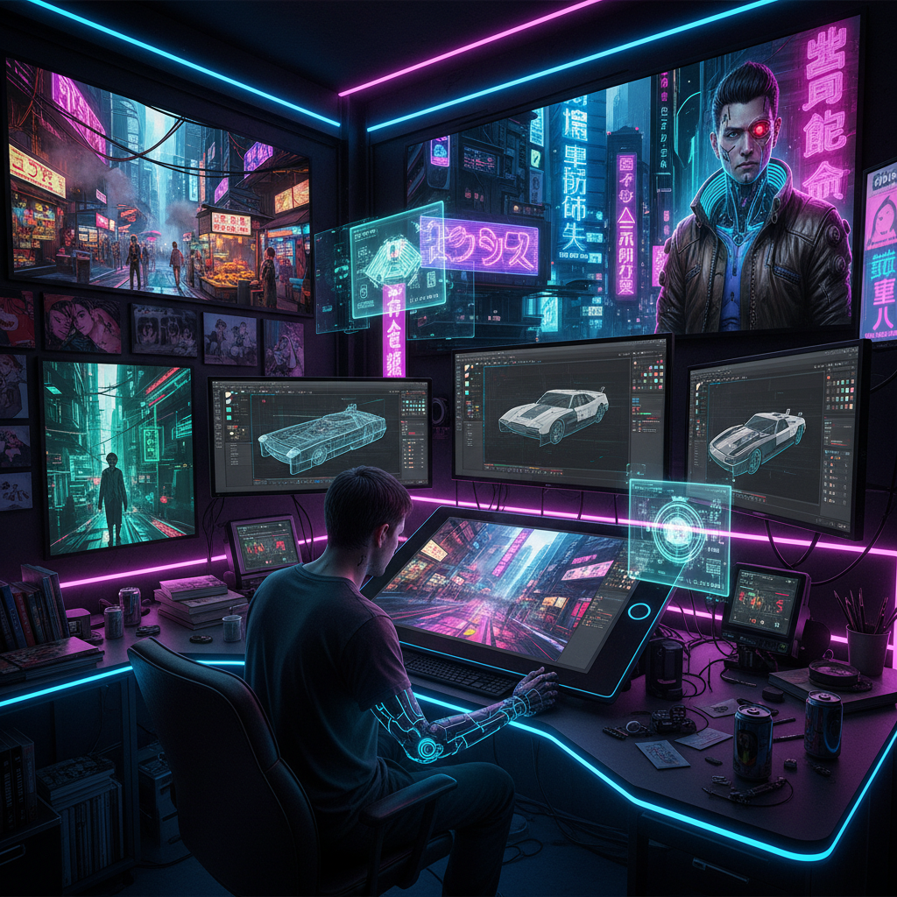

# Cyberpunk Art 赛博朋克艺术

> "Cyberpunk is the neon-lit nightmare of high tech and low life — a future where corporations own everything, hackers fight from the margins, the human body is augmented with chrome and silicon, rain-slicked streets reflect holographic advertisements in languages you cannot read, and the only freedom left is in the cracks of the system, a vision born from the collision of William Gibson's prose, Ridley Scott's rain, and the anxiety of a world racing toward a future it cannot control." — Unknown

## 概述

赛博朋克（Cyberpunk）是1980年代兴起的一种科幻亚文化和美学风格，描绘一个高度技术化但社会极度不平等的近未来世界——"高科技，低生活"（high tech, low life）。赛博朋克的视觉世界充满了霓虹灯、全息广告、赛博格身体改造、巨型企业建筑、拥挤的亚洲风格街道和永恒的雨夜。

赛博朋克的文学起源包括威廉·吉布森（William Gibson）的《神经漫游者》（Neuromancer, 1984）和菲利普·K·迪克（Philip K. Dick）的作品。在视觉领域，雷德利·斯科特（Ridley Scott）的电影《银翼杀手》（Blade Runner, 1982）确立了赛博朋克的视觉范式——永恒的雨夜、巨型霓虹广告、东西方文化混合的街景。赛博朋克后来在动漫（《攻壳机动队》《阿基拉》）、游戏（《赛博朋克2077》）和当代艺术中持续发展。

## 核心特征

| 特征 | 描述 |
|------|------|
| 高科技 | 先进的信息技术 |
| 低生活 | 社会底层的生存 |
| 企业 | 巨型企业的统治 |
| 赛博格 | 人体的机械改造 |
| 黑客 | 黑客和反抗者 |
| 反乌托邦 | 反乌托邦的社会 |

## 视觉特征

- **霓虹**：霓虹灯和发光标志
- **雨夜**：永恒的雨夜氛围
- **城市**：密集的垂直城市
- **全息**：全息投影和广告
- **改造**：身体的机械改造
- **混合**：东西方文化混合

## 代表作品

| 作品 | 艺术家 | 年代 | 意义 |
|------|--------|------|------|
| *Blade Runner* | Ridley Scott / Syd Mead | 1982 | 赛博朋克视觉范式 |
| *Ghost in the Shell* | Masamune Shirow | 1989 | 攻壳机动队 |
| *Akira* | Katsuhiro Otomo | 1988 | 大友克洋的阿基拉 |
| *Neuromancer covers* | Various | 1984起 | 神经漫游者的封面艺术 |
| *Cyberpunk 2077* | CD Projekt Red | 2020 | 赛博朋克2077的视觉设计 |

## 历史时间线

| 时期 | 事件 |
|------|------|
| 1982 | 《银翼杀手》上映 |
| 1984 | 吉布森《神经漫游者》出版 |
| 1988-95 | 日本赛博朋克动漫黄金期 |
| 2000年代 | 赛博朋克的游戏化 |
| 当代 | 赛博朋克的持续影响 |

## 中国语境

赛博朋克在中国有极其丰富的文化回响。中国的超大城市（如深圳、重庆、香港）本身就被国际社会视为"赛博朋克现实"——密集的霓虹灯、垂直的城市空间、高科技与日常生活的混合。中国的科幻文学和影视中有大量赛博朋克元素。中国的游戏产业也积极创作赛博朋克风格的作品。有趣的是，赛博朋克原始文本中的"亚洲美学"（日本和中国元素）使得中国观众对赛博朋克有一种特殊的亲近感和批判性距离。中国的一些当代艺术家和设计师也在创作"中国赛博朋克"——将中国传统元素与赛博朋克美学融合。

## AI生成概念图

## 与其他风格的关系

- **Solarpunk** → 太阳朋克（对立面）
- **Steampunk** → 蒸汽朋克
- **Science Fiction Art** → 科幻艺术
- **Neon Art** → 霓虹艺术
- **Digital Art** → 数字艺术
- **Dystopian Art** → 反乌托邦艺术

---

*浮光艺志 | Chronicle of Artistry*
