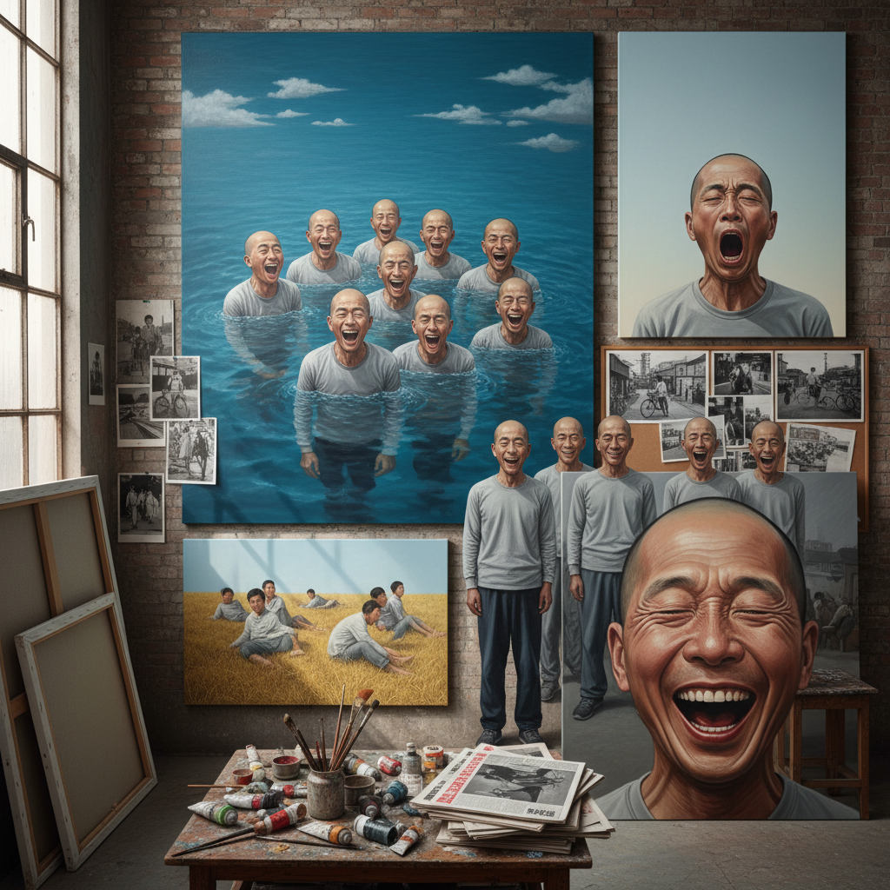

# Cynical Realism Art 玩世现实主义艺术

> "Cynical Realism is the art of the knowing smirk — of painters who watched China's ideological certainties collapse and responded not with anger or grief but with a shrug and a grin, who painted figures laughing at nothing, yawning through history, grinning with the vacant contentment of people who have given up on meaning and found a strange freedom in meaninglessness, an art that captures the spiritual condition of a generation caught between the death of communism and the birth of consumerism, too smart for belief and too comfortable for revolution, choosing irony as a survival strategy in a world where sincerity had become dangerous." — Unknown

## 概述

玩世现实主义（Cynical Realism / 玩世现实主义）是1990年代初在中国兴起的一个重要艺术运动，与政治波普同期发展但采取了不同的策略。代表艺术家包括方力钧、岳敏君、刘炜和杨少斌。玩世现实主义以其标志性的"傻笑"面孔和无聊的日常场景著称——画面中的人物通常表现出一种空洞的笑容、打哈欠或无所事事的状态。

玩世现实主义的核心态度是"无聊"和"无所谓"——面对意识形态的崩塌和社会的剧变，这些艺术家选择了一种犬儒主义的姿态：既不反抗也不顺从，而是以一种戏谑的冷漠来回应一切。方力钧的光头形象和岳敏君的大笑人物成为了这一运动最具辨识度的视觉符号。评论家栗宪庭将这种态度命名为"玩世现实主义"，认为它反映了后89一代中国知识分子的精神状态。

## 核心特征

| 特征 | 描述 |
|------|------|
| 犬儒 | 犬儒主义的态度 |
| 无聊 | 无聊和空虚 |
| 笑容 | 空洞的笑容 |
| 日常 | 无意义的日常 |
| 反讽 | 反讽和戏谑 |
| 写实 | 写实的技法 |

## 视觉特征

- **光头**：光头的男性形象
- **笑容**：夸张的空洞笑容
- **哈欠**：打哈欠的人物
- **群体**：无差别的群体
- **天空**：空旷的天空背景
- **肉色**：大面积的肉色

## 代表作品

| 作品 | 艺术家 | 年代 | 意义 |
|------|--------|------|------|
| *Series 2* | 方力钧 | 1992 | 方力钧的光头系列 |
| *Execution* | 岳敏君 | 1995 | 岳敏君的大笑处决 |
| *Swimming* | 方力钧 | 1994 | 方力钧的游泳系列 |
| *Garbage* | 刘炜 | 1990年代 | 刘炜的肉体绘画 |
| *Red Guards* | 杨少斌 | 1990年代 | 杨少斌的暴力场景 |

## 历史时间线

| 时期 | 事件 |
|------|------|
| 1991-92 | 方力钧开始光头系列 |
| 1993 | 威尼斯双年展的国际曝光 |
| 1993 | 栗宪庭命名"玩世现实主义" |
| 1990年代中后 | 运动的高峰期 |
| 2000年代 | 市场价格的飙升 |

## 中国语境

玩世现实主义是中国当代艺术中最具本土性的运动之一——它直接回应了中国特定的历史经验：从集体主义理想的崩塌到市场经济的冲击，从政治高压到精神真空。玩世现实主义的"笑"不是快乐的笑，而是一种防御性的、自嘲的、甚至是绝望的笑——它反映了一代人在失去信仰之后的精神状态。这种态度在中国社会中有广泛的共鸣，也预示了后来的"佛系"和"躺平"文化。玩世现实主义在国际市场上的成功也引发了关于"中国性"和"东方主义"的讨论——西方收藏家是否在消费中国的政治创伤？

## AI生成概念图

## 与其他风格的关系

- **Political Pop** → 政治波普
- **Pop Art** → 波普艺术
- **Photorealism** → 照相写实主义
- **Chinese Contemporary** → 中国当代艺术
- **Neo-Expressionism** → 新表现主义
- **Social Realism** → 社会现实主义

---

*浮光艺志 | Chronicle of Artistry*
