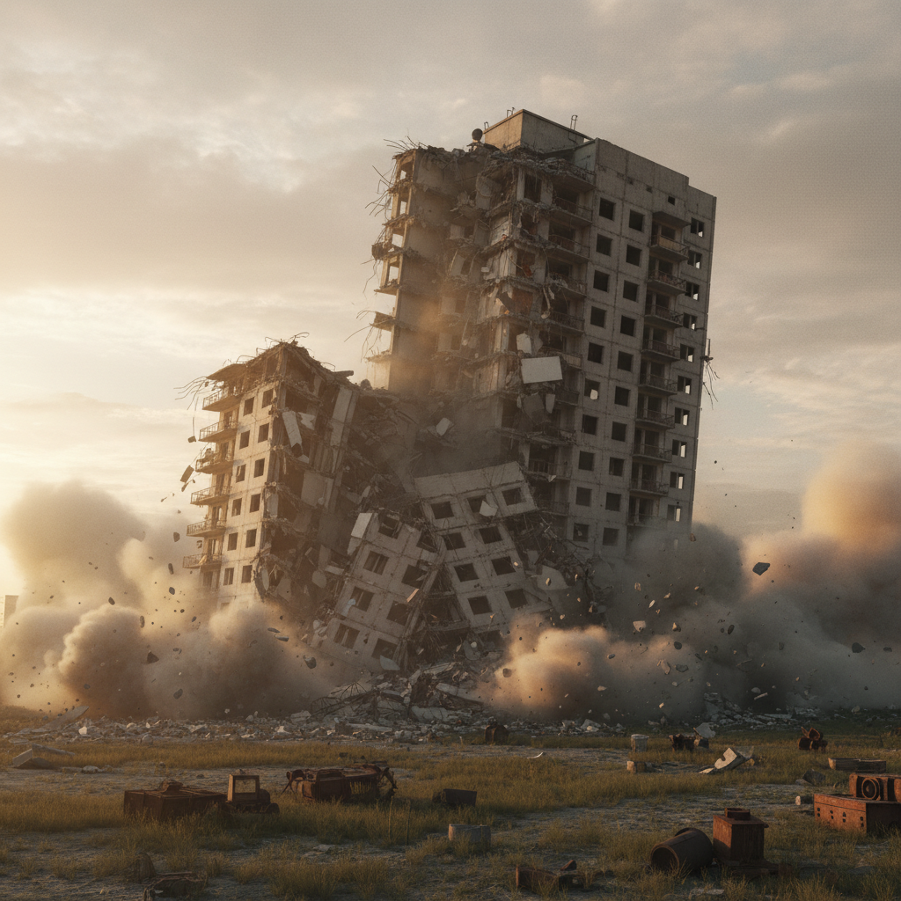

# Cyprien Gaillard 西普里安·盖拉尔

> **时期：** 1980–至今  
> **关键词：** 废墟浪漫主义、建筑暴力、数字考古、啤酒与混凝土

## 概述

Cyprien Gaillard 是法国艺术家，以探索建筑废墟和城市暴力的浪漫主义而闻名。他拍摄苏联时期公寓楼的爆破拆除、用啤酒箱搭建金字塔、在VR中重建被摧毁的古迹——将当代城市的破坏与古典废墟美学连接起来。

## 风格特征

- **爆破美学**：建筑拆除的慢动作影像如同浪漫主义风景画
- **数字考古**：用3D扫描和VR重建消失的建筑和雕塑
- **材料对比**：啤酒、混凝土、棕榈树等意外材料组合
- **新浪漫主义**：用当代技术重新诠释废墟崇拜
- **城市暴力**：足球流氓、拆迁、涂鸦等城市冲突

## 代表作品

- *Desniansky Raion*（2007）
- *Nightlife*（2015，3D电影）
- *Ocean II Ocean*（2019）
- *Humpty Dumpty*（2021）

## 概念图

