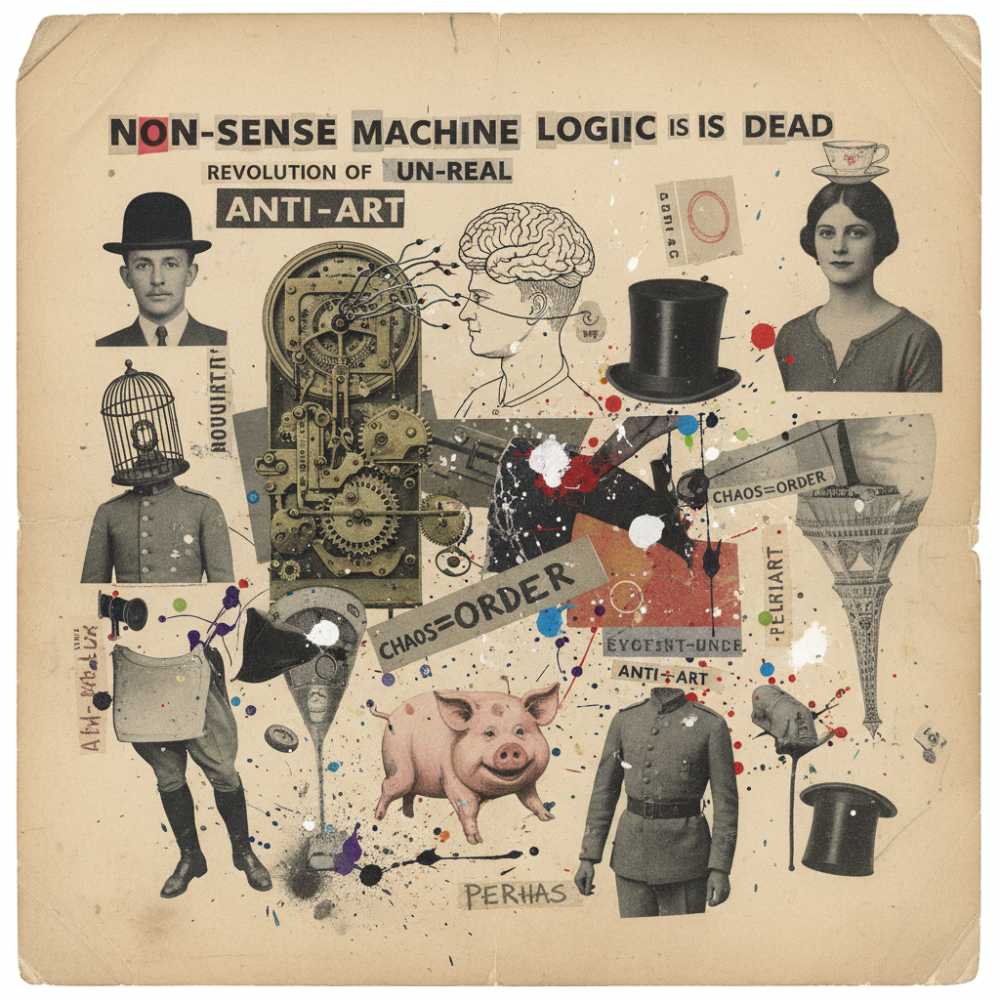

# Dadaism Painting 达达主义绘画

> **时期：** 1916年–1924年  
> **关键词：** 反艺术、荒诞、偶然性、拼贴、苏黎世

## 概述

Dadaism（达达主义）是一战期间在苏黎世诞生的反艺术运动——面对战争的疯狂，艺术家们用更大的疯狂来回应。杜尚给蒙娜丽莎画胡子、施维特斯用垃圾做拼贴、阿尔普用偶然法则创作——达达不是一种风格，而是一种态度：如果世界已经荒诞，那么"艺术"这个概念本身就是最大的笑话。

## 风格特征

- **反美学**：故意丑陋和荒诞
- **偶然性**：随机和意外作为创作方法
- **拼贴**：现成物品的重新组合
- **文字游戏**：无意义的诗歌和排版
- **挑衅性**：以激怒观众为目的

## 代表人物与作品

- 马塞尔·杜尚《泉》（小便池）
- 库尔特·施维特斯 梅尔茨拼贴
- 汉斯·阿尔普 偶然拼贴
- 弗朗西斯·毕卡比亚 机械讽刺

## 概念图

