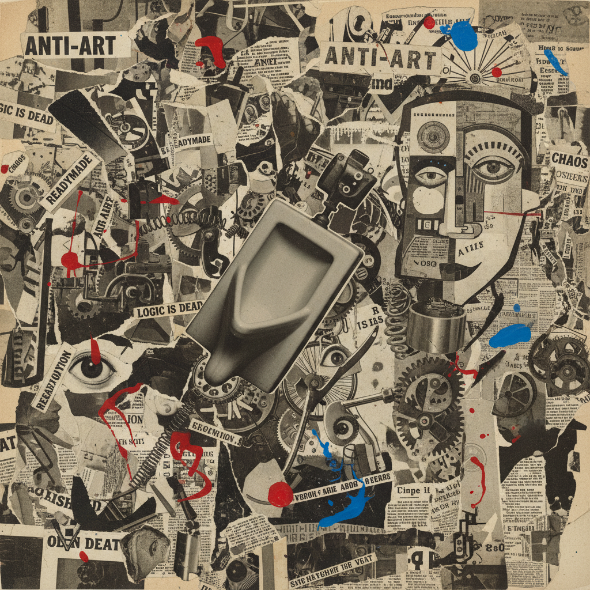

# Dadaism 达达主义



> **"艺术已死——我们在它的葬礼上跳舞——反一切、反逻辑、反艺术本身。"**

## 概述

| 维度 | 描述 |
|------|------|
| 时期 | 1916–1924/影响至今 |
| 别名 | Dada, Dadaism, Anti-Art, 达达主义 |
| 核心色彩 | 无规则——拼贴中的任何颜色、黑白印刷品 |
| 关键元素 | 反艺术、拼贴、现成品(readymade)、偶然性、荒诞 |
| 代表人物 | Marcel Duchamp, Tristan Tzara, Hannah Höch, Man Ray, Kurt Schwitters |
| 关联风格 | Surrealism, Punk, Fluxus, Conceptual Art, Collage Art |

---

## 历史脉络

| 年份 | 事件 |
|------|------|
| 1916 | 苏黎世 Cabaret Voltaire——达达诞生 |
| 1917 | Duchamp《泉》(小便池)——现成品革命 |
| 1918 | 柏林达达——政治化、拼贴 |
| 1920 | 巴黎达达——走向超现实主义 |
| 1924 | 达达"结束"——超现实主义接棒 |
| 1960s | Fluxus, Pop Art——达达精神复活 |
| 2020s | Meme文化 = 达达的数字后代 |

### 核心哲学

达达主义的精神是**"如果世界是荒诞的——艺术也应该是荒诞的"**：
- 反 = 立场（"反艺术、反逻辑、反战争、反一切'正确'"）
- 偶然 = 方法（"从报纸上随机剪字——这就是诗"）
- 现成品 = 革命（"小便池签个名 = 艺术——因为我说它是"）
- 荒诞 = 真实（"一战杀了千万人——这才是真正的荒诞"）
- Tzara: "达达什么都不意味——达达就是达达"

---

## 视觉语法

### 色彩系统

```
无规则——达达拒绝一切规则

常见材料色：
  报纸黑白 — 印刷品
  照片色 — 拼贴
  手写墨色 — 文字
  任何颜色 — 偶然

规则（反规则）：
  - 没有规则
  - 偶然决定一切
  - 材料决定颜色
  - 丑 = 美（如果美是规则的话）

质感：
  拼贴 — 剪贴、层叠
  印刷 — 报纸、海报
  照片 — 蒙太奇
  现成品 — 任何物体
```

### 标志性元素

| 类别 | 元素 |
|------|------|
| 技法 | 拼贴、蒙太奇、现成品、偶然诗 |
| 材料 | 报纸、照片、票据、垃圾、任何物品 |
| 态度 | 反艺术、荒诞、讽刺、破坏、自由 |
| 表演 | 朗诵、噪音音乐、挑衅 |
| 文字 | 无意义诗、随机排列、字体混搭 |
| 精神 | 反一切、偶然、荒诞、自由、革命 |

---

## 与千禧怀旧的关系

### Meme = 达达的数字后代
- Meme文化的荒诞 = 达达精神的互联网版本
- "Shitposting" = 数字时代的达达诗
- "达达在1916年发明了meme——只是当时没有互联网"
- 反讽、荒诞、拼贴 = 当代网络文化的核心

### 对当代艺术的影响
- Duchamp的"现成品" → 概念艺术 → 当代艺术
- "Duchamp是20世纪最重要的艺术家——因为他改变了'艺术是什么'的定义"
- 达达 → Punk → 所有反文化运动的视觉语言

---

## 中国语境

- 中国当代艺术中的达达精神
- 中国网络文化中的荒诞美学
- 中国"恶搞"文化与达达的关系
- 中国行为艺术中的达达影响

---

## 设计应用

| 场景 | 应用方式 |
|------|----------|
| 品牌 | 反叛+年轻+荒诞+讽刺+独特 |
| 杂志 | 拼贴+实验排版+混搭 |
| 音乐 | 专辑封面+MV+视觉实验 |
| 数字 | Meme+社交媒体+病毒传播 |

---

## 相关风格

← [Cubism 立体主义](cubism.md) | [Surrealism 超现实主义](surrealism.md) →

↑ [返回千禧怀旧目录](README.md) | [返回总目录](../README.md)
