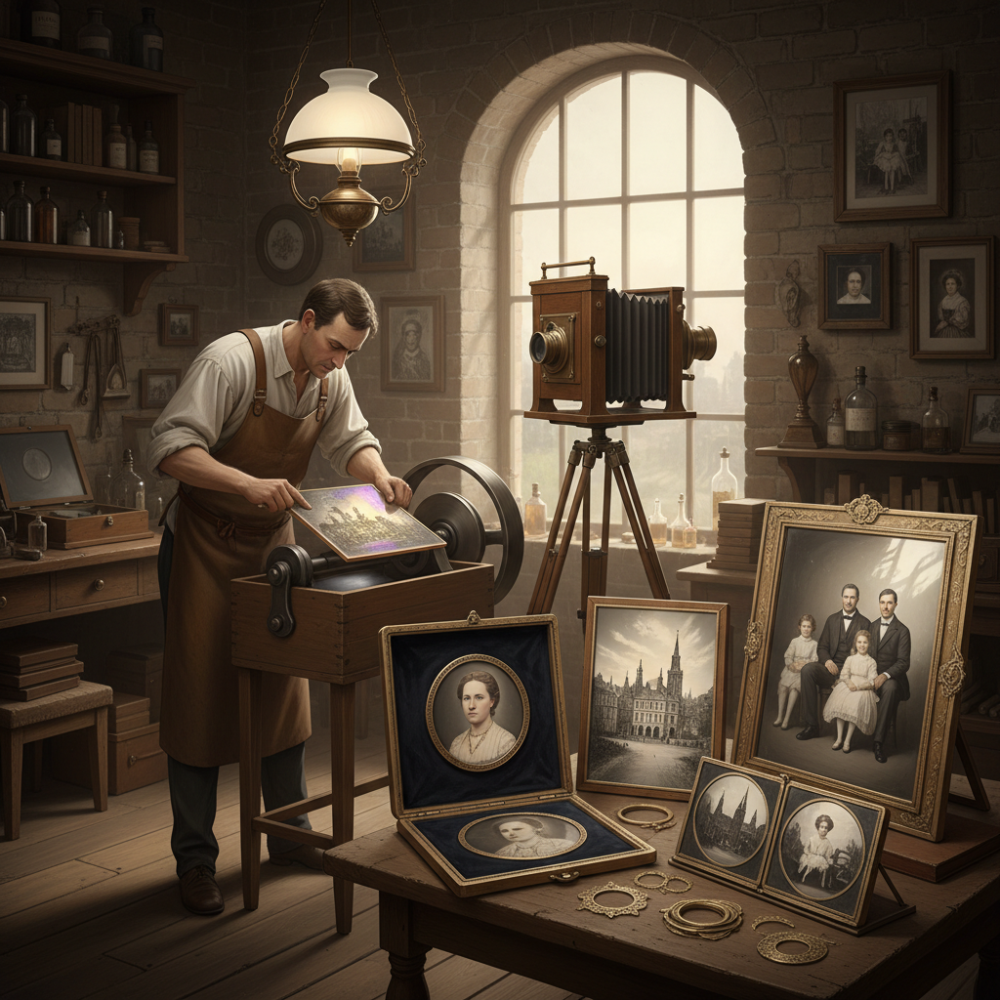

# Daguerreotype 达盖尔银版法

> "The daguerreotype is a mirror with a memory — a polished silver surface that captures reality with such impossible precision that viewers swore they could see the very breath of the sitter frozen in metallic light." — Oliver Wendell Holmes

## 概述

达盖尔银版法（Daguerreotype）是世界上第一种实用的摄影术——由法国人路易·达盖尔（Louis-Jacques-Mandé Daguerre）于1839年公开发表。其过程是将一块镀银的铜板抛光至镜面，在碘蒸气中感光化，在相机中曝光后用汞蒸气显影，最后用硫代硫酸钠定影。每一张达盖尔银版照片都是独一无二的正像——无法复制，只能从特定角度观看。

达盖尔银版法的特点是：极其精细的细节（分辨率超过现代数码相机）、独特的镜面质感（从不同角度看呈正像或负像）、银灰色的金属色调、每张都是唯一的原件。达盖尔银版法在1840-1860年代是最流行的摄影方式，主要用于肖像摄影。后被湿版火棉胶法取代。

## 核心特征

| 特征 | 描述 |
|------|------|
| 银版 | 镀银铜板 |
| 镜面 | 镜面般的表面 |
| 唯一 | 每张都是唯一 |
| 精细 | 极其精细的细节 |
| 第一 | 第一种实用摄影术 |
| 珍贵 | 极其珍贵 |

## 视觉特征

- **镜面**：镜面般的反射
- **精细**：极其精细的细节
- **银色**：银灰色的色调
- **角度**：角度依赖的观看
- **珍贵**：珍贵的物质感
- **古典**：古典的庄重感

## 代表作品

| 作品 | 艺术家 | 年代 | 意义 |
|------|--------|------|------|
| *Boulevard du Temple* | Daguerre | 1838 | 最早的人物照片 |
| *Self-portrait* | Robert Cornelius | 1839 | 最早的自拍像 |
| *Presidential portraits* | Various | 1840s | 美国总统肖像 |
| *Southworth & Hawes portraits* | S&H | 1840s-50s | 达盖尔法的艺术巅峰 |
| *Contemporary daguerreotypes* | Various | 当代 | 当代达盖尔法复兴 |

## 历史时间线

| 时期 | 事件 |
|------|------|
| 1839 | 达盖尔法公开发表 |
| 1840s | 达盖尔法的全球传播 |
| 1840s-50s | 达盖尔法肖像摄影的黄金时代 |
| 1851 | 湿版法发明，开始取代达盖尔法 |
| 1860s | 达盖尔法的商业衰落 |
| 当代 | 达盖尔法的艺术复兴 |

## 中国语境

达盖尔银版法与中国有特殊的历史联系——1844年，法国海关官员于勒·埃及尔（Jules Itier）用达盖尔法拍摄了已知最早的中国照片（广州和澳门）。中国的摄影史教育中，达盖尔法作为摄影术的起源被重点介绍。中国的一些博物馆收藏有珍贵的早期达盖尔银版照片。中国的当代摄影艺术家中，有少数人尝试复兴达盖尔法创作。

## AI生成概念图

## 与其他风格的关系

- **Wet Plate Collodion** → 湿版火棉胶
- **Calotype** → 卡罗法
- **Ambrotype** → 安布罗法
- **Tintype** → 锡版摄影
- **Photography History** → 摄影史
- **Alternative Process** → 替代工艺

---

*浮光艺志 | Chronicle of Artistry*
