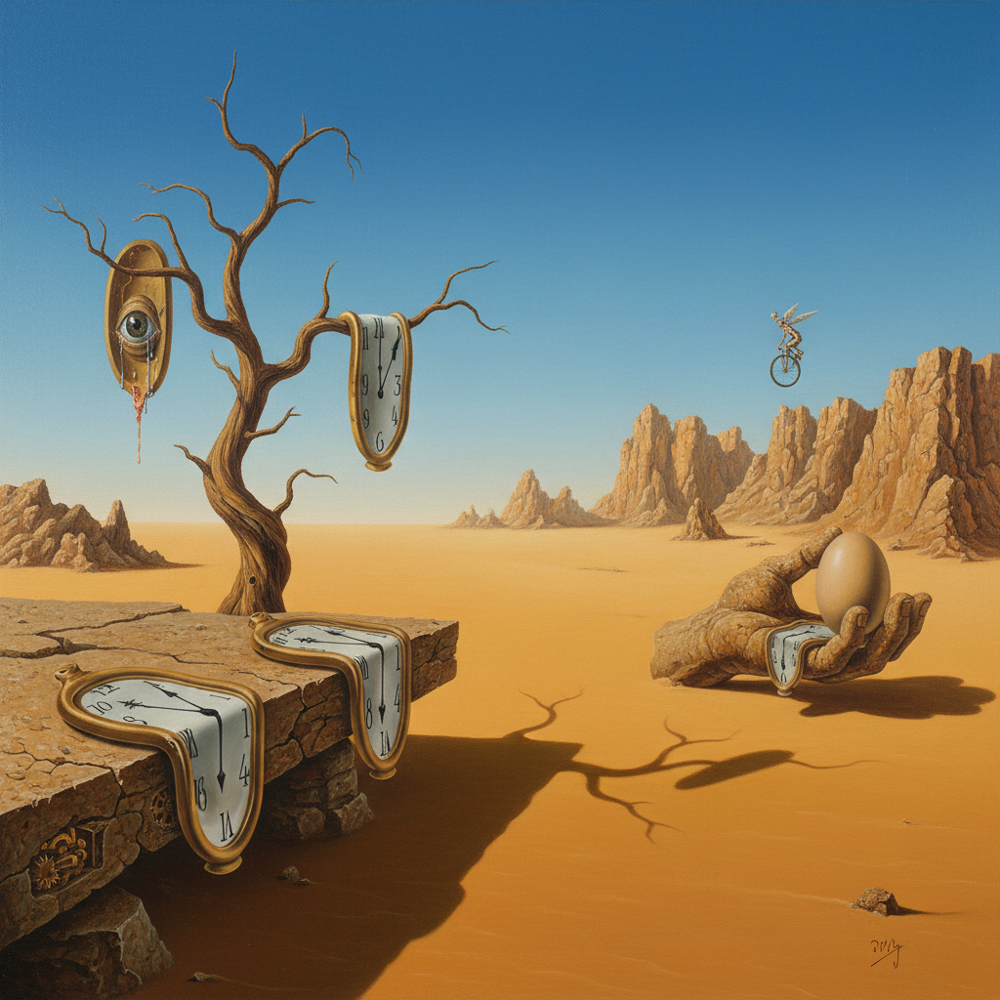

# Salvador Dalí 达利

> "I do not understand why, when I ask for a grilled lobster in a restaurant, I am never served a cooked telephone." — Salvador Dalí

## 概述

萨尔瓦多·达利（Salvador Domingo Felipe Jacinto Dalí i Domènech，1904–1989）是西班牙超现实主义画家，20世纪最具公众知名度的艺术家之一。他以精确的古典写实技法描绘梦境般的荒诞场景——融化的钟表、燃烧的长颈鹿、拐杖支撑的软体——创造了一种"偏执狂批判法"（paranoiac-critical method）的独特创作方式。

达利不仅是画家，更是一个全方位的文化现象——电影、雕塑、摄影、珠宝设计、广告、时装，他将超现实主义从画布延伸到了生活的每一个角落。

## 核心特征

| 特征 | 描述 |
|------|------|
| 偏执狂批判法 | 主动诱发幻觉和妄想状态来创作 |
| 精确写实 | 用古典大师的精确技法描绘荒诞场景 |
| 梦境逻辑 | 弗洛伊德式的梦境象征和潜意识 |
| 双重图像 | 一个形象同时是另一个形象 |
| 荒诞并置 | 不相关事物的超现实组合 |
| 自我神话 | 将自己塑造为活的艺术品 |

## 视觉特征

- **空间**：无限延伸的荒凉平原（加泰罗尼亚海岸）
- **光线**：清澈的地中海光线，极精确的阴影
- **物体**：软化、融化、变形的日常物品
- **色彩**：清澈的蓝天、金色沙漠、精确的固有色
- **细节**：显微镜般的精确细节
- **透视**：深远的文艺复兴式透视

## 代表作品

| 作品 | 年代 | 意义 |
|------|------|------|
| *The Persistence of Memory* | 1931 | 融化的钟表——超现实主义最著名的图像 |
| *Swans Reflecting Elephants* | 1937 | 双重图像的典范 |
| *The Burning Giraffe* | 1937 | 战争恐惧的超现实表达 |
| *Galatea of the Spheres* | 1952 | 核物理时代的古典美 |
| *Christ of Saint John of the Cross* | 1951 | 从上方俯瞰的十字架——独特视角 |
| *The Elephants* | 1948 | 细长蜘蛛腿的大象——达利标志性形象 |

## 真实作品（公共领域）

达利部分早期作品已进入公共领域，但多数作品仍受版权保护：

| 作品 | 来源 |
|------|------|
| *The Persistence of Memory* | [MoMA](https://www.moma.org/collection/works/79018)（仅展示） |
| *Dalí Theatre-Museum* | [Fundació Gala-Salvador Dalí](https://www.salvador-dali.org/en/) |

> ⚠️ 达利的多数作品仍受版权保护。本条目使用AI生成概念图展示风格特征。

## AI生成概念图

## 与其他风格的关系

- **Surrealism** → 超现实主义最著名的代表
- **Academic Art** → 古典写实技法的超现实应用
- **Freudian Psychology** → 弗洛伊德潜意识理论的视觉化
- **Pop Art** → 达利的自我营销预示了波普艺术
- **Metaphysical Art** → 受德·基里科形而上绘画影响
- **Renaissance** → 对维米尔和拉斐尔的深度研究

---

*浮光艺志 | Chronicle of Artistry*
