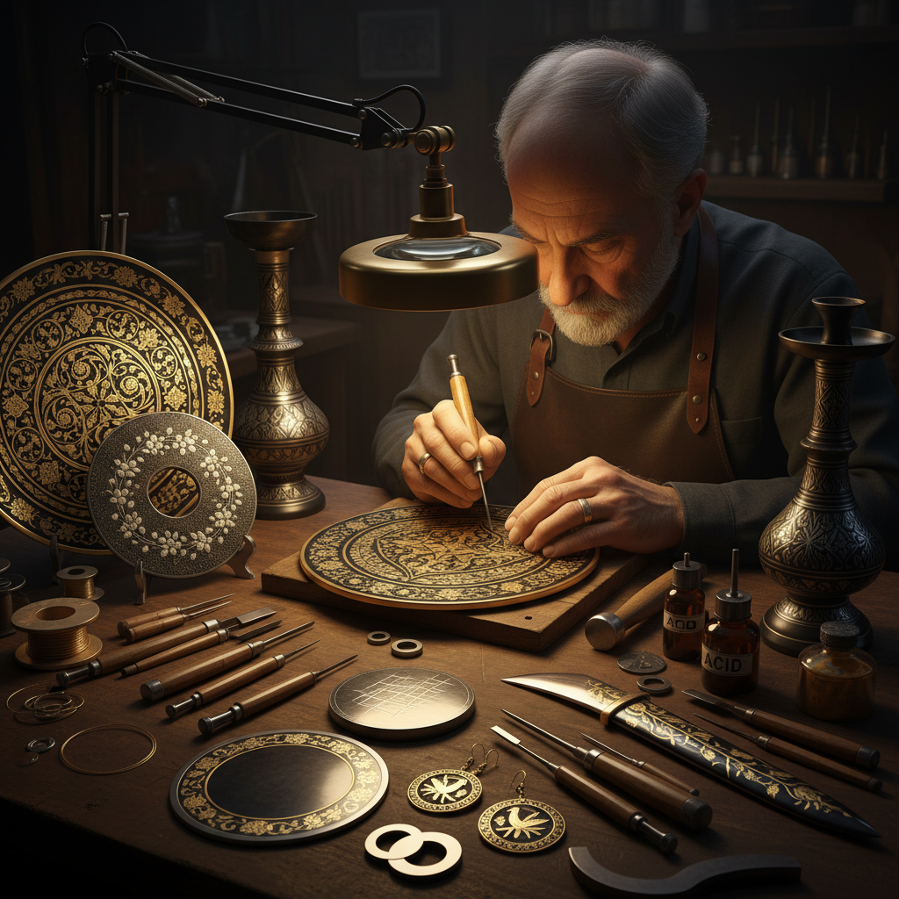

# Damascene Art 大马士革镶嵌艺术

> "Damascene is the art of writing in gold upon iron — of making the hardest metal carry the softest, of marrying war and beauty in a single surface. The damascene master cuts grooves into steel with a chisel finer than a needle, then hammers gold or silver wire into those grooves until the precious metal is locked forever into the base. The result is a surface where darkness and light interweave like calligraphy, where geometry becomes poetry." — Unknown

## 概述

大马士革镶嵌艺术（Damascene Art）是一种将金、银等贵金属丝或片嵌入铁或钢基体表面的金属装饰工艺——通过在钢铁表面刻出细槽，然后将金银丝锤入槽中，形成精美的装饰图案。这种工艺因叙利亚大马士革城而得名，但在世界多个文化中都有独立发展。

大马士革镶嵌艺术的实践包括：1）线镶嵌——将金银丝嵌入刻槽中；2）面镶嵌——将金银片覆盖在刻花表面上；3）武器装饰——刀剑和盔甲的金银镶嵌；4）首饰制作——大马士革风格的首饰；5）器物装饰——盘、盒等器物的镶嵌装饰；6）建筑装饰——门窗和栏杆的金属镶嵌；7）当代大马士革——将传统技法与现代设计结合的创作。

## 核心特征

| 特征 | 描述 |
|------|------|
| 对比 | 金银与黑铁的强烈对比 |
| 精密 | 极其精密的镶嵌工艺 |
| 耐久 | 金属镶嵌极其耐久 |
| 华丽 | 华丽的装饰效果 |
| 几何 | 精美的几何图案 |
| 古老 | 极其古老的工艺 |

## 视觉特征

- **黑金**：黑色钢铁上的金色图案
- **线条**：精细的金银线条
- **几何**：伊斯兰几何图案
- **花卉**：阿拉伯花纹装饰
- **对比**：明暗的强烈对比
- **光泽**：金银的贵金属光泽

## 代表作品

| 作品 | 艺术家/文化 | 年代 | 意义 |
|------|-------------|------|------|
| *Toledo damascene* | 西班牙托莱多 | 中世纪至今 | 西班牙大马士革 |
| *Japanese zogan* | 日本传统 | 古代至今 | 日本象嵌 |
| *Indian bidri ware* | 印度比德里 | 14世纪至今 | 印度镶嵌 |
| *Syrian damascene* | 叙利亚 | 古代至今 | 大马士革原产地 |
| *Persian koftgari* | 波斯/伊朗 | 古代至今 | 波斯金属镶嵌 |

## 历史时间线

| 时期 | 事件 |
|------|------|
| 古代 | 金属镶嵌技术的起源 |
| 中世纪 | 大马士革成为工艺中心 |
| 文艺复兴 | 技术传播到欧洲 |
| 19世纪 | 托莱多成为欧洲中心 |
| 当代 | 大马士革工艺的传承 |

## 中国语境

大马士革镶嵌艺术在中国有对应的传统形式——中国的"错金银"工艺与大马士革镶嵌有异曲同工之妙。中国的错金银技术可追溯到春秋战国时期——在青铜器上嵌入金银丝形成精美的装饰图案。中国古代的错金银青铜器是世界金属工艺的杰作——如战国时期的错金银铜壶、汉代的错金银博山炉等。中国的云南大理白族有传统的银器镶嵌工艺——在铁器或铜器上镶嵌银丝。中国当代的一些金属工艺师也在探索大马士革镶嵌技法——将中国传统图案与这种古老技法相结合。日本的象嵌（zogan）技法也影响了中国当代的金属工艺——特别是在刀具装饰领域。中国的错金银技艺已被列入非物质文化遗产保护名录。

## AI生成概念图

## 与其他风格的关系

- **Metal Inlay** → 金属镶嵌
- **Goldsmithing** → 金器艺术
- **Islamic Art** → 伊斯兰艺术
- **Weapon Art** → 武器装饰
- **Niello** → 黑金镶嵌
- **Jewelry Art** → 珠宝艺术

---

*浮光艺志 | Chronicle of Artistry*
