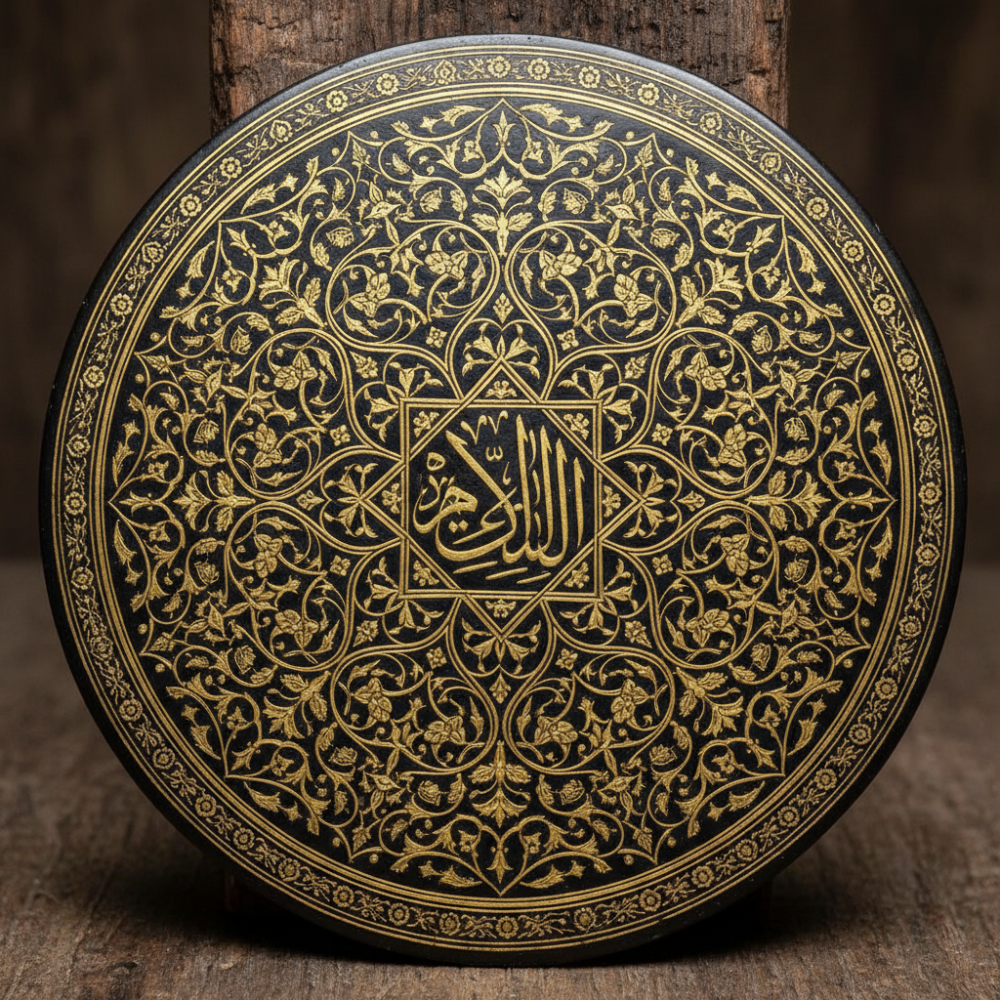

# Damascene 大马士革镶嵌 | الدمشقي

> **"钢铁上的金丝画——大马士革工匠在刀剑上编织出黄金的诗篇。"**

## 概述

大马士革镶嵌（Damascene / الدمشقي / Damasquinado）是一种在钢铁或其他深色金属表面上镶嵌金丝或银丝的装饰工艺。工匠先在金属表面刻出细槽，然后将金丝或银丝锤入槽中，形成精美的图案。"Damascene"得名于叙利亚大马士革（دمشق），但这种技法实际上在中东、西班牙（Toledo）、日本（布目象嵌 Nunome-zōgan）和印度（Koftgari）都有独立发展。西班牙托莱多的Damasquinado至今仍是活态传统。

## 主要传统

| 地区 | 名称 | 特征 |
|------|------|------|
| 叙利亚 | الدمشقي | 阿拉伯花纹 |
| 西班牙托莱多 | Damasquinado | 几何和花卉 |
| 日本 | 布目象嵌 Nunome-zōgan | 武士刀装饰 |
| 印度 | Koftgari | 莫卧儿花卉 |
| 伊朗 | Qalam-zani | 波斯图案 |

## 核心特征

- **金属底**：深色钢铁或铜底
- **金银丝**：镶嵌金丝或银丝
- **刻槽锤入**：先刻槽再锤入金属丝
- **对比色**：金/银在黑色底上的强烈对比
- **精细图案**：极精细的线条和填充
- **功能性装饰**：装饰在武器和器物上

## 常见题材

| 题材 | 传统 |
|------|------|
| 阿拉伯花纹 | 中东 |
| 几何图案 | 西班牙/伊斯兰 |
| 花卉藤蔓 | 印度/波斯 |
| 鸟兽 | 各传统 |
| 书法 | 阿拉伯/波斯 |
| 家纹 | 日本 |

## 视觉特征

- 黑色金属底上的金色光芒
- 极精细的金属丝线条
- 强烈的明暗对比
- 精密的几何和花卉图案
- 金属的冷峻质感
- 奢华与力量的结合

## 与其他风格的关系

| 风格 | 关系 |
|------|------|
| 伊斯兰几何 | 共享几何装饰传统 |
| Filigree金银丝 | 共享金属丝工艺 |
| 日本刀装具 | 布目象嵌的应用 |
| Niello黑金 | 共享金属装饰传统 |
| 当代金属工艺 | Damascene的现代应用 |

## 概念图

---

*浮光艺志 | Chronicle of Artistry*
