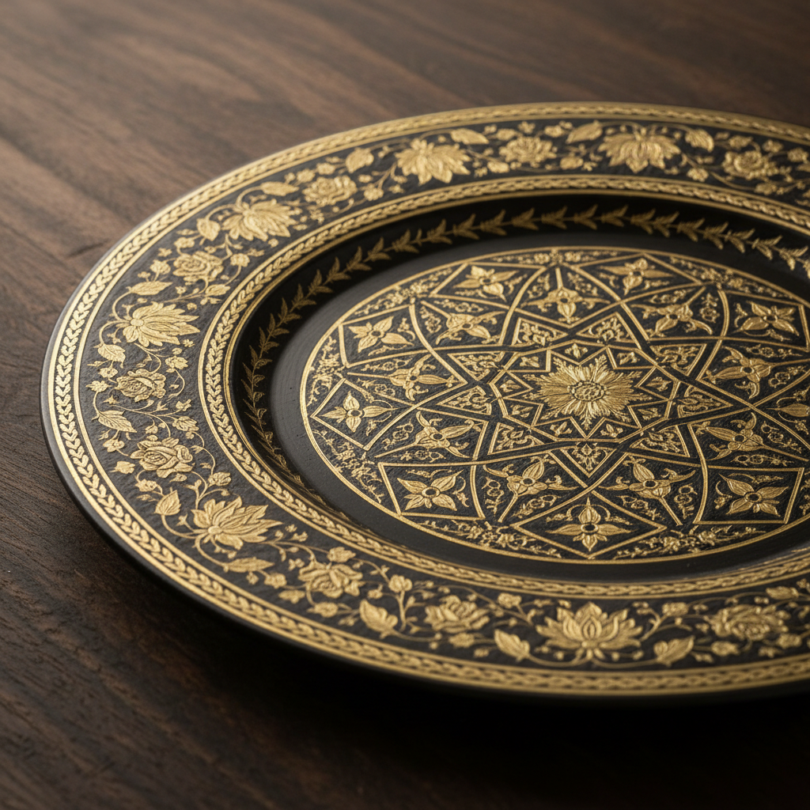

# Damascening Art 大马士革镶嵌艺术

> "Damascening is the art of inlaying precious metal into base metal — gold or silver wire is hammered into grooves cut in iron or steel, creating patterns that gleam against the dark ground like stars against a night sky. Named for Damascus, though practiced across the Islamic world, India, Japan, and Spain, damascening transforms utilitarian metalwork into objects of extraordinary luxury, where the contrast between dark iron and bright gold creates designs of timeless elegance." — Unknown

## 概述

大马士革镶嵌艺术（Damascening Art）是将贵金属（金、银）嵌入贱金属（铁、钢）表面的传统金属装饰工艺——通过在铁或钢表面刻出细槽，然后将金丝或银丝锤入槽中，创造出在深色金属背景上闪耀的装饰图案。大马士革镶嵌在中东、西班牙、印度和日本都有悠久的传统。

大马士革镶嵌艺术的实践包括：1）线镶——将金属丝锤入刻槽；2）面镶——将金属片嵌入较大的凹面；3）覆盖镶嵌——在交叉刻痕上覆盖金属片；4）浮雕镶嵌——创造凸起的镶嵌效果；5）Toledo镶嵌——西班牙托莱多的传统技法；6）布引——日本的金属镶嵌技法；7）当代大马士革镶嵌——将传统技法与现代设计结合的创作。

## 核心特征

| 特征 | 描述 |
|------|------|
| 镶嵌 | 贵金属嵌入贱金属 |
| 对比 | 金色与黑色的对比 |
| 精密 | 极其精密的操作 |
| 奢华 | 奢华的装饰效果 |
| 古老 | 数千年的历史 |
| 全球 | 多文化的传统 |

## 视觉特征

- **对比**：金色在黑色上的闪耀
- **精细**：极其精细的线条和图案
- **几何**：几何和植物图案
- **光泽**：金银的温暖光泽
- **深邃**：深色底面的深邃感
- **奢华**：极其奢华的整体感

## 代表作品

| 作品 | 艺术家/文化 | 年代 | 意义 |
|------|-------------|------|------|
| *Toledo damascene* | 西班牙 | 中世纪至今 | 托莱多大马士革镶嵌 |
| *Bidri ware* | 印度 | 14世纪至今 | 比德里金属器 |
| *Japanese nunome-zogan* | 日本 | 传统 | 日本布目象嵌 |
| *Islamic metalwork* | 中东 | 中世纪 | 伊斯兰金属工艺 |
| *Contemporary damascening* | 当代 | 当代 | 当代大马士革镶嵌 |

## 历史时间线

| 时期 | 事件 |
|------|------|
| 古代 | 大马士革镶嵌的起源（中东） |
| 中世纪 | 伊斯兰世界的黄金时代 |
| 8世纪 | 摩尔人将技法带入西班牙 |
| 室町时代 | 日本布目象嵌的发展 |
| 当代 | 大马士革镶嵌的艺术化发展 |

## 中国语境

大马士革镶嵌艺术在中国有一定的传统和认知。中国传统的"错金银"工艺与大马士革镶嵌有相似之处——都是将贵金属嵌入贱金属表面。中国战国和汉代的错金银青铜器是世界上最精美的金属镶嵌作品之一——技法与大马士革镶嵌原理相通。中国云南的"乌铜走银"是独特的金属镶嵌传统——将银丝嵌入乌铜表面创造装饰效果。中国的一些传统金属工艺中有类似的镶嵌技法——如景泰蓝的掐丝工艺也涉及金属丝的嵌入。中国当代的一些金属工艺师开始研究大马士革镶嵌——将其与中国传统错金银技法结合。中国的非物质文化遗产保护中，错金银和乌铜走银被列为保护项目——传承这些珍贵的金属镶嵌传统。

## AI生成概念图

## 与其他风格的关系

- **Mokume-gane** → 木目金
- **Metal Inlay** → 金属镶嵌
- **Islamic Art** → 伊斯兰艺术
- **Toledo Art** → 托莱多艺术
- **Metalwork** → 金属工艺
- **Decorative Art** → 装饰艺术

---

*浮光艺志 | Chronicle of Artistry*
