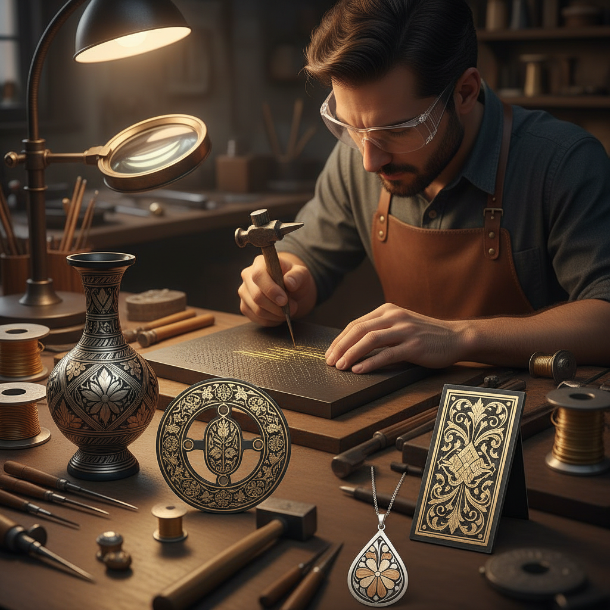

# Damascening 大马士革镶嵌

> "Damascening is gold woven into iron — precious metal hammered into base metal's grooves, turning weapons of war into objects of impossible beauty." — Unknown

## 概述

大马士革镶嵌（Damascening）是将金丝或银丝嵌入铁或钢的表面的金属装饰工艺。工匠先在铁/钢表面用刻刀刻出细密的交叉网格纹（undercut grooves），然后将金丝或银丝放在刻痕上，用锤子敲打使其嵌入并固定在凹槽中。最后打磨和氧化处理——铁/钢表面变为深黑色，而嵌入的金银保持明亮，形成强烈的对比。大马士革镶嵌最初用于装饰武器和盔甲——刀剑、盾牌、头盔上的金银图案既是装饰也是身份的象征。

大马士革镶嵌的哲学在于：贵贱的融合——将最珍贵的金银嵌入最普通的铁中，让对比产生超越两者的美。

## 核心特征

| 特征 | 描述 |
|------|------|
| 镶嵌 | 金银嵌入铁钢 |
| 刻槽 | 先刻交叉凹槽 |
| 锤入 | 锤打金银丝入槽 |
| 对比 | 黑铁与金银的对比 |
| 武器 | 传统用于武器装饰 |
| 精细 | 极其精细的图案 |

## 视觉特征

- **对比**：黑色铁底与金银的对比
- **精细**：精细的线条图案
- **金属**：金属的光泽
- **图案**：阿拉伯式花纹
- **奢华**：奢华的视觉效果
- **力量**：武器的力量感

## 代表作品

| 作品 | 艺术家 | 年代 | 意义 |
|------|--------|------|------|
| *Damascus swords* | 匿名 | 中世纪 | 大马士革刀剑 |
| *Toledo damascene* | Various | 16世纪+ | 西班牙托莱多镶嵌 |
| *Japanese sword fittings* | Various | 传统 | 日本刀装具 |
| *Indian bidri ware* | 匿名 | 17世纀+ | 印度比德里器 |
| *Contemporary damascene* | Various | 当代 | 当代大马士革镶嵌 |

## 历史时间线

| 时期 | 事件 |
|------|------|
| 古代 | 中东最早的金属镶嵌 |
| 中世纪 | 大马士革成为镶嵌中心 |
| 16世纪 | 西班牙托莱多的黄金时代 |
| 传统 | 日本刀装具的镶嵌传统 |
| 19世纪 | 工业化后的衰落 |
| 当代 | 当代大马士革镶嵌的复兴 |

## 中国语境

大马士革镶嵌在中国有对应的传统——中国的"错金银"工艺与Damascening原理完全相同。中国的错金银可追溯到春秋战国时期，在青铜器上嵌入金银丝形成精美的图案。中国的错金银工艺在汉代达到巅峰——河北满城汉墓出土的错金银铜器是杰出代表。当代中国的金属工艺家继续传承错金银技法，将其应用于当代艺术品和高端定制。中国的错金银与中东的Damascening虽然独立发展，但技法和美学有惊人的相似性。

## AI生成概念图

## 与其他风格的关系

- **Metalwork** → 金属工艺
- **Niello** → 黑金镶嵌
- **Inlay** → 镶嵌
- **Sword Making** → 刀剑制作
- **Islamic Art** → 伊斯兰艺术
- **Engraving** → 雕刻

---

*浮光艺志 | Chronicle of Artistry*
