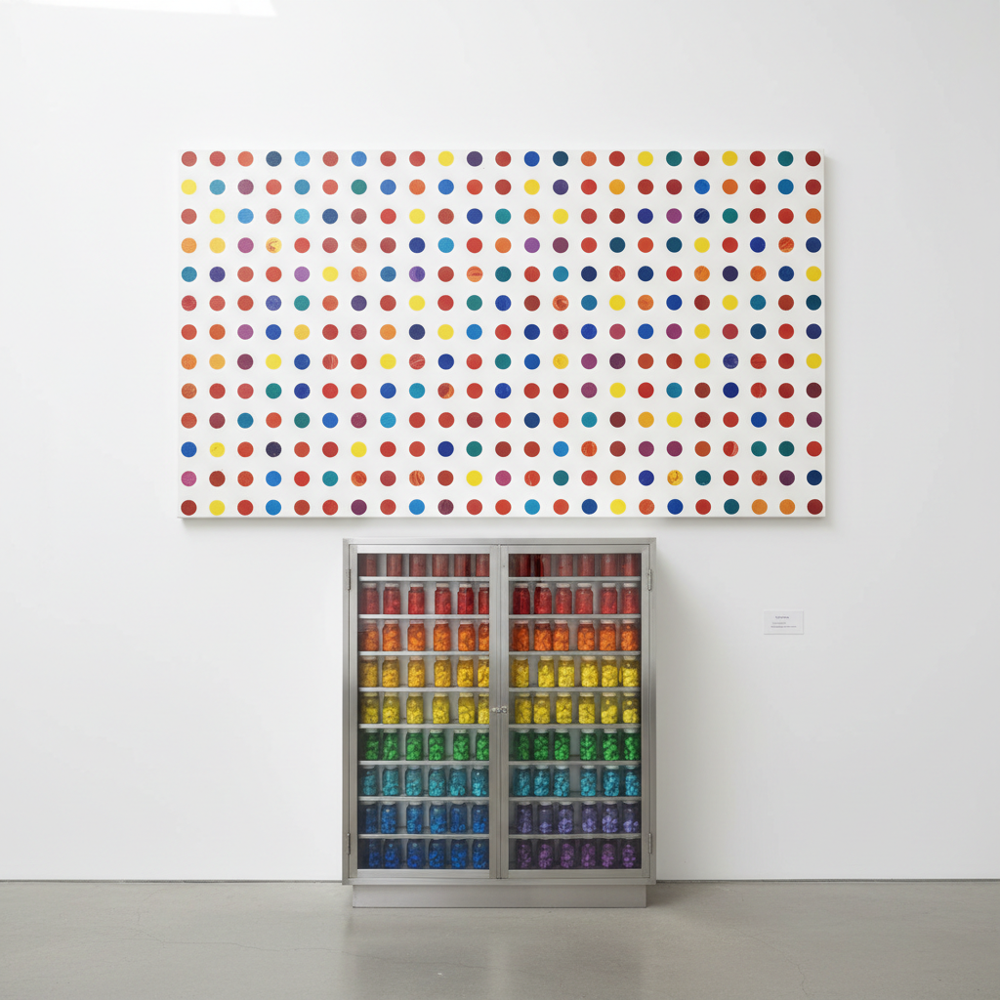

# Damien Hirst 达米恩·赫斯特

> "I sometimes feel that I have nothing to say and I want to communicate this." — Damien Hirst

## 概述

达米恩·赫斯特（Damien Hirst，1965–）是英国当代艺术家，YBA（Young British Artists）运动的领军人物。他以探索死亡与美的关系闻名——将鲨鱼、羊和蝴蝶浸泡在甲醛中，用钻石覆盖骷髅头，创作旋转画和药片柜，将艺术推向商业、科学和死亡的交叉地带。

## 核心特征

| 特征 | 描述 |
|------|------|
| 甲醛标本 | 动物浸泡在玻璃柜中 |
| 死亡主题 | 对死亡的直面与美化 |
| 药片柜 | 药物作为色彩排列 |
| 旋转画 | 离心力创造的色彩飞溅 |
| 圆点画 | 规则排列的彩色圆点 |
| 商业策略 | 艺术市场的颠覆者 |

## 代表作品

| 作品 | 年代 | 意义 |
|------|------|------|
| *The Physical Impossibility of Death in the Mind of Someone Living* | 1991 | 甲醛鲨鱼的震撼 |
| *For the Love of God* | 2007 | 钻石骷髅的奢华死亡 |
| *Pharmacy* | 1992 | 药物作为艺术材料 |
| *The Spot Paintings* | 1986– | 无限重复的色彩系统 |

## AI生成概念图

## 与其他风格的关系

- **YBA** → 英国青年艺术家运动领袖
- **Conceptual Art** → 观念先于手工
- **Pop Art** → 商业与艺术的融合
- **Jeff Koons** → 共享商业化策略
