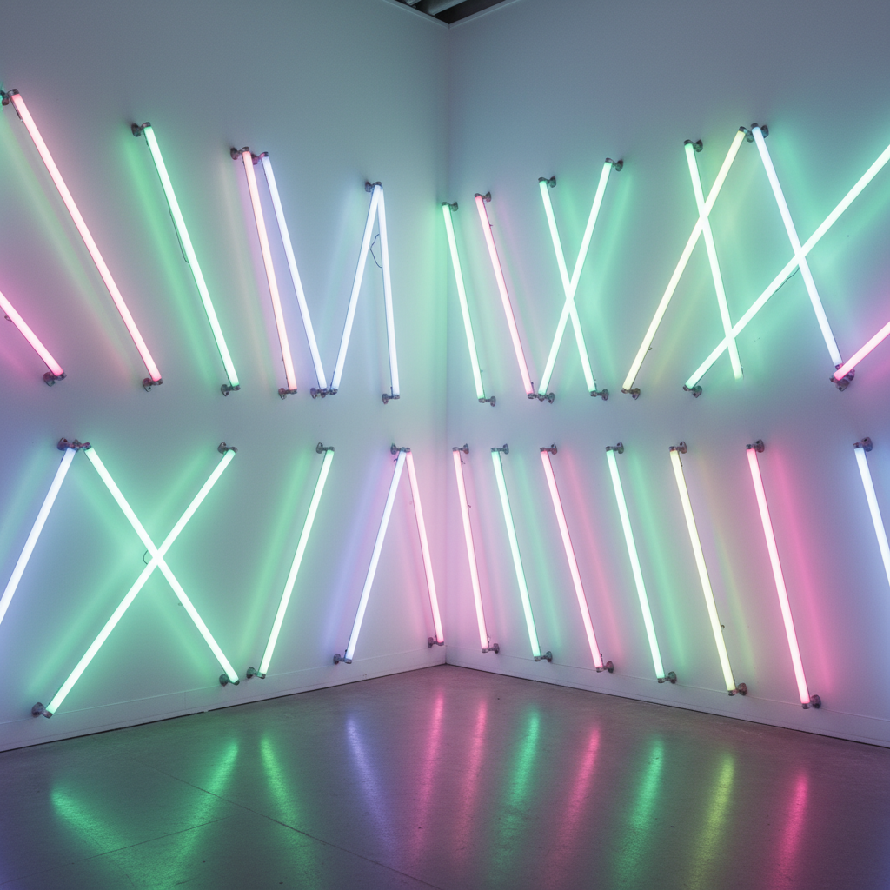

# Dan Flavin 丹·弗莱文

> **流派**: 极简主义 · 光艺术  
> **时期**: 1933–1996 美国  
> **关键词**: 荧光灯管、光与空间、工业现成品、色彩光晕

## 概述

丹·弗莱文以商业荧光灯管作为唯一媒介，创造了一种全新的艺术形式。他将标准尺寸的彩色灯管以简单的几何方式排列在墙角、墙面或空间中，用光本身——而非描绘光——来改变观者对空间的感知。

## 视觉特征

- **荧光灯管**: 使用商业标准的直管荧光灯
- **彩色光晕**: 灯管发出的光在墙面和空间中扩散混合
- **简单排列**: 对角线、平行线、角落装置等基本构型
- **空间变形**: 光改变了建筑空间的感知尺度和氛围
- **标准尺寸**: 仅使用2、4、6、8英尺四种标准长度

## 代表作品

- 《对角线》(致康斯坦丁·布朗库西) (1963)
- 《无题》(致唐纳德·贾德) (1987)
- 《纪念碑》系列 (致V·塔特林) (1964–90)
- 里士满弗吉尼亚美术馆装置 (1971)

## 历史影响

弗莱文证明了最普通的工业产品可以创造最崇高的审美体验。他的光装置影响了后来的光与空间运动、沉浸式艺术和建筑照明设计。

## 相关风格

- [Minimalism 极简主义](minimalism.md)
- [Donald Judd 唐纳德·贾德](donald-judd.md)
- [James Turrell 詹姆斯·特瑞尔](james-turrell.md)
