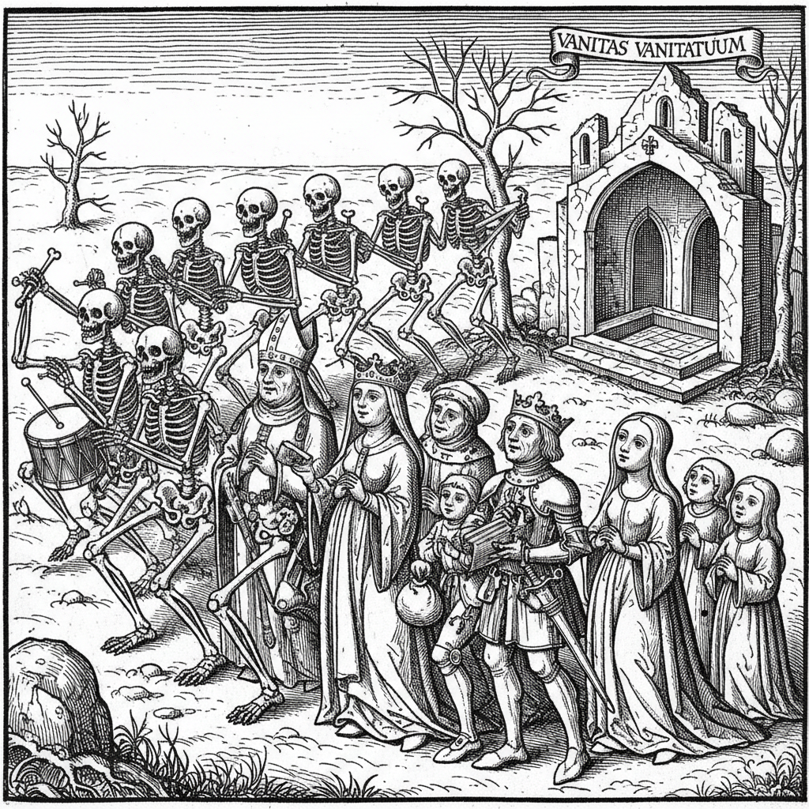

# Dance of Death 死亡之舞

> **时期：** 14世纪–17世纪  
> **关键词：** 骷髅、社会等级、黑死病、木刻版画、平等主义

## 概述

Dance of Death（死亡之舞/Danse Macabre）是中世纪晚期出现的艺术主题——骷髅引领各个社会阶层的人（从教皇到农民）跳起最后的舞蹈。黑死病的恐怖催生了这一图像传统：无论你是国王还是乞丐，死亡面前人人平等。它既是恐惧的表达，也是对权力和虚荣的辛辣讽刺。

## 风格特征

- **骷髅拟人**：死神以跳舞的骷髅形象出现
- **社会全景**：从教皇到农民的等级序列
- **连续叙事**：一系列配对场景的序列
- **讽刺幽默**：骷髅的嘲弄姿态
- **木刻风格**：黑白对比的版画传统

## 代表人物与作品

- 小汉斯·霍尔拜因《死亡之舞》木刻系列
- 巴塞尔死亡之舞壁画
- 迈克尔·沃尔格穆特《纽伦堡编年史》
- 圣英诺森公墓壁画（巴黎）

## 概念图

