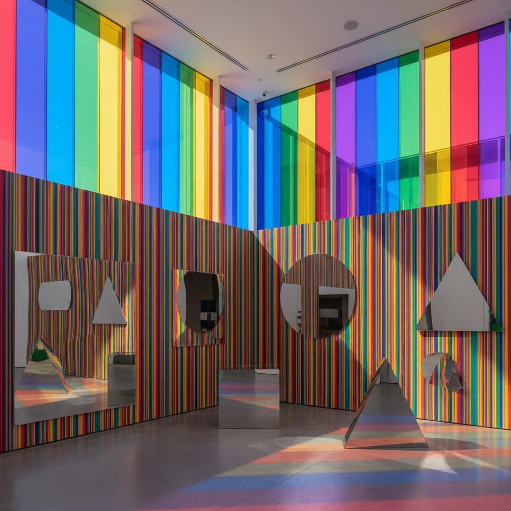

# Daniel Buren 丹尼尔·布伦

> **时期：** 1938–至今  
> **关键词：** 8.7cm条纹、原位创作、制度批判、公共空间干预

## 概述

Daniel Buren 是法国艺术家，以其标志性的8.7厘米宽交替色条纹闻名。自1960年代起，他坚持使用这一"视觉工具"在全球各种建筑和公共空间中进行原位创作，通过最简单的图案揭示空间的结构、权力和观看条件。

## 风格特征

- **8.7cm条纹**：固定宽度的交替色竖条纹是唯一的视觉元素
- **原位创作**：作品为特定场所量身定制，不可移动
- **制度批判**：揭示美术馆和展览体制的权力结构
- **色彩与光**：近年作品加入彩色滤光片和镜面
- **公共性**：大量作品位于公共空间而非画廊

## 代表作品

- *Les Deux Plateaux*（1986，巴黎皇家宫殿）
- *Excentrique(s)*（2012，巴黎大皇宫）
- *Observatory of Light*（2016，路易威登基金会）
- *Comme un jeu d'enfant*（2014）

## 概念图

