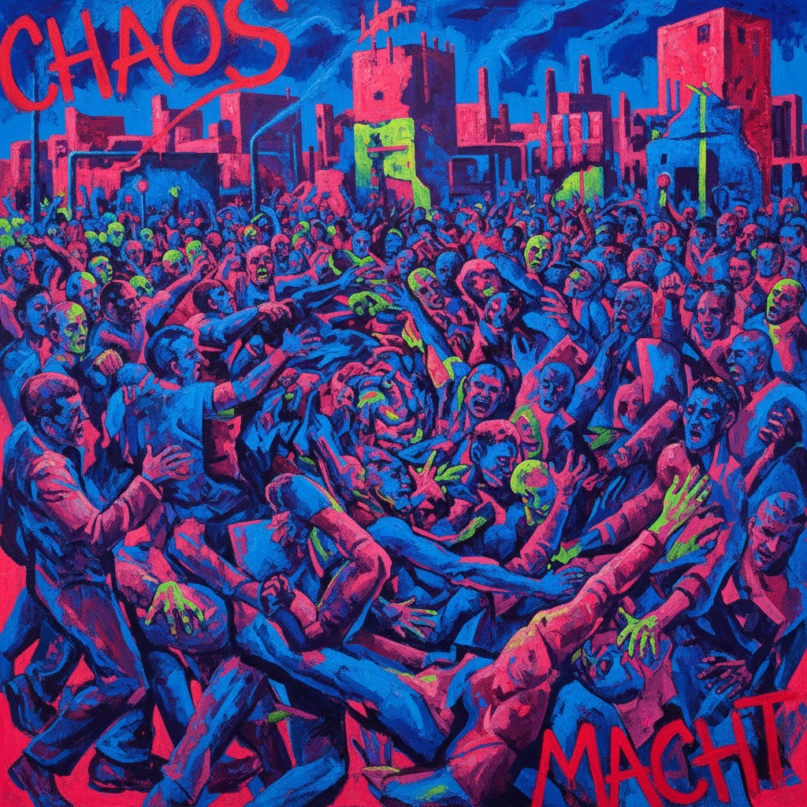

# Daniel Richter 丹尼尔·里希特

> **时期：** 1962–至今  
> **关键词：** 政治具象、荧光色彩、混乱构图、德国当代绘画

## 概述

Daniel Richter 是德国当代画家，早期以抽象的迷幻色彩场域闻名，2000年代后转向具象绘画，描绘难民、暴力冲突和社会边缘人群。他的作品将政治内容包裹在极度华丽的色彩中，制造出美感与不安之间的持续冲突。

## 风格特征

- **荧光色彩**：大量使用荧光粉、酸性绿、电光蓝，画面如同霓虹灯下的噩梦
- **混乱构图**：人物群像纠缠扭曲，空间关系模糊，如同新闻照片被搅碎重组
- **政治叙事**：描绘移民、边境、暴力和社会冲突，但拒绝提供明确的道德判断
- **笔触多变**：从精细描绘到粗暴涂抹在同一画面中并存
- **艺术史引用**：频繁引用德拉克洛瓦、戈雅等大师的群像构图

## 代表作品

- *Tarifa*（2001）
- *Lonely Old Slogans*（2006）
- *Horde*（2006）
- *Eternal Youth*（2004）

## 历史意义

Richter 代表了德国绘画在新表现主义之后的延续与更新，他证明了绘画仍然能够回应最紧迫的政治现实，同时保持形式上的激进实验。他的作品是"美丽的政治绘画"这一看似矛盾命题的最佳范例。

## 概念图

