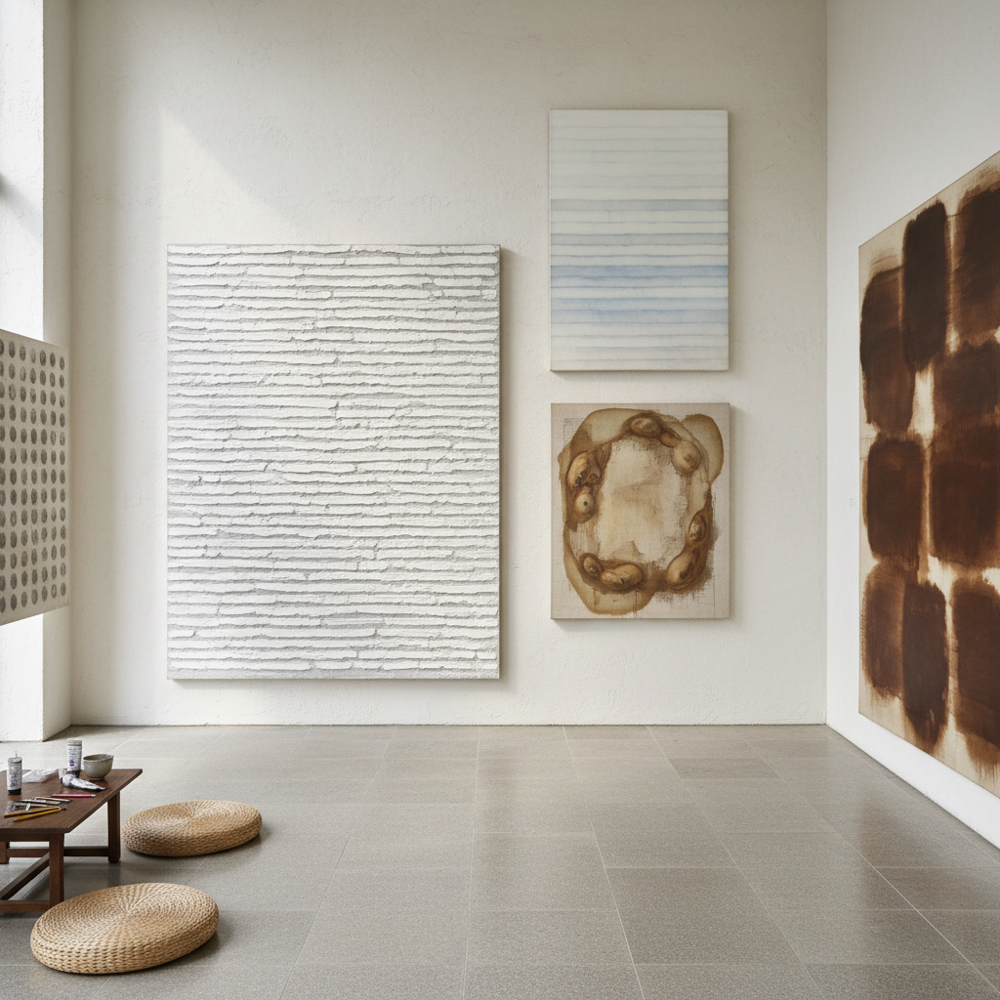

# Dansaekhwa Art 单色画艺术

> "Dansaekhwa is the art of patience made visible — of pushing paint through the back of a canvas and smoothing it on the front, of applying layer after layer of white on white until the surface breathes, of repeating a single gesture ten thousand times until the distinction between artist and material dissolves, a Korean painting practice that is neither abstraction nor meditation but something that encompasses both, where the monochrome surface becomes a record of time spent, of breath taken, of the body's quiet persistence against the canvas, achieving through repetition what cannot be achieved through invention." — Unknown

## 概述

单色画（단색화 / Dansaekhwa，字面意为"单色绘画"）是1970年代在韩国兴起的一个重要绘画运动，代表艺术家包括朴栖甫（Park Seo-Bo）、郑相和（Chung Sang-Hwa）、河钟贤（Ha Chong-Hyun）、尹亨根（Yun Hyong-keun）和李禹焕（Lee Ufan）。单色画以其克制的色彩（通常是白色、灰色、土色的微妙变化）、重复性的手势和对材料过程的强调而著称。

单色画不是简单的"单色"绘画，而是一种通过重复的身体行为和材料过程来实现"精神与物质合一"的实践。朴栖甫在湿润的画布上用铅笔反复划线（"描法"系列）；河钟贤将颜料从画布背面推到正面（"接合"系列）；郑相和反复涂抹和剥离颜料层。这些过程性的方法使画面成为时间和身体劳动的记录。单色画受到韩国传统美学（如"无为"和"自然"的概念）、道家思想和禅宗修行的影响。

## 核心特征

| 特征 | 描述 |
|------|------|
| 单色 | 克制的单色调 |
| 重复 | 重复性的手势 |
| 过程 | 过程的可见性 |
| 物质 | 材料的物理性 |
| 时间 | 时间的积累 |
| 修行 | 修行般的实践 |

## 视觉特征

- **白色**：白色和灰色的微妙变化
- **纹理**：重复手势产生的纹理
- **层次**：多层颜料的积累
- **网格**：规则的网格和线条
- **土色**：大地色调
- **呼吸**：画面的"呼吸感"

## 代表作品

| 作品 | 艺术家 | 年代 | 意义 |
|------|--------|------|------|
| *Écriture* | Park Seo-Bo | 1970年代起 | 朴栖甫的描法系列 |
| *Conjunction* | Ha Chong-Hyun | 1974起 | 河钟贤的接合系列 |
| *Untitled* | Chung Sang-Hwa | 1970年代起 | 郑相和的剥离绘画 |
| *Burnt Umber & Ultramarine* | Yun Hyong-keun | 1970年代 | 尹亨根的渗透绘画 |
| *From Point* | Lee Ufan | 1973起 | 李禹焕的从点系列 |

## 历史时间线

| 时期 | 事件 |
|------|------|
| 1970年代 | 单色画运动的形成 |
| 1975 | 东京画廊的韩国五人展 |
| 1970-80年代 | 运动的成熟期 |
| 2000年代 | 国际重新评价 |
| 2010年代 | 全球市场的认可 |

## 中国语境

单色画与中国艺术有深层的文化联系。韩国和中国共享儒道佛的文化传统，单色画中的"无为"、"自然"和"修行"概念在中国文化中有丰富的对应。中国水墨画传统中的"墨分五色"——用单一的墨色表现无限的色彩变化——与单色画的精神有深层的共鸣。中国当代的一些抽象艺术家也在探索类似的"过程性"和"重复性"实践，如梁铨的拼贴绘画、丁乙的"十示"系列等。单色画的国际成功也为中国当代艺术提供了一个重要的参照——如何将东亚的文化传统转化为具有国际影响力的当代艺术语言。

## AI生成概念图

## 与其他风格的关系

- **Mono-ha** → 物派
- **Minimalism** → 极简主义
- **Color Field** → 色域绘画
- **Zen Art** → 禅宗艺术
- **Process Art** → 过程艺术
- **Ink Painting** → 水墨画

---

*浮光艺志 | Chronicle of Artistry*
