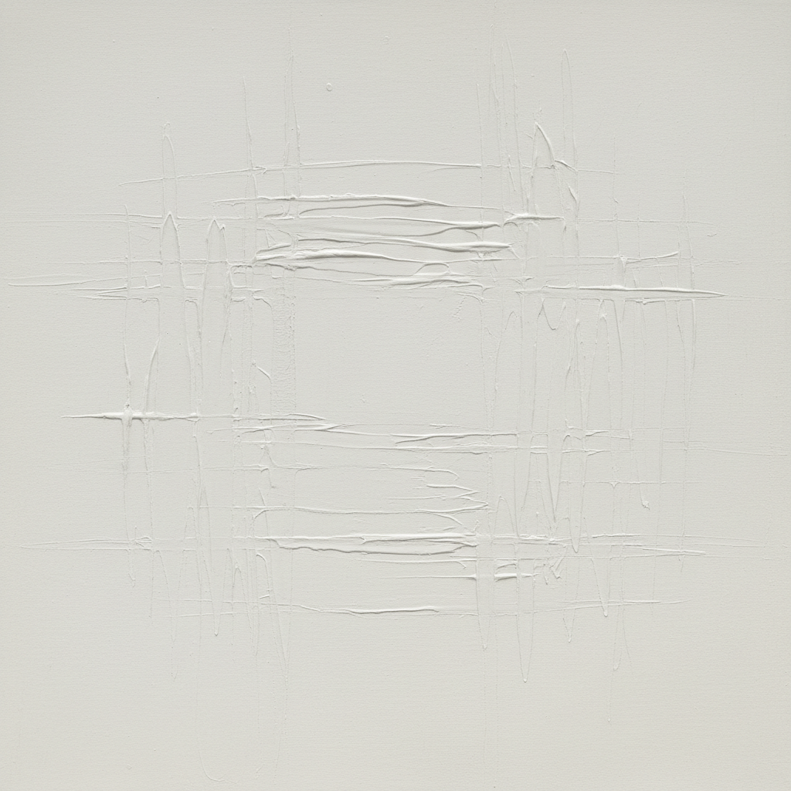

# Dansaekhwa 단색화 韩国单色画



> **"缓慢而审慎地画上一笔，画笔在画布上停留的时间正如我深长的一呼一吸——物我两相忘。"**

## 概述

单色画（단색화 / Dansaekhwa）是1970年代韩国兴起的独特抽象绘画运动，代表了韩国现代艺术史上第一个获得国际认可的本土艺术流派。它以冥想式的重复笔触、极简的单色调画面和东方哲学精神为核心，在西方现代主义与东方美学的交汇中开辟了独特道路。

## 时代背景

| 维度 | 内容 |
|------|------|
| 兴起 | 1970年代韩国 |
| 社会语境 | 军事独裁时期，文化内省与民族身份重建 |
| 里程碑展览 | 1975年东京画廊"五位艺术家—五种白色" |
| 国际认可 | 2010年代全球拍卖市场爆发 |
| 哲学根基 | 儒释道思想 + 韩国书法传统 |

## 核心艺术家

| 艺术家 | 特征 |
|------|------|
| 朴栖甫 Park Seo-Bo | "单色画之父"，Écriture（描法）系列 |
| 尹亨根 Yun Hyong-Keun | 焦赭与群青蓝的渗透 |
| 河钟贤 Ha Chong-Hyun | 从画布背面推挤颜料（Conjunction系列） |
| 郑相和 Chung Sang-Hwa | 反复涂抹-撕揭-再涂的物质过程 |
| 金昌烈 Kim Tschang-Yeul | 水滴系列 |
| 李禹焕 Lee Ufan | 物派理论家，"从点开始""从线开始" |

## 视觉特征

- **单色调**：白、灰、赭、蓝等单一色系的微妙变化
- **重复笔触**：冥想式的反复动作留下的痕迹
- **物质肌理**：韩纸（hanji）、厚涂颜料的触觉质感
- **留白与呼吸**：画面中的空间如同呼吸的间隙
- **过程痕迹**：推、压、撕、揭等身体动作的记录
- **大尺幅**：沉浸式的视觉体验

## 核心理念

### 与自然合一

> "我的作品与东方的空间传统有关，是精神性的空间概念。我更关注从自然角度出发的空间。" ——朴栖甫

单色画不是西方式的"表现自我"，而是通过重复的身体劳动达到"物我两忘"——让自然通过艺术家的身体自行显现。

### "白"的哲学

在1975年"五种白色"展中，"白"不再是现象层面的色彩，而是一种母体、一个宇宙——色彩与形象退位，绘画行为本身孕育着远多于视觉感观的呈现。

### 描法（Myobop / Écriture）

朴栖甫的核心方法：在未干的颜料表面用铅笔反复划线，或将韩纸层层叠加后用手指压出纹路——既是书写，也是冥想，也是呼吸。

## 与其他运动的关系

```
抽象表现主义(美) ──→ [影响] ──→ 单色画(韩, 1970s)
极简主义(美) ──→ [影响] ──→ 单色画
                                    ↕
物派(日, Mono-ha) ←→ 单色画 ←→ Supports/Surfaces(法)
                                    ↓
                        当代韩国抽象艺术
```

## 当代影响

- 2010年代全球拍卖市场对单色画的重新发现与价格飙升
- 三星The Frame电视收录朴栖甫作品
- 香港M+博物馆重要收藏
- 对当代冥想式抽象绘画的持续启发
- 韩国文化软实力的重要组成部分

## 多语言名称

| 语言 | 名称 |
|------|------|
| 韩语 | 단색화 / 단색조 예술 |
| 英语 | Dansaekhwa / Korean Monochrome Painting |
| 中文 | 单色画 |
| 日语 | 韓国モノクローム絵画 |
| 法语 | Peinture monochrome coréenne |

## 延伸阅读

- Joan Kee《Contemporary Korean Art: Tansaekhwa and the Urgency of Method》
- 1975年东京画廊"五位艺术家—五种白色"展
- 2014年国际画廊协会Dansaekhwa专题展

---

*最后更新：2026-07-26*
