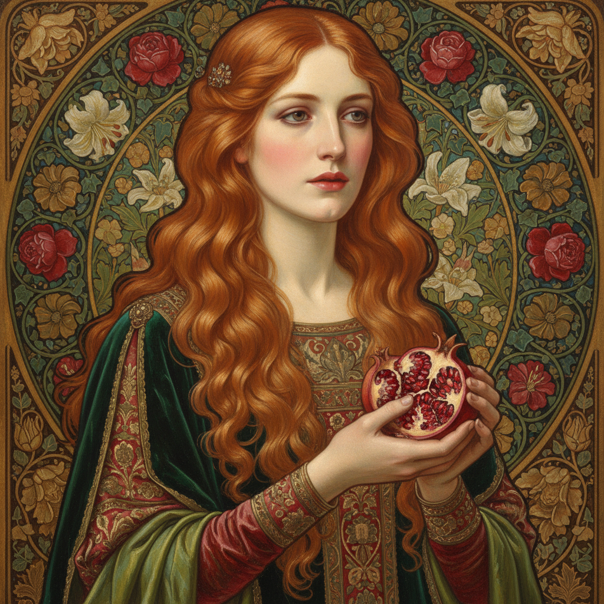

# Dante Gabriel Rossetti 罗塞蒂

> "The worst moment for the atheist is when he is really thankful and has nobody to thank." — D.G. Rossetti

## 概述

但丁·加百列·罗塞蒂（Dante Gabriel Rossetti，1828–1882）是英国画家和诗人，前拉斐尔派兄弟会的联合创始人。他以描绘致命的美丽女性闻名——浓密的红发、丰满的嘴唇、忧郁的眼神，将中世纪浪漫、但丁的诗歌和感官之美融合为一种独特的视觉语言。

## 核心特征

| 特征 | 描述 |
|------|------|
| 致命女性 | 美丽而危险的女性形象 |
| 红发之美 | 标志性的浓密红色卷发 |
| 中世纪浪漫 | 但丁、亚瑟王的文学世界 |
| 感官色彩 | 深红、翡翠绿的浓烈调性 |
| 诗画合一 | 绘画与诗歌的互文 |
| 装饰性 | 花卉和织物的精细描绘 |

## 代表作品

| 作品 | 年代 | 意义 |
|------|------|------|
| *Beata Beatrix* | 1864–70 | 但丁之爱的视觉化 |
| *Proserpine* | 1874 | 致命女性的经典 |
| *The Blessed Damozel* | 1875–78 | 诗画合一的代表 |
| *Lady Lilith* | 1866–68 | 感官之美的极致 |

## AI生成概念图

## 与其他风格的关系

- **Pre-Raphaelite** → 前拉斐尔派联合创始人
- **Symbolism** → 预示了象征主义的感官美学
- **Art Nouveau** → 影响了新艺术运动的女性形象
- **Aestheticism** → 唯美主义运动的先驱
