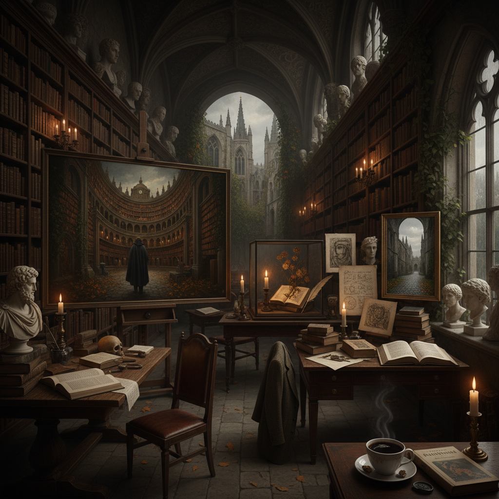

# Dark Academia Art 暗黑学院风

> "Dark Academia is knowledge wrapped in shadow — the romance of ancient libraries and candlelit study, leather-bound books and Latin inscriptions, Gothic spires and autumn leaves, a world where learning is sacred and melancholy is beautiful, where the pursuit of knowledge carries the weight of mortality and every poem memorized is a small victory against the darkness, an aesthetic that makes scholarship feel like a secret society and reading like rebellion." — Unknown

## 概述

暗黑学院风（Dark Academia）是2010年代末至2020年代兴起的一种互联网美学和文化运动，浪漫化古典教育、文学、艺术史、哲学和学术生活。Dark Academia的视觉世界充满了古老的大学建筑、图书馆、博物馆、古典雕塑、油画、手写笔记、旧书、秋天的落叶和昏暗的烛光——一种对欧洲古典学术传统的理想化想象。

Dark Academia在2019-2020年间通过Tumblr和TikTok迅速传播。它的文化参照包括：唐娜·塔特（Donna Tartt）的小说《秘史》（The Secret History, 1992）、电影《死亡诗社》（Dead Poets Society, 1989）、牛津和剑桥的学院建筑、以及古希腊罗马的古典文化。Dark Academia不仅是一种视觉美学，也是一种对知识和学习的浪漫化态度。

## 核心特征

| 特征 | 描述 |
|------|------|
| 古典 | 古典教育和文化 |
| 学术 | 学术生活的浪漫化 |
| 哥特 | 哥特式建筑和氛围 |
| 文学 | 文学和诗歌的崇拜 |
| 秋天 | 秋天的忧郁美感 |
| 暗色 | 暗色调的视觉 |

## 视觉特征

- **图书馆**：古老的图书馆和书架
- **建筑**：哥特式学院建筑
- **书籍**：皮革装帧的旧书
- **手写**：手写笔记和信件
- **秋天**：秋叶和阴天
- **暗色**：棕色、黑色、深绿

## 代表作品

| 作品 | 艺术家 | 年代 | 意义 |
|------|--------|------|------|
| *The Secret History* | Donna Tartt | 1992 | 暗黑学院风的文学原型 |
| *Dead Poets Society* | Peter Weir | 1989 | 死亡诗社的学院美学 |
| *Dark Academia aesthetic* | Various creators | 2019起 | 互联网美学运动 |
| *Kill Your Darlings* | John Krokidas | 2013 | 垮掉一代的学院故事 |
| *Brideshead Revisited* | Evelyn Waugh | 1945 | 牛津的黄金时代 |

## 历史时间线

| 时期 | 事件 |
|------|------|
| 1989 | 《死亡诗社》上映 |
| 1992 | 唐娜·塔特《秘史》出版 |
| 2019 | Dark Academia在Tumblr兴起 |
| 2020 | TikTok上的爆发 |
| 当代 | Dark Academia的持续影响 |

## 中国语境

暗黑学院风在中国年轻人中有广泛的追随者。中国的社交媒体（小红书、微博等）上有大量Dark Academia风格的穿搭和生活方式内容。中国的一些古老大学（如北京大学、清华大学、武汉大学）的历史建筑也成为Dark Academia摄影的热门场所。有趣的是，中国传统的"书院"文化（如岳麓书院、白鹿洞书院）本身就有类似Dark Academia的气质——古老的建筑、经典的文本、师生的传承。中国的"国风学院"美学将Dark Academia与中国传统书院文化结合，创造了独特的"中式暗黑学院风"。

## AI生成概念图

## 与其他风格的关系

- **Gothic** → 哥特风格
- **Romanticism** → 浪漫主义
- **Cottagecore** → 田园核心
- **Classical Art** → 古典艺术
- **Pre-Raphaelite** → 前拉斐尔派
- **Light Academia** → 明亮学院风

---

*浮光艺志 | Chronicle of Artistry*
