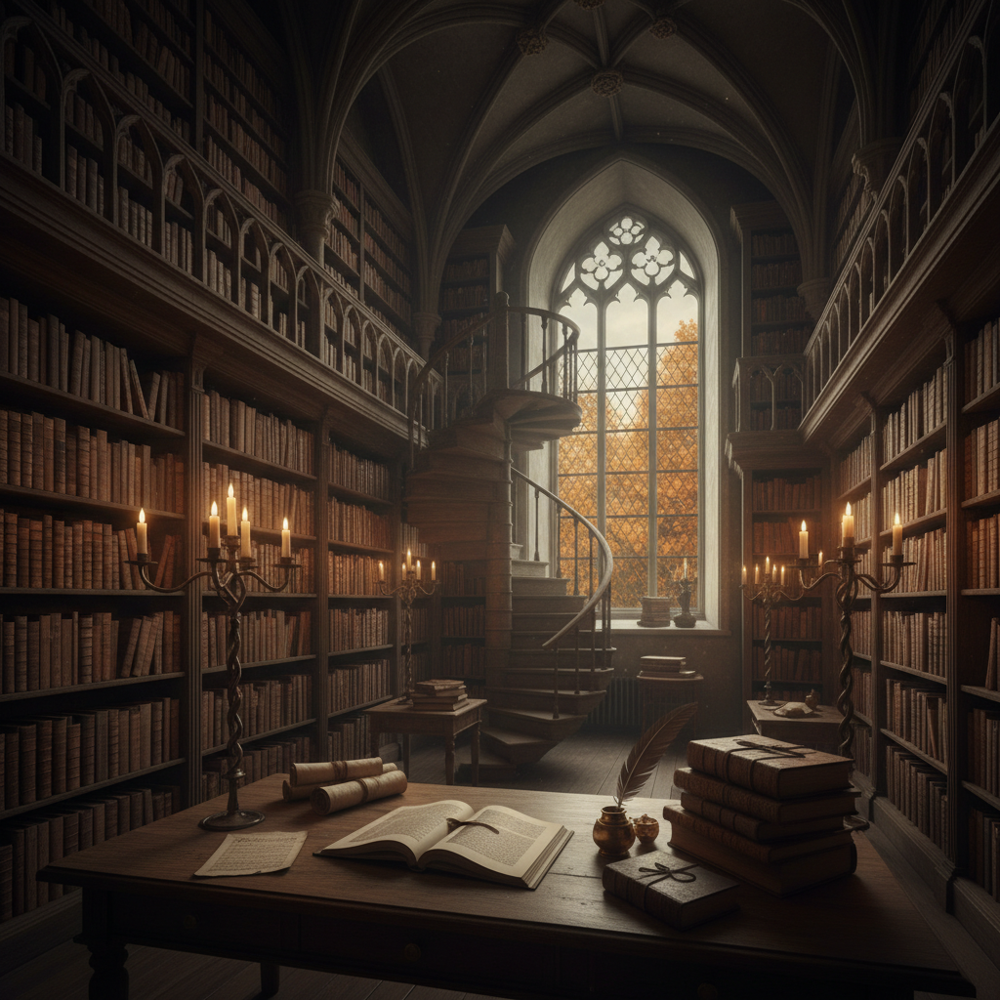

# Dark Academia 暗黑学院

> "To live would be an awfully big adventure." — J.M. Barrie (Dark Academia motto)

## 概述

暗黑学院（Dark Academia）是2010年代末在Tumblr和TikTok上兴起的美学运动，浪漫化古典教育、文学、哲学和欧洲老式大学的氛围。它融合了哥特的阴郁、学术的严肃和浪漫主义的激情。

暗黑学院的核心幻想是：在牛津或剑桥的古老图书馆里，穿着花呢外套，在烛光下阅读拉丁文，窗外是秋天的落叶和雨。

## 核心特征

| 特征 | 描述 |
|------|------|
| 古典学术 | 文学、哲学、艺术史、古典语言 |
| 哥特氛围 | 阴郁的、秋冬的、烛光的 |
| 欧洲大学 | 牛津、剑桥、海德堡的建筑 |
| 死亡浪漫 | 对死亡和短暂性的诗意沉思 |
| 精英感 | 旧世界贵族教育的想象 |
| 文学性 | 以书籍和写作为核心 |

## 视觉特征

- **色调**：深褐、墨绿、酒红、金色、黑色
- **材质**：皮革、花呢、天鹅绒、旧纸张
- **光线**：烛光、壁炉光、阴天的窗户光
- **场景**：图书馆、教堂、古堡、秋日校园
- **物品**：旧书、钢笔、地球仪、骷髅标本
- **建筑**：哥特式拱门、石墙、螺旋楼梯

## 代表作品

| 作品 | 年代 | 意义 |
|------|------|------|
| *The Secret History* (Donna Tartt) | 1992 | 暗黑学院的圣经 |
| *Dead Poets Society* | 1989 | 学术浪漫的电影经典 |
| *Harry Potter* 霍格沃茨 | 1997– | 暗黑学院建筑的大众化 |
| *The Picture of Dorian Gray* | 1890 | 美与死亡的经典 |
| Oxbridge 建筑摄影 | 各时期 | 视觉美学的直接来源 |

## 真实作品（公共领域）

| 作品 | 来源 |
|------|------|
| 牛津大学建筑 | [Oxford University Images](https://www.ox.ac.uk/) |
| Caspar David Friedrich 画作 | [Alte Nationalgalerie](https://www.smb.museum/en/museums-institutions/alte-nationalgalerie/) |
| 中世纪手抄本 | [British Library](https://www.bl.uk/manuscripts/) |

## AI生成概念图

## 与其他风格的关系

- **Gothic** → 哥特美学的学术化版本
- **Romanticism** → 浪漫主义的当代互联网变体
- **Cottagecore** → 同为互联网美学但氛围相反
- **Pre-Raphaelite** → 共享对中世纪的浪漫化
