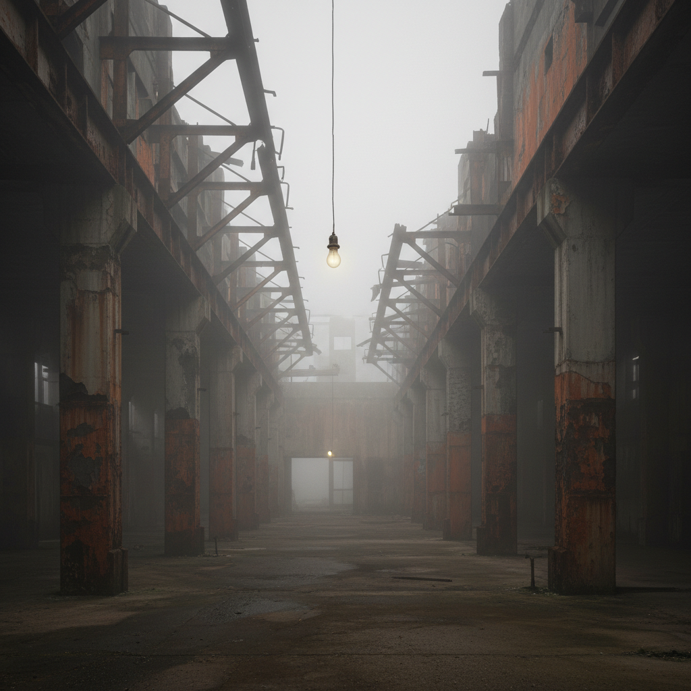

# Dark Ambient 暗黑氛围（视觉美学）



> **"声音的黑暗有了形状——废墟、雾、无限的空旷。"**

## 概述

| 维度 | 描述 |
|------|------|
| 时期 | 1980s–至今 |
| 别名 | Dark Ambient, 暗黑氛围, Industrial Ambient |
| 核心色彩 | 深黑、雾灰、锈棕、冷蓝、骨白 |
| 关键元素 | 废墟、雾、工业遗迹、空旷、衰败、无人 |
| 代表人物 | Lustmord, Atrium Carceri, Cryo Chamber厂牌 |
| 关联风格 | Industrial, Dungeon Synth, Liminal Space, Dark Fantasy, Brutalism |

---

## 历史脉络

| 年份 | 事件 |
|------|------|
| 1980 | Throbbing Gristle/SPK——工业音乐中的氛围元素 |
| 1990 | Lustmord《Heresy》——Dark Ambient的定义性专辑 |
| 1990s | Dark Ambient从工业音乐中独立 |
| 2010s | Cryo Chamber厂牌——Dark Ambient视觉美学的系统化 |
| 2015+ | Dark Ambient封面美学影响概念艺术和建筑摄影 |
| 2020s | 与Liminal Space美学交汇——"无人的恐怖空间" |

### 核心哲学

Dark Ambient视觉的精神是**"如果黑暗有形状——它是什么样的？"**：
- "空旷不是空虚——是充满了看不见的存在"
- "废墟比新建筑更有灵魂——因为它记得"
- "雾不是遮挡——是揭示（揭示了空间的深度）"
- "没有人 = 最恐怖的场景"
- "声音的视觉化——低频嗡鸣看起来像什么？"

---

## 视觉语法

### 色彩系统

```
主色：
  深黑 (#0A0A0A) — 虚空、未知
  雾灰 (#696969) — 模糊、不确定
  锈棕 (#8B4513) — 衰败、时间
  冷蓝 (#4682B4) — 寒冷、孤独

辅色：
  骨白 (#FFF8DC) — 死亡、残骸
  深绿 (#006400) — 苔藓、侵蚀
  暗红 (#4A0000) — 血迹、危险

视觉特征：
  雾/烟 — 弥漫、模糊边界
  废墟 — 人类消失后的世界
  工业遗迹 — 锈蚀、巨大、空旷
  自然侵蚀 — 植物吞噬建筑
  极简构图 — 大面积黑暗+小光源

规则：
  - 黑暗占画面80%以上
  - 没有人——或只有极小的人影
  - 雾/烟是必须的——模糊边界
  - 衰败 > 完整
  - 巨大 > 人类尺度
```

### 标志性元素

| 类别 | 元素 |
|------|------|
| 空间 | 废墟、隧道、地下室、工厂 |
| 自然 | 雾、枯树、苔藓、黑水 |
| 建筑 | 混凝土、锈铁、破碎玻璃 |
| 光线 | 微弱、单一光源、逆光 |
| 人物 | 无人/极小剪影 |
| 态度 | 恐惧、崇高、孤独、冥想 |

---

## 与千禧怀旧/当代的关系

### Liminal Space的暗黑版
- Liminal Space = "不该空的空间是空的"
- Dark Ambient视觉 = "应该有人的废墟没有人"
- 两者共享：空旷、无人、不安

### 对当代视觉文化的影响
- 建筑废墟摄影(Urbex) = Dark Ambient美学的摄影实践
- 恐怖游戏的环境设计 = Dark Ambient视觉
- Brutalist建筑摄影 = Dark Ambient的建筑版

---

## 设计应用

| 场景 | 应用方式 |
|------|----------|
| 音乐 | 专辑封面+视觉化+MV |
| 游戏 | 恐怖+探索+氛围 |
| 摄影 | 废墟+工业+极简暗黑 |
| 空间 | 沉浸式装置+声光体验 |

---

## 相关风格

← [Dungeon Synth 地牢合成器](dungeon-synth.md) | [Liminal Space 阈限空间](liminal-space.md) →

↑ [返回千禧怀旧目录](README.md) | [返回总目录](../README.md)
