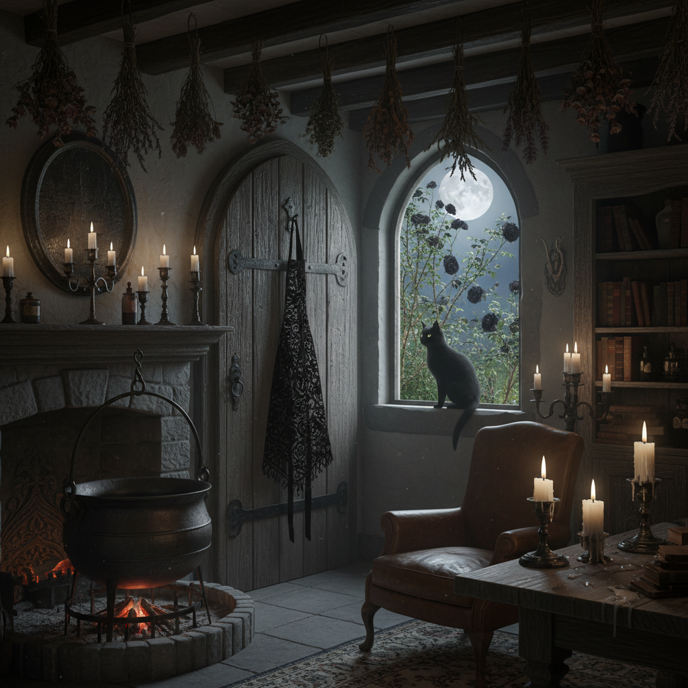

# Dark Cottagecore 暗黑田园核



> **"荆棘花园、黑色蕾丝围裙、月光下的草药——田园生活的暗面。"**

## 概述

| 维度 | 描述 |
|------|------|
| 时期 | 2020–至今 |
| 别名 | Dark Cottagecore, Gothic Cottagecore, Witch Cottage |
| 核心色彩 | 黑色、深绿、深紫、暗红、棕色 |
| 关键元素 | 荆棘、黑色花卉、草药、蜡烛、乌鸦 |
| 代表人物 | TikTok/Pinterest 社区驱动 |
| 关联风格 | Cottagecore, Witchcore, Gothic, Dark Folk |

---

## 历史脉络

| 年份 | 事件 |
|------|------|
| 中世纪 | "草药女巫"——乡村智慧女性 |
| 1800s | 哥特小说中的乡村恐怖 |
| 2020 | Cottagecore 爆发 → Dark Cottagecore 分支 |
| 2021 | 与 Witchcore 融合 |
| 2022 | 成为独立美学分支 |

### 核心哲学

Dark Cottagecore 的精神是**"田园不只有阳光——月光下的花园同样美丽"**：
- Cottagecore 的"暗面"（不是对立，是补充）
- 自然 = 美丽 + 危险（毒蘑菇、荆棘）
- 独立 = 不需要"可爱"来定义自己
- "我是花园里的女巫，不是公主"
- 黑暗 ≠ 邪恶（只是另一种美）

---

## 视觉语法

### 色彩系统

```
主色：
  黑色 (#1A1A1A) — 夜晚、力量
  深绿 (#1B3B1B) — 苔藓、草药
  深紫 (#2D0033) — 薰衣草暗面
  暗红 (#4A0000) — 玫瑰、浆果
  棕色 (#3E2723) — 木头、土壤

辅色：
  银色 (#808080) — 月光
  米白 (#F5F5DC) — 蕾丝、骨头
  金色 (#8B6914) — 蜂蜜、烛光

质感：
  蕾丝 — 黑色蕾丝
  粗麻 — 围裙、袋子
  铸铁 — 锅、钥匙
  干花 — 倒挂的草药
  蜡 — 蜡烛、封蜡
```

### 标志性元素

| 类别 | 元素 |
|------|------|
| 植物 | 荆棘、黑玫瑰、毒草、干花、苔藓 |
| 动物 | 乌鸦、黑猫、蛾子、蜘蛛 |
| 物件 | 草药瓶、蜡烛、铸铁锅、旧书 |
| 空间 | 月光花园、暗色小屋、地窖 |
| 服装 | 黑色蕾丝围裙、长裙、斗篷 |
| 态度 | 独立、神秘、智慧、不讨好 |

---

## 与千禧怀旧的关系

### Cottagecore 的"暗面分支"
- Cottagecore = 阳光、花朵、烘焙、可爱
- Dark Cottagecore = 月光、荆棘、草药、神秘
- 两者共享"乡村独立生活"的核心
- 区别在于"光"vs"暗"的选择

### 与 Witchcore 的交叉
- 两者都有"草药""蜡烛""月亮"
- Dark Cottagecore 更偏"乡村生活"
- Witchcore 更偏"魔法实践"
- 重叠区域 = "乡村女巫"

---

## 中国语境

- 与中国"暗黑系"田园的交叉
- 中国草药文化的视觉化
- 与中国"山野隐居"的暗面
- 月光、荆棘在中国文学中的意象

---

## 设计应用

| 场景 | 应用方式 |
|------|----------|
| 品牌 | 暗色+草药+手工+神秘+独立 |
| 空间 | 深色木材+干花+蜡烛+铸铁 |
| 时尚 | 黑色蕾丝+天然面料+暗色花卉 |
| 产品 | 草药+暗色包装+手写标签 |

---

## 相关风格

← [Cottagecore 田园核](cottagecore.md) | [Witchcore 女巫核](witchcore.md) →

↑ [返回千禧怀旧目录](README.md) | [返回总目录](../README.md)
