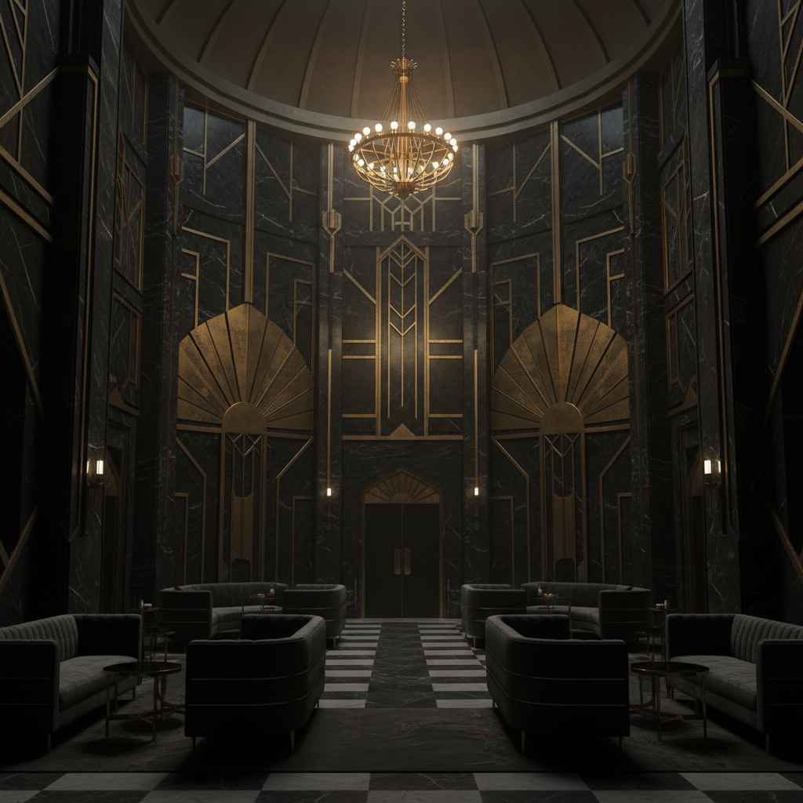

# Dark Deco 暗黑装饰艺术



> **"Art Deco的几何奢华遇见哥特的黑暗深渊——金色线条在黑色大理石上闪耀，优雅与恐惧共舞。"**

## 概述

| 维度 | 描述 |
|------|------|
| 时期 | 2010s–至今（作为美学标签流行）/根源可追溯至1920s–1940s |
| 别名 | Dark Deco, Gothic Art Deco, Noir Deco, Dark Luxe, 暗黑装饰派 |
| 核心色彩 | 纯黑、深金、暗铜、深红、墨绿——黑色为底，金属为骨 |
| 关键元素 | Art Deco几何+哥特暗黑氛围、金属线条、黑色大理石、暗色奢华 |
| 代表人物 | 电影《哥谭》美术设计、《了不起的盖茨比》暗面、Zaha Hadid暗色作品 |
| 关联风格 | Art Deco, Gothic, Film Noir, Dark Academia, Baroque, Cyberpunk |

---

## 历史脉络

| 年份 | 事件 |
|------|------|
| 1920s | Art Deco 黄金时代——几何、奢华、速度 |
| 1940s | Film Noir——Art Deco建筑+黑暗叙事=Dark Deco雏形 |
| 1989 | Tim Burton《蝙蝠侠》——哥谭市=Dark Deco城市 |
| 2000s | 游戏《生化奇兵》(BioShock)——水下Dark Deco乌托邦 |
| 2010s | "Dark Deco"作为独立美学标签在社交媒体流行 |
| 2019 | 电影《小丑》——哥谭市的Dark Deco美学 |
| 2020s | Dark Deco在室内设计、品牌、游戏中持续流行 |

### 核心哲学

Dark Deco的精神是**"奢华不需要光明——黑暗中的金色更加耀眼"**：
- 黑暗 = 力量（"黑色不是缺席——是最强的存在"）
- 几何 = 秩序（"即使在黑暗中——也有完美的秩序"）
- 金属 = 永恒（"金色在黑色上——像星星在夜空"）
- 奢华 = 危险（"最美的东西往往最危险——这就是Dark Deco"）
- "Art Deco是白天的派对——Dark Deco是午夜的仪式"

---

## 视觉语法

### 色彩系统

```
主色：
  纯黑 (#0A0A0A) — 深渊、基底、力量
  深金 (#B8860B) — 线条、装饰、奢华
  暗铜 (#8B4513) — 金属、温暖的黑暗
  深红 (#4A0000) — 血、危险、激情

辅色：
  墨绿 (#013220) — 毒药、神秘
  深紫 (#1A0033) — 皇室、黑暗
  银灰 (#708090) — 金属、冷

规则：
  - 黑色占画面70%以上
  - 金属色只用于线条和装饰
  - 永远不用明亮色彩
  - 对比来自材质而非色彩（哑光vs光泽）

质感：
  黑色大理石 — 深沉、纹理
  拉丝金属 — 金、铜、银
  天鹅绒 — 深色、吸光
  烟熏玻璃 — 半透明、神秘
```

### 标志性元素

| 类别 | 元素 |
|------|------|
| 几何 | Art Deco扇形、人字纹、放射线——但全部暗色 |
| 材质 | 黑色大理石、深色金属、烟熏玻璃、深色木材 |
| 建筑 | 哥谭式摩天楼、暗色大厅、尖顶+几何 |
| 装饰 | 金色线条、铜色浮雕、几何图案、对称 |
| 氛围 | 午夜、烛光、雾气、阴影、神秘 |
| 态度 | 奢华+危险、优雅+黑暗、秩序+恐惧 |

---

## 与千禧怀旧的关系

### 哥谭市——Dark Deco的完美化身
- Tim Burton/Christopher Nolan的哥谭 = Dark Deco城市
- 《蝙蝠侠》系列 = Dark Deco美学的流行文化载体
- "哥谭不是纽约——是纽约的噩梦版本——Art Deco的黑暗镜像"
- 游戏《蝙蝠侠：阿卡姆》系列 = 可探索的Dark Deco世界

### BioShock——水下的Dark Deco乌托邦
- Rapture(销魂城) = Art Deco乌托邦的崩溃
- "当Art Deco的理想主义遇见人性的黑暗——就是Dark Deco"
- BioShock = 游戏史上最经典的Dark Deco视觉设计

### 当代室内设计趋势
- "Dark Luxe"/"Moody Interiors" = Dark Deco的室内设计版本
- 黑色大理石+金色五金+深色天鹅绒 = 2020s高端室内趋势
- 酒吧、酒店、餐厅 → Dark Deco氛围设计

---

## 与Art Deco的区别

| 维度 | Art Deco | Dark Deco |
|------|----------|-----------|
| 色调 | 明亮、金色、白色 | 黑暗、深金、黑色 |
| 氛围 | 乐观、庆祝、白天 | 神秘、危险、午夜 |
| 情绪 | 快乐、奢华、进步 | 恐惧、权力、堕落 |
| 时代感 | 1920s爵士时代 | 1940s黑色电影 |
| 叙事 | 盖茨比的派对 | 盖茨比的葬礼 |

---

## 中国语境

- 中国高端酒吧/餐厅的Dark Deco设计
- 中国游戏中的Dark Deco世界观
- 中国奢侈品牌的暗色奢华趋势
- 上海Art Deco建筑的"暗面"诠释

---

## 设计应用

| 场景 | 应用方式 |
|------|----------|
| 空间 | 酒吧+酒店+高端餐厅+会所+影院 |
| 品牌 | 奢侈品+威士忌+珠宝+高端男装 |
| 游戏 | 世界观+建筑+UI+氛围 |
| 影视 | 美术设计+场景+道具+光影 |

---

## 相关风格

← [Art Deco 装饰艺术](art-deco.md) | [Gothic 哥特](gothic.md) →

↑ [返回千禧怀旧目录](README.md) | [返回总目录](../README.md)
