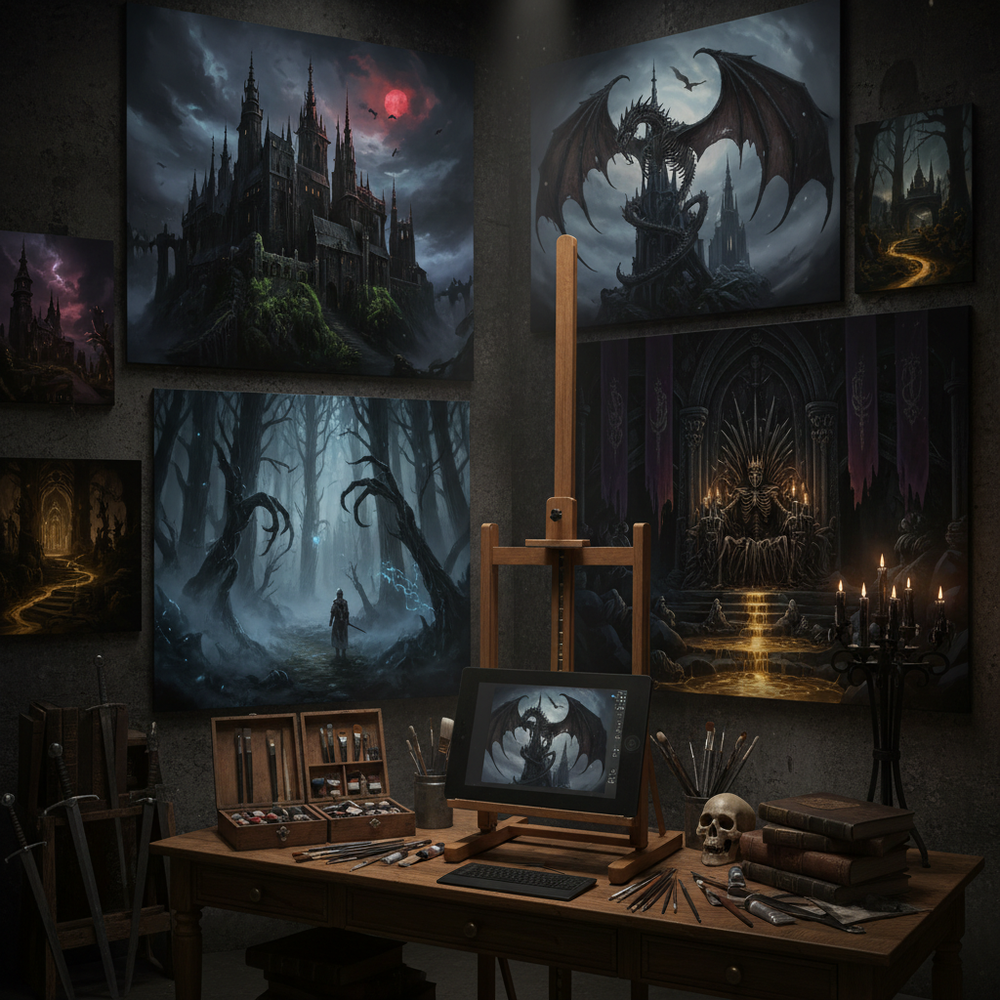

# Dark Fantasy Art 暗黑奇幻艺术

> "Dark fantasy art dwells in the shadow between wonder and dread — enchanted forests where beauty hides teeth, castles whose towers reach toward skies that never see sun, creatures that are simultaneously magnificent and terrible, a visual world where magic exists but carries a price, where every fairy tale remembers its original ending before it was softened for children, and where the sublime and the horrific share the same throne." — Unknown

## 概述

暗黑奇幻艺术（Dark Fantasy Art）是一种将奇幻（fantasy）元素与黑暗、哥特、恐怖和忧郁氛围结合的视觉艺术风格。与传统奇幻艺术的英雄主义和光明色调不同，暗黑奇幻强调阴暗面——死亡、腐朽、诅咒、堕落的美、以及善恶之间模糊的界限。

暗黑奇幻艺术的文学根源包括：H.P.洛夫克拉夫特（H.P. Lovecraft）的宇宙恐怖、迈克尔·穆尔科克（Michael Moorcock）的反英雄叙事、以及克莱夫·巴克（Clive Barker）的黑暗想象。在视觉领域，弗兰克·弗雷泽塔（Frank Frazetta）的野蛮人绘画、H.R.吉格（H.R. Giger）的生物机械美学、以及贝克辛斯基（Zdzisław Beksiński）的噩梦风景都是暗黑奇幻的重要视觉参照。当代的暗黑奇幻在游戏（《黑暗之魂》《血源诅咒》）和影视中有丰富的表现。

## 核心特征

| 特征 | 描述 |
|------|------|
| 黑暗 | 黑暗的氛围和色调 |
| 奇幻 | 奇幻和超自然元素 |
| 哥特 | 哥特式的美学 |
| 恐怖 | 恐怖和不安的元素 |
| 崇高 | 崇高和壮丽的恐惧 |
| 堕落 | 堕落的美和腐朽 |

## 视觉特征

- **黑暗**：极暗的色调和光线
- **城堡**：哥特式的建筑废墟
- **生物**：恐怖而壮丽的生物
- **骷髅**：死亡和骷髅意象
- **森林**：黑暗扭曲的森林
- **盔甲**：黑暗骑士和武器

## 代表作品

| 作品 | 艺术家 | 年代 | 意义 |
|------|--------|------|------|
| *Nightmare landscapes* | Zdzisław Beksiński | 1970-90年代 | 贝克辛斯基的噩梦 |
| *Dark Souls concept art* | FromSoftware | 2011起 | 黑暗之魂的视觉 |
| *Conan paintings* | Frank Frazetta | 1960-70年代 | 弗雷泽塔的野蛮人 |
| *Berserk manga* | Kentaro Miura | 1989起 | 剑风传奇的暗黑世界 |
| *Diablo concept art* | Blizzard | 1996起 | 暗黑破坏神的视觉 |

## 历史时间线

| 时期 | 事件 |
|------|------|
| 1960-70年代 | Frazetta的奇幻绘画 |
| 1970-90年代 | Beksiński的噩梦风景 |
| 1990年代 | 暗黑奇幻游戏的兴起 |
| 2011 | 《黑暗之魂》的视觉革命 |
| 当代 | 暗黑奇幻的全球化 |

## 中国语境

暗黑奇幻在中国有庞大的爱好者群体，特别是在游戏和动漫社区中。中国的网络文学中有大量"黑暗流"和"无限流"作品，其视觉想象与暗黑奇幻密切相关。中国传统文化中的"鬼神"世界观、《山海经》中的异兽、以及道教的地狱想象都为中国暗黑奇幻提供了丰富的文化资源。中国的游戏产业（如《黑神话：悟空》）也在积极探索融合中国神话与暗黑奇幻美学的可能性。中国的一些概念设计师和插画师在国际暗黑奇幻艺术领域有重要影响力。

## AI生成概念图

## 与其他风格的关系

- **Gothic Art** → 哥特艺术
- **Fantasy Art** → 奇幻艺术
- **Horror Art** → 恐怖艺术
- **Surrealism** → 超现实主义
- **Romanticism** → 浪漫主义（黑暗面）
- **Concept Art** → 概念设计

---

*浮光艺志 | Chronicle of Artistry*
