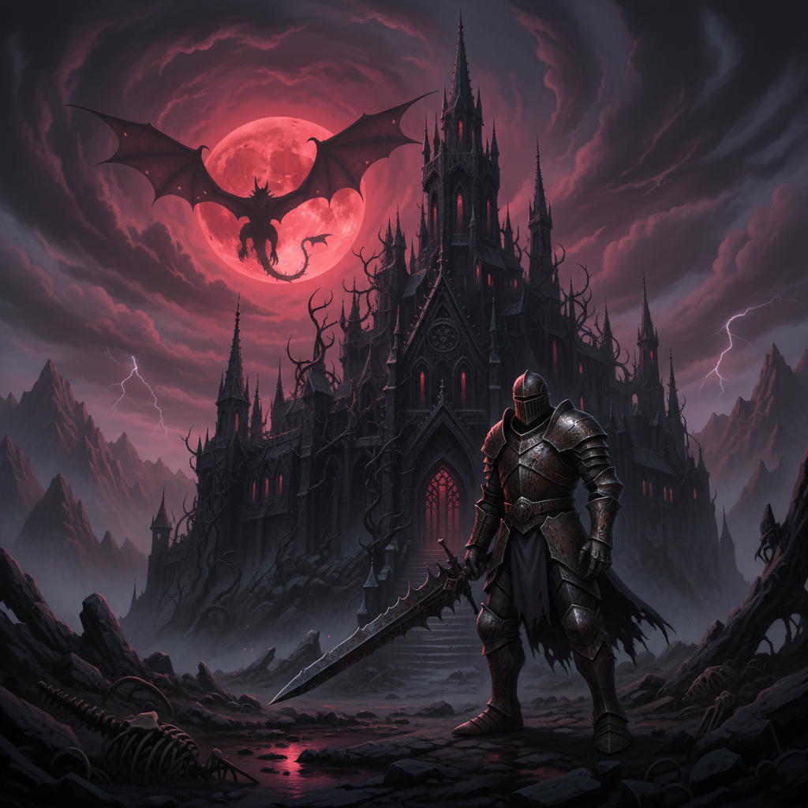
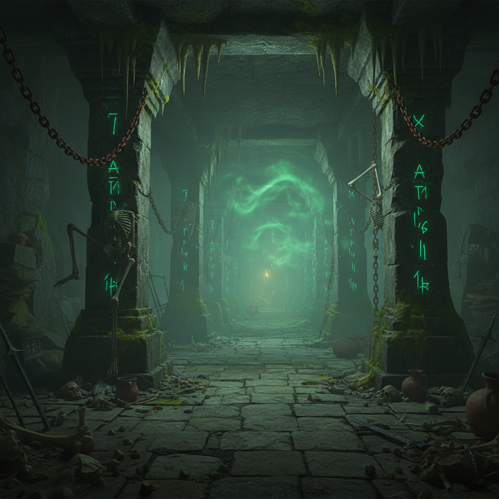

# Dark Fantasy 暗黑奇幻





> **"龙焰照亮的哥特城堡、血月下的骑士——当奇幻世界拒绝光明结局。"**

## 概述

| 维度 | 描述 |
|------|------|
| 时期 | 持续存在 / 2010s 视觉文化高峰 |
| 别名 | Dark Fantasy, Gothic Fantasy, Grimdark |
| 核心色彩 | 深红、暗紫、铁灰、骨白、火焰橙 |
| 关键元素 | 哥特城堡、龙、暗黑骑士、血月、荆棘 |
| 代表人物 | Dark Souls、Game of Thrones、Berserk |
| 关联风格 | Gothic, Steampunk, Witchcore, Medieval |

---

## 历史脉络

### 文学起源

Dark Fantasy 作为文学类型可以追溯到哥特小说：
- Mary Shelley《弗兰肯斯坦》(1818)
- Bram Stoker《德古拉》(1897)
- H.P. Lovecraft 的宇宙恐怖 (1920s–30s)
- Michael Moorcock 的反英雄奇幻 (1960s)

### 2010s：视觉文化爆发

| 作品 | 贡献 |
|------|------|
| Game of Thrones (2011–2019) | 将暗黑奇幻带入主流 |
| Dark Souls 系列 (2011–) | 定义了暗黑奇幻游戏美学 |
| The Witcher (2015/2019) | 斯拉夫暗黑奇幻 |
| Elden Ring (2022) | 暗黑奇幻的巅峰视觉 |
| Berserk 漫画 | 日本暗黑奇幻的视觉圣经 |

### 核心哲学

Dark Fantasy 的吸引力在于它提供了一种**不回避黑暗的幻想世界**：
- 传统奇幻：善恶分明，光明必胜
- Dark Fantasy：道德模糊，代价沉重
- 英雄不一定能拯救世界
- 美丽和恐怖可以共存

---

## 视觉语法

### 色彩系统

```
主色：
  深红 (#8B0000) — 血、火、权力
  暗紫 (#301934) — 魔法、腐败
  铁灰 (#434343) — 盔甲、城堡
  骨白 (#F5F5DC) — 骷髅、月光
  火焰橙 (#FF4500) — 龙焰、熔岩

辅色：
  黑色 (#000000) — 深渊、阴影
  金色 (#B8860B 暗) — 古老的财富
  毒绿 (#00FF00 暗) — 毒药、腐蚀

质感：
  锈蚀金属 — 古老的武器和盔甲
  石材 — 城堡、废墟
  皮革 — 盔甲、书籍
  骨/角 — 装饰、武器
  烟雾/迷雾 — 氛围
```

### 标志性元素

| 类别 | 元素 |
|------|------|
| 生物 | 龙、恶魔、亡灵、狼人、巨人 |
| 建筑 | 哥特城堡、废墟、地下城、黑塔 |
| 武器 | 巨剑、锁链、法杖、诅咒武器 |
| 自然 | 血月、荆棘、枯树、沼泽、深渊 |
| 人物 | 暗黑骑士、女巫、亡灵王、堕落天使 |
| 符号 | 骷髅、乌鸦、蛇、倒十字、五芒星 |

---

## 与千禧怀旧的关系

### 2000s 的奇幻热潮
- 《指环王》三部曲 (2001–2003) 开启了奇幻视觉的黄金时代
- 2000s 的 MMORPG（魔兽世界等）的暗黑副本
- 这些是很多千禧一代的青春记忆

### 从"光明奇幻"到"暗黑奇幻"
- 2000s：《指环王》式的史诗光明奇幻
- 2010s：《权力的游戏》式的暗黑现实奇幻
- 这种转变反映了一代人从乐观到现实的成长

---

## 中国语境

- 仙侠/玄幻中的"魔道"/"暗黑"元素
- 《黑神话：悟空》的暗黑东方奇幻
- 网络小说中的"黑暗流"/"无限流"
- 与"哥特风"/"暗黑系"穿搭的交叉
- 国产暗黑奇幻游戏的视觉美学

---

## 设计应用

| 场景 | 应用方式 |
|------|----------|
| 游戏 | 暗色调+锈蚀质感+哥特建筑+巨型Boss |
| 品牌 | 深红+黑色+哥特字体+金属质感 |
| 出版 | 暗色封面+金色烫印+纹理纸张 |
| 空间 | 暗色+蜡烛+金属+石材+皮革 |

---

## 相关风格

← [Witchcore 巫术核](witchcore.md) | [Steampunk 蒸汽朋克](steampunk.md) →

↑ [返回千禧怀旧目录](README.md) | [返回总目录](../README.md)
