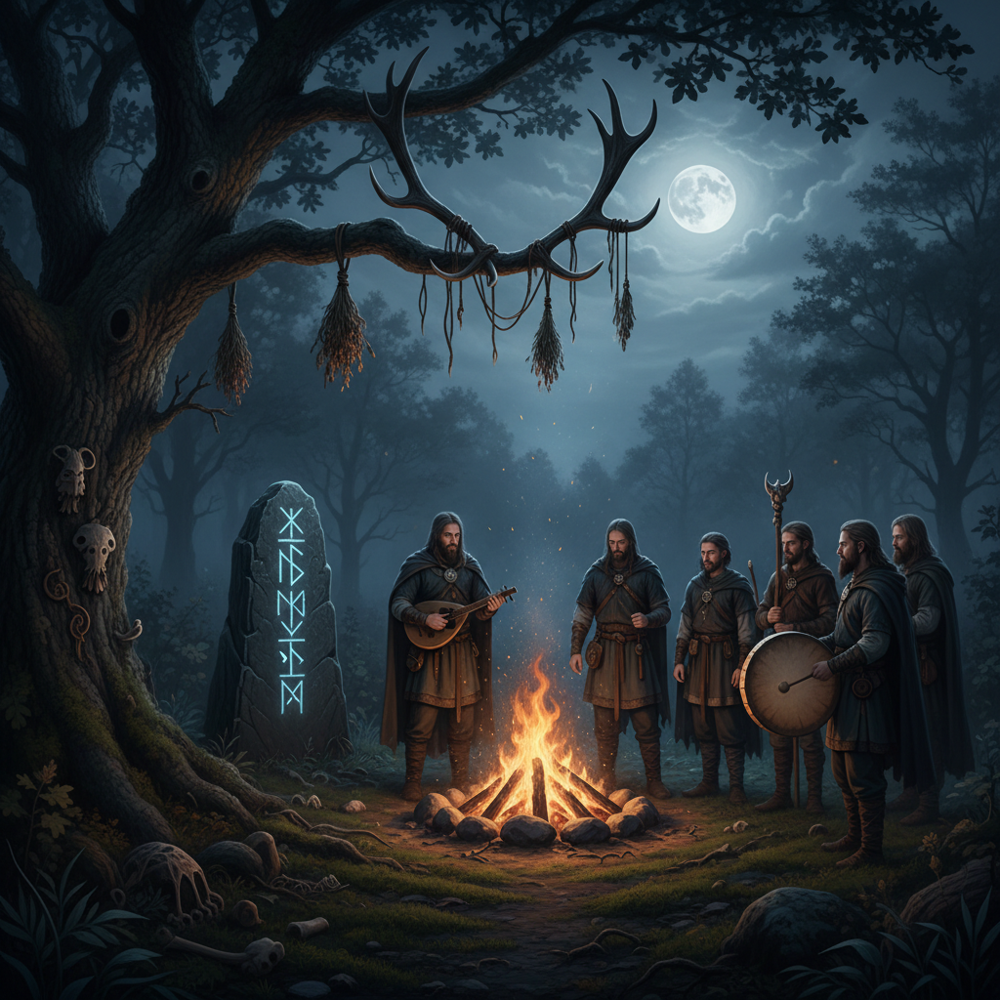

# Dark Folk 暗黑民谣



> **"篝火、符文、鹿角——当北欧森林的古老歌谣在月光下复活。"**

## 概述

| 维度 | 描述 |
|------|------|
| 时期 | 1990s 音乐起源 / 2015–至今 美学流行 |
| 别名 | Dark Folk, Neofolk, Pagan Aesthetic, Viking Aesthetic |
| 核心色彩 | 深棕、黑色、暗绿、骨白、铁灰 |
| 关键元素 | 符文、鹿角、篝火、手工皮革、森林 |
| 代表人物 | Wardruna、Heilung、Danheim |
| 关联风格 | Cottagecore Dark, Witchcore, Viking, Dark Academia |

---

## 历史脉络

### 从地下音乐到视觉美学

| 年份 | 事件 |
|------|------|
| 1990s | Neofolk 音乐在欧洲地下发展 |
| 2003 | Wardruna 成立——北欧异教音乐 |
| 2013 | 《Vikings》电视剧——维京美学主流化 |
| 2015 | Heilung 现场表演——原始仪式感 |
| 2020 | 《Assassin's Creed Valhalla》——维京美学游戏化 |
| 2020s | Dark Folk 美学在社交媒体流行 |

### 核心哲学

Dark Folk 的精神是**"回到工业化之前——当人类还与自然和神灵对话"**：
- 古老 > 现代
- 自然 = 神圣
- 手工 = 真实
- "我们的祖先知道我们遗忘的东西"
- 仪式、季节、循环

---

## 视觉语法

### 色彩系统

```
主色：
  深棕 (#3E2723) — 木材、皮革、大地
  黑色 (#1A1A1A) — 夜晚、神秘
  暗绿 (#1B5E20) — 森林、苔藓
  骨白 (#F5F5DC) — 骨头、亚麻
  铁灰 (#424242) — 金属、石头

辅色：
  暗红 (#8B0000) — 血、火
  金色 (#B8860B) — 蜂蜜酒、火光
  蓝灰 (#607D8B) — 冬天、北方

质感：
  粗糙皮革 — 手工、原始
  亚麻 — 天然、古老
  木材 — 雕刻、纹理
  毛皮 — 温暖、野性
  铁 — 锻造、武器
```

### 标志性元素

| 类别 | 元素 |
|------|------|
| 符号 | 符文、凯尔特结、三角符号、生命之树 |
| 自然 | 鹿角、乌鸦、狼、橡树、蘑菇 |
| 物件 | 篝火、蜡烛、号角杯、手鼓 |
| 服装 | 亚麻长袍、皮革护甲、毛皮披肩 |
| 空间 | 森林、石圈、木屋、洞穴 |
| 音乐 | 手鼓、骨笛、吟唱、自然音效 |

---

## 与千禧怀旧的关系

### 对现代性的逃离
- "回到过去"= 对数字时代的反抗
- 与 Cottagecore 共享"逃离现代"的冲动
- 但更黑暗、更原始、更仪式化
- "我不想回到奶奶的花园——我想回到维京时代"

### 游戏和影视的推动
- 《Vikings》《The Witcher》《Valhalla》
- 维京/中世纪题材的持续流行
- 游戏中的北欧神话热潮
- 从娱乐到生活方式的转化

---

## 中国语境

- 与中国"古风"/"汉服"运动的平行
- 都是对"前现代"的浪漫化
- 中国版：山林隐士、道教仪式、古琴
- 北欧神话在中国的流行（游戏/影视）

---

## 设计应用

| 场景 | 应用方式 |
|------|----------|
| 音乐 | 符文字体+深色+自然元素+手工质感 |
| 品牌 | 手工感+天然材质+古老符号+仪式 |
| 空间 | 木材+皮革+烛光+自然+原始 |
| 活动 | 篝火+森林+仪式+季节+社区 |

---

## 相关风格

← [Witchcore 巫术核](witchcore.md) | [Cottagecore Dark 暗黑田园核](cottagecore-dark.md) →

↑ [返回千禧怀旧目录](README.md) | [返回总目录](../README.md)
