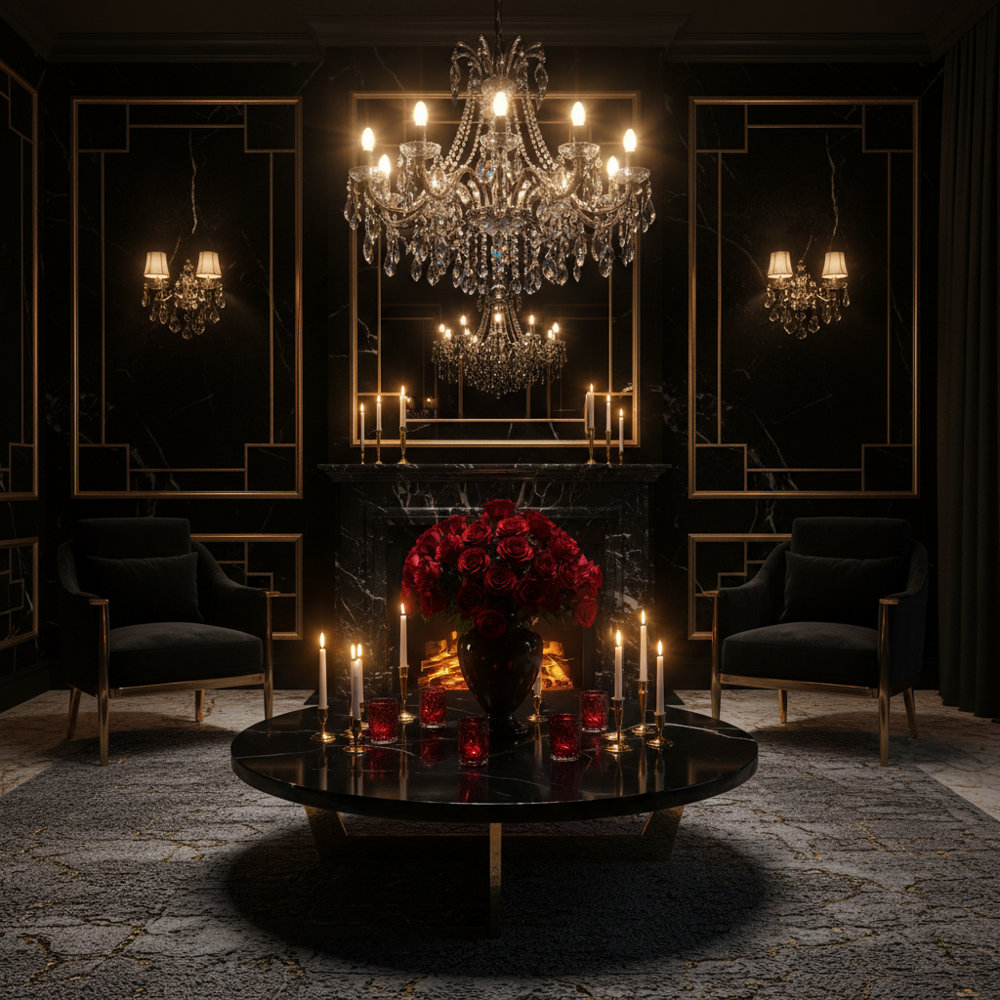

# Dark Luxe 暗黑奢华



> **"黑色天鹅绒、金色细节、暗影中的光芒——奢华不需要明亮。"**

## 概述

| 维度 | 描述 |
|------|------|
| 时期 | 2018–至今 |
| 别名 | Dark Luxe, Dark Luxury, Noir Luxury |
| 核心色彩 | 黑色、金色、深红、深绿、银色 |
| 关键元素 | 天鹅绒、大理石、金属、暗色花卉、烛光 |
| 代表人物 | Tom Ford, Alexander McQueen, Balmain |
| 关联风格 | Gothic, Dark Academia, Old Money, Maximalism |

---

## 历史脉络

| 年份 | 事件 |
|------|------|
| 1800s | 维多利亚哥特——黑色+奢华的起源 |
| 1990s | Tom Ford 时期的 Gucci——性感暗黑奢华 |
| 2010s | Alexander McQueen——暗黑浪漫主义 |
| 2018 | Dark Luxe 作为室内设计趋势兴起 |
| 2020 | 疫情期间"茧居奢华"——暗色调家居 |
| 2023 | 与 Quiet Luxury 形成对比——"不安静的奢华" |

### 核心哲学

Dark Luxe 的精神是**"奢华不需要白色和明亮——黑暗中的光更珍贵"**：
- 黑色 = 力量 + 神秘 + 永恒
- 金色 = 在黑暗中更耀眼
- 质感 > 颜色（触觉优先）
- "少即是多"的反面——"暗即是奢"
- 夜晚比白天更有魅力

---

## 视觉语法

### 色彩系统

```
主色：
  黑色 (#0A0A0A) — 基底、力量
  金色 (#D4AF37) — 奢华、光芒
  深红 (#4A0000) — 激情、血液
  深绿 (#0B3B0B) — 宝石、自然
  银色 (#808080) — 金属、月光

辅色：
  深紫 (#1A0033) — 皇室
  深蓝 (#0A1628) — 夜空
  古铜 (#8B4513) — 温暖金属

质感：
  天鹅绒 — 触感奢华
  大理石 — 冰冷高贵
  金属 — 反光、锋利
  丝绸 — 流动、光泽
  皮革 — 力量、质感
```

### 标志性元素

| 类别 | 元素 |
|------|------|
| 材质 | 天鹅绒、大理石、黄铜、水晶、皮革 |
| 花卉 | 黑色玫瑰、深红牡丹、暗色兰花 |
| 光线 | 烛光、壁灯、聚光、暗角 |
| 空间 | 深色墙面、金色框架、水晶吊灯 |
| 服装 | 黑色西装、金色配饰、天鹅绒礼服 |
| 态度 | 神秘、力量、精致、不妥协 |

---

## 与千禧怀旧的关系

### 对"极简白"的反叛
- 2010s 北欧极简 = 白色+木色+简单
- Dark Luxe = "我受够了白色"
- 从"less is more"到"dark is more"
- 与 Maximalism 共享"更多"的精神

---

## 中国语境

- 与中国"黑金"审美的交叉
- 高端酒店/会所的暗色调设计
- 与中国"轻奢"概念的对比
- 深色在中国文化中的"沉稳"含义

---

## 设计应用

| 场景 | 应用方式 |
|------|----------|
| 品牌 | 黑色+金色+质感+高端+神秘 |
| 空间 | 深色墙面+天鹅绒+金属+烛光 |
| 时尚 | 黑色+质感面料+金色配饰 |
| 包装 | 黑色+烫金+浮雕+质感纸张 |

---

## 相关风格

← [Gothic 哥特](gothic.md) | [Old Money 老钱风](old-money.md) →

↑ [返回千禧怀旧目录](README.md) | [返回总目录](../README.md)
