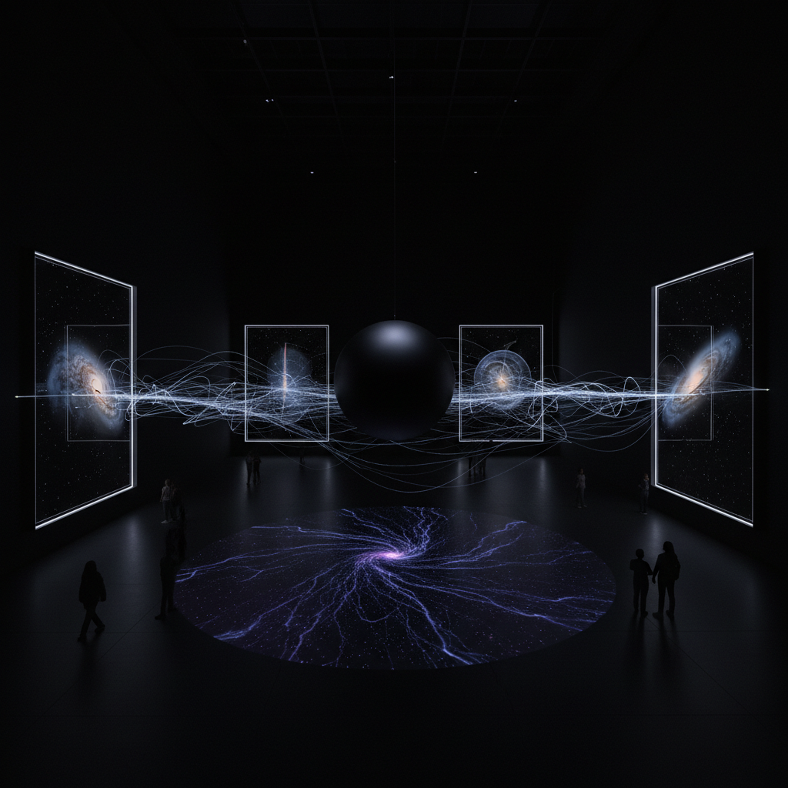

# Dark Matter Art 暗物质艺术

> "Dark matter art grapples with the greatest absence in the universe — the fact that eighty-five percent of all matter is invisible, undetectable by any instrument we possess, known only by its gravitational effects on the things we can see. To make art about dark matter is to make art about the limits of knowledge, about the vast unknown that surrounds and permeates everything we think we understand, about the humbling recognition that most of reality is hidden from us." — Unknown

## 概述

暗物质艺术（Dark Matter Art）是以宇宙中的暗物质和暗能量——占宇宙总质能的约95%但无法直接观测的神秘存在——为灵感的艺术实践。暗物质不发光、不吸收光、不与电磁力相互作用，只能通过其引力效应被间接推断。

暗物质艺术的实践包括：1）不可见的可视化——尝试给予暗物质某种视觉形式；2）引力透镜效应的美学化——将暗物质弯曲光线的效果转化为艺术；3）宇宙大尺度结构——将暗物质构成的"宇宙网"（cosmic web）可视化；4）缺失与存在——用暗物质作为隐喻探索不可见但真实存在的事物；5）科学数据的艺术化——将暗物质探测实验的数据转化为艺术体验。

## 核心特征

| 特征 | 描述 |
|------|------|
| 不可见 | 不可见的存在 |
| 引力 | 引力效应 |
| 宇宙 | 宇宙尺度 |
| 未知 | 未知的本质 |
| 结构 | 宇宙大尺度结构 |
| 隐喻 | 存在与缺失 |

## 视觉特征

- **黑暗**：深邃的黑色和暗色
- **扭曲**：引力透镜的扭曲
- **网络**：宇宙网的丝状结构
- **光晕**：暗物质晕的表现
- **空间**：巨大的空间感
- **微光**：极微弱的光线

## 代表作品

| 作品 | 艺术家 | 年代 | 意义 |
|------|--------|------|------|
| *Dark matter visualizations* | Various | 2010年代 | 暗物质可视化 |
| *Cosmic web art* | Various | 2010年代 | 宇宙网艺术 |
| *Gravitational lensing art* | Various | 2020年代 | 引力透镜艺术 |
| *Dark universe installations* | Various | 当代 | 暗宇宙装置 |
| *Particle detector art* | Various | 当代 | 粒子探测器艺术 |

## 历史时间线

| 时期 | 事件 |
|------|------|
| 1933 | Fritz Zwicky提出暗物质概念 |
| 1970年代 | Vera Rubin的星系旋转曲线证据 |
| 2000年代 | 暗物质分布的计算机模拟 |
| 2010年代 | 暗物质艺术的兴起 |
| 当代 | 暗物质探测与艺术的结合 |

## 中国语境

暗物质艺术在中国有独特的科学和文化背景。中国在暗物质研究领域有重要贡献——中国锦屏地下实验室（CJPL）是世界上最深的地下实验室之一，专门用于暗物质探测。中国的"悟空"暗物质粒子探测卫星也在太空中搜寻暗物质的踪迹。中国传统哲学中的"无"——道家认为"无"不是空无，而是充满可能性的存在——与暗物质的概念有深刻的共鸣。中国当代的一些艺术家在探索暗物质艺术：将中国暗物质实验的数据转化为艺术体验、用"无中生有"的道家观念来理解暗物质、以及将宇宙大尺度结构的美学与中国传统的"气韵"概念结合。

## AI生成概念图

## 与其他风格的关系

- **Space Art** → 太空艺术
- **Science Art** → 科学艺术
- **Light Art** → 光艺术
- **Conceptual Art** → 观念艺术
- **Data Art** → 数据艺术
- **Quantum Art** → 量子艺术

---

*浮光艺志 | Chronicle of Artistry*
